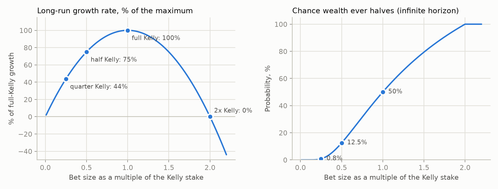
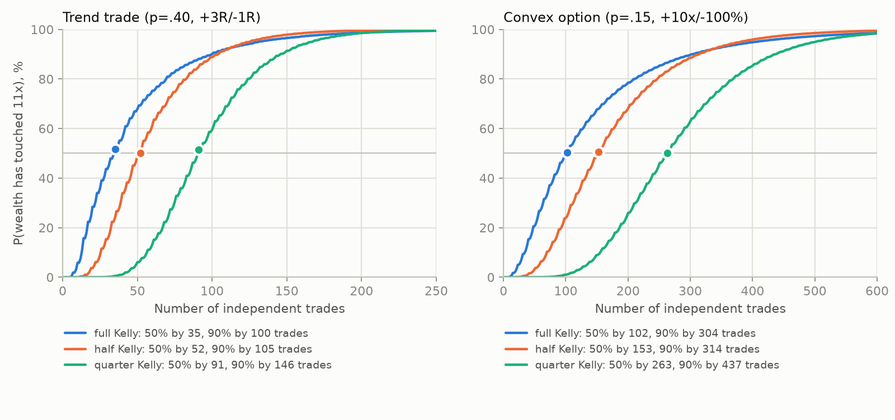
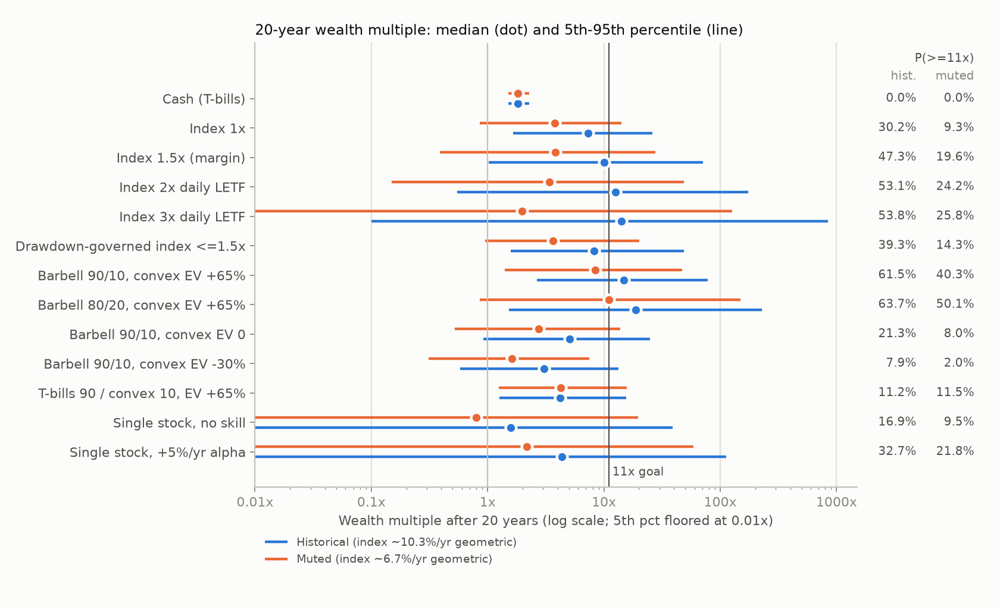

# 03: The mathematics of extreme returns (Kelly, sizing, ruin, and what "1000%" requires)

*Research track 03 of 10. Written 2026-09-28. All simulations are reproducible:
`python3 research/code/03-math/run_all.py` (about 3 minutes, fixed seeds). Every table
below has a CSV/Markdown twin in `research/code/03-math/results/`.*

---

## TL;DR

- **Maximizing expected % return per trade is the wrong objective. It recommends going all-in and ruins almost everyone.**
  Take a coin flip that pays +50% or costs −40%. Its expected return is +5% per round. After 100 rounds, 86.5% of simulated players have less money than they started with. The median player ends at 0.5% of starting wealth, and the luckiest 1% hold 98% of all the money (Peters 2019).
  - The engine should maximize **expected log growth** (Kelly 1956). This maximizes the *median* outcome (Ethier 2004) and minimizes the expected time to reach a large goal (Breiman 1961).
  - "1000%" (11x) should be reported as a *probability*, never as an expected value.
- **Compounding needs trades, so "fewest trades" and "11x" pull against each other.** Expected log wealth is N x g (number of trades times growth per trade). Reaching 11x needs the per-trade contributions to add up to ln 11 = 2.40.
  - The number of trades needed at half Kelly for a 50% / 90% chance of *ending* at or above 11x:

    | Trade type | 50% chance | 90% chance |
    |---|---|---|
    | Crisis buy | 6 | 9 |
    | Trend trade | 54 | 113 |
    | Convex option bet | 165 | 354 |
    | Binary event, true p 10pp above price | 156 | 299 |
    | Binary event, true p 5pp above price | 630 | 1,227 |

  - US crashes of 30% or more have occurred only about **0.7 times per decade** (7 since 1926). So even the best trade type cannot be repeated often enough.
- **"Few trades and 1000%" is achievable only with ruin-level risk.** I solved for the best possible sizing policy by dynamic programming, with no leverage.
  - With 10 trend trades, it reaches 11x 39% of the time but leaves 58% of users with 10% or less of their money.
  - With 10 option bets: 23% success, 75% near-wipeout.
  - Kelly-sized policies need 50 to 300+ trades but almost never wipe out.
- **Half Kelly beats full Kelly for this user.**
  - It keeps about 75% of the growth rate and cuts the chance of ever halving from 50% to 12.5%.
  - For high-confidence targets it reaches 11x in *fewer* trades. For 90% confidence: trend trade 113 vs 132 trades, option bet 354 vs 412.
  - Estimation error pushes the best fraction lower still. If p is overstated by just 5pp, both full- and half-Kelly option betting lose money in the long run.
  - With 20 or fewer trades of track record, plugging the observed hit rate into Kelly gives negative expected growth on thin-edge bets.
  - When p had to be estimated from a finite track record, quarter Kelly kept 40-48% of the maximum growth in every case I tested, and a skeptical Bayesian prior plus half Kelly never went negative.
- **Honest arithmetic for 11x.** With continuous trading, the probability of 11x by year T can never exceed Φ(Φ⁻¹(e^{rT}/11) + θ√T), where θ is the Sharpe ratio (Browne 1999). Only an all-or-nothing strategy reaches that ceiling.
  - A 50% chance of 11x in 10 years at half Kelly needs a **portfolio Sharpe of 0.74** after costs, sustained for the whole decade. The US market's 1927-2025 Sharpe is 0.44.
  - The requirement is 0.48 over 20 years and 1.09 over 5 years.
- **A 100-year bootstrap of US market data (1926-2026) gives these 20-year chances of 11x.** Each pair is historical returns / muted forward returns, where "muted" is close to current forecasts.

  | Strategy | P(11x in 20 years) | Other outcomes (historical / muted) |
  |---|---|---|
  | Plain index | 30% / 9% | |
  | 3x daily leveraged ETF | 54% / 26% | P(loss) 18% / 40%; a 50%+ drawdown is near-certain; the 1929-32 path lost 99.9% |
  | 90/10 barbell, convex bets with EV +65% | 62% / 40% | |
  | 90/10 barbell, fairly priced convex bets (EV 0) | 21% / 8% | worse than the index |
  | 90/10 barbell, typical retail options (EV −30%) | 8% / 2% | worse than the index |
  | All-in single stock | | median 1.6x / 0.8x; P(loss) 43% / 54% |

  - The barbell only beats the index if its convex bets have a large positive expected value.
  - Over **5 years, essentially nothing reaches 11x** except 3x leverage (7.5% / 3.0%).
- **Real skill is slow to prove.** At 12 trades a year:
  - A genuine per-trade Sharpe of 0.3 takes about 6 years to confirm (90% power, 90% confidence).
  - A 55% vs 50% hit rate takes about 57 years.
  - Monthly recalibration on raw results is noise: one month's hit rate has a standard error of about 50 percentage points.
- **Proposed sizing rule:**
  `stake = G(drawdown) x min( k·Kelly(p_shrunk), Kelly(p − δ), per-trade cap, remaining stress budget )`
  - p_shrunk = p_breakeven + κ(p_model − p_breakeven). κ is a learned "edge realization ratio" that starts at 0.5.
  - k = 0.25 at launch, never above 0.5. δ = min(5pp, p/3).
  - Caps: stress loss of 2-3% or less per satellite trade; total option/event premium of 10% or less; 8% or less per correlated cluster; no leverage at launch.
  - A drawdown governor cuts new risk linearly from a 10% drawdown to zero at 40%.
  - Only recommend trades that add at least 0.2% of expected log growth.

---

## 1. Reframing "fewest trades, maximum % return"

### 1.1 Arithmetic vs geometric returns

An investor's wealth after N trades is multiplicative: W_N = Π(1 + f·R_i). Over time, the average of ln(1 + f·R) drives wealth, not the average of R.

- **Volatility drag.** For small returns, g ≈ μ − σ²/2. US stocks from 1927 to 2025 averaged 12.1% a year arithmetic but compounded at only 10.2%. The 1.9% gap is σ²/2 with σ = 19.8% (Fama-French data, `results/d_historical_leverage_paths.csv`).
- **Losses are asymmetric in % terms.** Recovering from −50% needs +100%, and recovering from −90% needs +900%. A 1000% goal is badly damaged by one large loss.
- **Maximizing E[return] per bet means betting everything whenever EV > 0.** The expected value can grow while almost every realized path goes to zero.

**Ergodicity (Peters 2019; Peters & Gell-Mann 2016).** For multiplicative wealth, the ensemble average (the "expected value") is not what any individual experiences over time. The coin simulation (`results/g1_ergodicity_coin.csv`, 100,000 players, 100 rounds of +50%/−40%) shows the gap:

| Policy | E[W] (ensemble) | Median W | Time-average growth/round | P(end below start) | P(end < 1% of start) | Share of all wealth held by top 1% |
|---|---|---|---|---|---|---|
| All-in every round | 132x | 0.005x | −5.27% | 86.5% | 54.2% | 98% |
| Kelly: stake 25% of wealth | 3.46x | 1.86x | +0.62% | 30.9% | 0.0% | 11% |

The same favorable gamble ruins the all-in player and enriches the Kelly bettor.

Behavioral evidence shows the risk is real even for experts. Haghani & Dewey (2016) gave 61 quantitatively trained subjects $25 and a coin biased 60/40, capped at $250:
- 28% went bust.
- Only 21% reached the cap.
- 18 subjects bet everything on a single flip.
- The average payout was $91, against roughly $240 attainable with constant-proportion (Kelly-like) betting.

### 1.2 Kelly: what it is and why it fits this user

**Kelly (1956)** chooses the fraction f to maximize g(f) = E[ln(1 + f·R)].

- **Breiman (1961):** the log-optimal strategy eventually beats any essentially different strategy almost surely. It also minimizes the expected time to reach a large wealth target.
- **Ethier (2004):** it maximizes the *median* fortune. That makes it a precise reading of "make as much % return as possible" for a single person, who lives one path, not the average.

**Limits of Kelly:**
- **Samuelson (1979):** maximizing E[ln W] is not optimal for all preferences, and "in the long run" is asymptotic.
- **Utility link:** in continuous time, betting a fraction c of Kelly is exactly optimal for constant-relative-risk-aversion utility with risk aversion γ = 1/c (Merton 1969). Half Kelly corresponds to γ = 2, a normal level of risk aversion.
- **MacLean, Thorp & Ziemba (2010)** list the good properties (maximum growth, fastest to large goals, no ruin in theory) and the bad ones:
  - bets can be enormous;
  - drawdowns are deep;
  - wealth over finite horizons varies widely.

### 1.3 The growth budget: why "fewest trades" is the binding constraint

Because E[ln W_N] = N·g, **total growth scales with the number of trades.** For small bets, the full-Kelly growth per trade is about SR²/2 and the half-Kelly growth about 0.375·SR², where SR is the per-trade Sharpe ratio. Skewness shifts this (positive skew raises it by 15-30% for the trend and option trades), so exact values are used below.

| Trade type (brief) | EV per $ staked | Per-trade Sharpe | Kelly stake f* | Growth per trade at f* | Growth per trade at ½f* |
|---|---|---|---|---|---|
| Crisis buy: p=.80, +100% / −40% | +72% | 1.29 | 180% of W (1.8x leverage) | 0.569 | 0.424 |
| Trend trade: p=.40, +3R / −1R | +0.60R | 0.31 | 20% of W at risk (R) | 0.054 | 0.042 |
| Convex option: p=.15, +10x / −100% | +65% | 0.17 | 6.5% of W in premium | 0.018 | 0.014 |
| Binary event, 60c true vs 50c price | +20% | 0.20 | 20% | 0.020 | 0.015 |
| Binary event, 55c true vs 50c price | +10% | 0.10 | 10% | 0.0050 | 0.0038 |

ln 11 = 2.40, so the median number of trades to reach 11x is about 2.40/g. A **trade budget** of about 12 per year and a **10-year** horizon therefore require average growth of about **0.02 per trade** for a median of 11x. That is a trend-trade edge at quarter Kelly (0.025), or a 60c-vs-50c event edge at full Kelly (0.020), on *every* trade.

Caveats on the brief's stylized trades:
- **Crisis buy.** An EV of +72% per trade, mostly realized over multi-year holds, is an optimistic stylization. Its real limit is frequency: 7 US drawdowns of 30% or more since 1926, about 0.7 per decade (`results/h_crisis_buy_frequency.csv`).
- **Convex option.** The brief assumes a 15% chance of +1000%. A fairly priced 1-year call 30% out of the money on a 20%-volatility stock returns 10x or more only about 6% of the time (`results/g6_kelly_for_call_options.csv`). The brief's bet therefore assumes the option is heavily mispriced.

### 1.4 The objective, stated precisely

The literal request (maximize % return with few trades) is ill-posed. Its maximizer is "put everything into the single most positively skewed bet available."

The defensible version: **maximize the expected log growth rate of total wealth per year, after costs and taxes, subject to (i) a drawdown or ruin constraint and (ii) a trade budget.** The "1000%" ambition is reported as P(W_T ≥ 11·W_0) together with the median outcome and downside quantiles (section 4).

---

## 2. The Kelly toolkit the engine needs

### 2.1 Binary bets

A binary bet stakes f of wealth, wins +b per $ with probability p, and loses a per $ otherwise.

- **Kelly stake:** f* = p/a − q/b. For even odds (a = b = 1) this is p − q.
- **Stake that ruins:** f = 1/a. For the crisis buy that is 2.5x: a −40% move on 2.5x leverage is −100%.
- **Contract bought at price π that pays $1:** f* = (p − π)/(1 − π). The Kelly growth equals the KL divergence D(p‖π) (Kelly 1956; Cover & Thomas 2006, ch. 6). So **relative** mispricing matters, not percentage points:

  | Mispricing | Growth per bet at full Kelly |
  |---|---|
  | +5pp at 50c | 0.0050 |
  | +5pp at 20c (25% true) | 0.0074 |
  | +10pp at 50c | 0.020 |
  | +10pp at 20c | 0.028 |

- **Favorite-longshot bias.** Longshots are usually *overpriced* in betting markets (Snowberg & Wolfers 2010). Real edges are rarer in exactly the contracts where the math is most generous.

### 2.2 Continuous (lognormal) assets

- **Kelly fraction:** f* = (μ − r)/σ², and the growth at f* is g* = r + SR²/2.
- **At a fraction c of Kelly:** g = r + SR²(c − c²/2), and the volatility of log wealth is c·SR.
- **US index examples:**

  | Assumption | Kelly leverage |
  |---|---|
  | 1927-2025 history (excess return 8.9%, σ 19.8%) | 2.3x |
  | Muted premium (about 5.6%) | 1.4x |
  | Vanguard's current forecast (VCMM, Dec 2025: 3.9-5.9% a year for US equities) | about 0.8-0.9x |

  **The 2.3x "historical Kelly" is hindsight from the best-performing major market of the century** (Jorion & Goetzmann 1999).
- **Leverage and volatility drag** (`results/g4_leverage_volatility_drag.csv`). With a 5% premium and 18% volatility, long-run growth is 6.9% at 1x, 5.6% at 2x and 2.0% at 3x. With a 3% premium, 3x compounds at −4.0% a year. Costs assumed: margin at T-bills + 1.5%; leveraged ETFs at a 0.9% expense ratio plus T-bills + 0.5% financing.
- **Leveraged ETF decay (Cheng & Madhavan 2009; Avellaneda & Zhang 2010).** Log return ≈ L·(index log return) − (L² − L)σ²/2 − costs. My cost model reproduces actual UPRO and SSO returns from 2009 to 2026 almost exactly:

  | ETF | Actual CAGR | Simulated CAGR |
  |---|---|---|
  | UPRO (3x) | 33.0% | 32.7% |
  | SSO (2x) | 25.2% | 25.1% |

  That period was a bull market (hindsight bias). The same 3x rule applied to 1929-32 loses **99.9%** peak to trough:

  | Daily-rebalanced, with costs | CAGR 1926-2026 | Max drawdown | CAGR 1929-32 | CAGR 2000-09 | CAGR 2009-26 |
  |---|---|---|---|---|---|
  | 1x index | 10.2% | −84.1% | −41.1% | −0.4% | 15.3% |
  | 1.5x (margin) | 11.8% | −94.8% | −57.8% | −4.5% | 20.7% |
  | 2x LETF | 12.6% | −98.4% | −70.7% | −9.4% | 25.4% |
  | 3x LETF | 12.5% | −99.9% | −87.2% | −21.0% | 33.2% |

### 2.3 Options and other asymmetric payoffs

- **General Kelly condition:** E[R/(1 + f·R)] = 0. Solve it numerically over a scenario set that includes stress scenarios.
- **Binary shortcut:** f* = edge/odds = (b·p − q)/b. For the brief's option bet that is 0.65/10 = 6.5% of wealth.
- **Lognormal example** (`results/g6_kelly_for_call_options.csv`): 1-year calls on an asset with 8% drift and 20% volatility, cash at 3.5%.

  | Implied vol | Strike | E[return on premium] | P(profit) | P(≥10x) | Kelly premium | Kelly growth/yr |
  |---|---|---|---|---|---|---|
  | 20% (fair) | ATM | +36% | 44% | 0.1% | 16.5% | 2.62% |
  | 20% (fair) | 120% | +53% | 23% | 4.6% | 7.0% | 1.53% |
  | 20% (fair) | 130% | +63% | 14% | 6.3% | 4.2% | 1.05% |
  | 23% (typical vol premium) | 120% | +13% | 22% | 2.2% | 2.3% | 0.14% |
  | 23% | 130% | +6% | 14% | 3.7% | 0.5% | 0.02% |

  For comparison, **the underlying stock itself at Kelly (1.12x) grows 6.0% a year.** Convexity is not free growth.
  - Fairly priced calls pass the equity premium through with leverage (consistent with Coval & Shumway 2001), but they give far less log growth.
  - A few volatility points of implied-vol premium remove the edge.
  - Retail favorites, high-skew single-stock calls, have low average returns (Boyer & Vorkink 2014).
  - Protective puts have been a drag in most historical tests (Israelov 2019).
- **Do not use μ/σ² for skewed trades** (`results/g9_gaussian_vs_exact_kelly.csv`).

  | Trade | Skew | Exact Kelly | μ/σ² | Growth at μ/σ², % of max |
  |---|---|---|---|---|
  | Trend (+3R/−1R) | +0.41 | 20.0% | 15.6% (under-bets) | 96% |
  | Convex option | +1.96 | 6.5% | 4.2% (under-bets) | 90% |
  | Crisis buy | −1.50 | 180% | 230% (over-bets) | 80% |
  | Short-option-like (95%: +5%, 5%: −60%) | −4.13 | 58% | 87% (over-bets) | 61% |
  | Same trade, σ estimated from a calm sample with no loss | | 58% | about 500x | ruin |

  **Negative skew plus a sample that has not yet seen the tail is how Kelly-style sizing blows up.**

### 2.4 Several simultaneous or correlated bets

- **Gaussian case:** f* = Σ⁻¹(μ − r·1). For n identical bets with pairwise correlation ρ, each bet gets f*/(1 + (n − 1)ρ). The total exposure tends to f*/ρ however many bets are added. At ρ = 0.5, a whole "diversified" cluster deserves at most 2x a single bet.
- **Simultaneous binary bets** must be optimized jointly (Whitrow 2007). One-factor Gaussian copula, 1M scenarios, 5 bets resolved at once (`results/c3_correlated_simultaneous_bets.csv`):

| Bets | Latent ρ | P(all 5 lose) | Individual Kelly each (total) | Growth/round at individual Kelly | Joint-optimal each (total) | Growth/round joint | Heuristic f*/(1+(n−1)ρ) |
|---|---|---|---|---|---|---|---|
| 5 trend trades | 0.0 | 7.8% | 20% (100% at risk) | **−∞ (ruin possible)** | 15.0% (75%) | +0.231 | 20% (ruin) |
| 5 trend trades | 0.3 | 17.9% | 20% (100%) | **−∞** | 10.7% (54%) | +0.150 | 9.1% (+0.147) |
| 5 trend trades | 0.6 | 29.3% | 20% (100%) | **−∞** | 7.7% (39%) | +0.105 | 5.9% (+0.099) |
| 5 option bets | 0.6 | 63.5% | 6.5% (33%) | +0.001 | 3.0% (15%) | +0.040 | 1.9% (+0.036) |
| 5 option bets | 0.9 | 75.4% | 6.5% (33%) | **−0.061** | 1.9% (9%) | +0.025 | 1.4% (+0.024) |

Rules that follow from the table:
- Never size simultaneous bets at their *individual* Kelly stakes.
- Never let the combined all-lose loss approach 100% of wealth.
- Assume ρ is at least 0.3 even for "unrelated" trades. The heuristic then achieves 90-97% of the joint-optimal growth in these tests.

### 2.5 Parameter uncertainty: shrink toward zero

- **Gaussian result.** Suppose the edge is estimated as μ̂ with standard error s. The multiplier c on the plug-in Kelly stake that maximizes expected growth is **c* = μ²/(μ² + s²) = t²/(1 + t²)**, where t is the *true* t-statistic of the edge. This follows directly from E[g] = (cμ² − c²(μ² + s²)/2)/σ².
- **Examples:** t = 1 gives half Kelly, t = 2 gives 0.8 Kelly, t = 0.58 gives quarter Kelly. This is the logic behind shrinkage in Baker & McHale (2013) and Kan & Zhou (2007).
- **Errors in means are far costlier than errors in variances** (Chopra & Ziemba 1993). Uncertainty handling should focus on the edge.
- **Plugging in the *estimated* t fails for small samples**, because lucky samples look confident. See 3c: the plug-in t-shrink rule had negative expected growth at n ≤ 20. A **Bayesian posterior with a skeptical prior centered on "no edge"** is robust. For a single binary bet, Bayesian Kelly is simply Kelly evaluated at the posterior mean of p.

### 2.6 Fractional Kelly: growth vs risk

In continuous time, betting c times Kelly keeps a fraction **2c − c²** of the maximum growth rate. The probability of *ever* falling to a fraction x of starting wealth is **x^(2/c − 1)** (Thorp 2006, via the first-passage probability of Brownian motion with drift). Both formulas are checked by Monte Carlo in `results/g2_fractional_kelly_continuous.csv`.



| Kelly multiple c | Growth kept | P(ever halve) | P(ever lose 80%) | P(double before halving) | P(50% drawdown within 10y) at Sharpe 0.3 / 0.5 / 0.8 | Median max drawdown in 10y at Sharpe 0.5 |
|---|---|---|---|---|---|---|
| 2.0 | 0% | 100% | 100% | 50% | 100% (at Sharpe 0.5) | 97% |
| 1.0 (full) | 100% | 50% | 20% | 67% | 76% / 98% / 100% | 75% |
| 0.75 | 94% | 31% | 6.8% | 76% | 45% / 84% / 99% | 63% |
| 0.5 (half) | 75% | 12.5% | 0.8% | 89% | 12% / 38% / 73% | 46% |
| 0.35 | 58% | 3.8% | 0.05% | 96% | 1% / 10% / 27% | 35% |
| 0.25 (quarter) | 44% | 0.8% | ~0% | 99% | 0% / 1% / 5% | 26% |

(Sources: `results/g2_fractional_kelly_continuous.csv`, `results/g8_drawdown_by_kelly_multiple_and_sharpe.csv`. The 10-year drawdown columns assume a strategy with the given annual Sharpe, sized at c times Kelly.)

**A single Kelly multiple does not control drawdowns.** The better the strategy, the bigger the Kelly bet and the faster time passes in risk terms. At half Kelly, the chance of a 50% drawdown within 10 years is 12% for a Sharpe-0.3 strategy but 73% for a Sharpe-0.8 strategy. The engine therefore needs a **portfolio volatility or stress budget and a drawdown governor** in addition to k.

### 2.7 Drawdown-constrained growth

- **Risk-constrained Kelly (Busseti, Ryu & Boyd 2016).** To guarantee P(wealth ever falls below α) ≤ β, maximize E[ln(r·b)] subject to **E[(r·b)^−λ] ≤ 1, with λ = ln β/ln α**. Why it works: W^−λ is then a supermartingale, so Ville's maximal inequality bounds P(min W ≤ α) by α^λ = β.
- **Lognormal case:** this reduces exactly to **c ≤ 2/(1 + λ)**. Maximum Kelly multiple (`results/g2_drawdown_tolerance_to_kelly_multiple.csv`):

| "Never fall below" (fraction of start) | with P ≤ 5% | with P ≤ 10% | with P ≤ 25% |
|---|---|---|---|
| 50% | 0.38 | 0.46 | 0.67 |
| 60% | 0.29 | 0.36 | 0.54 |
| 70% | 0.21 | 0.27 | 0.41 |
| 80% | 0.14 | 0.18 | 0.28 |

- **Grossman & Zhou (1993); Cvitanić & Karatzas (1995).** Suppose wealth must never fall below α x its running peak M. The optimal policy invests the Kelly fraction of the **cushion W − αM**, which is constant-proportion portfolio insurance (CPPI) with a ratcheting floor (Black & Perold 1992). The price is that long-run growth falls to about **(1 − α)** of the unconstrained rate.
- **Simulation check** (`results/g3_grossman_zhou_growth_cost.csv`: Sharpe 0.5, 50 years, daily):

  | Policy | Growth vs full Kelly | Theory | Worst max drawdown |
  |---|---|---|---|
  | Floor at 50% of peak | 54% | 50% | 50.0% |
  | Floor at 70% of peak | 33% | 30% | 30.0% |
  | Floor at 70%, half Kelly on the cushion | 23% | 22.5% | 29.3% |
  | Unconstrained full Kelly | 102% | 100% | 100% |
  | Unconstrained half Kelly | 76% | 75% | 97.6% |

  In discrete time, gaps can breach the floor. The practical form is therefore: **the sum of all open positions' stress losses must never exceed the cushion.**

### 2.8 Risk of ruin

- **Proportional betting at f < 1/a never reaches exactly zero in theory,** but "practical ruin" (falling to 10-20% of start) follows the x^(2/c − 1) law above.
- **Fixed-dollar betting has true gambler's ruin:** P(ruin) = (q/p)^B for a bankroll of B units at even odds.
  - With 20 units at p = 0.55: 1.8%.
  - At p = 0.52: 20%.
  - With 10 units at p = 0.52: 45%.
- **Leverage creates true ruin.** A 3x position is wiped out by a single −33% day. The worst US day since 1926 was −17.4% (19 Oct 1987), which would have been −52% at 3x. Margin calls come earlier.

### 2.9 Taleb's barbell

**The idea** (Taleb 2007, 2012; Spitznagel 2021): keep most wealth in very safe assets and a small slice in highly convex bets. The downside is capped by construction, and the upside is open.

**The evidence is contested.** Its growth value depends entirely on whether the convex slice has positive expected value. Systematically buying options has been expensive on average: straddles lost about 3% a week (Coval & Shumway 2001), and protective puts were a drag (Israelov 2019).

The simulation in 3d quantifies this:
- The barbell is excellent **if** the convex bets have large positive EV.
- It is **worse than holding the index** if they are fairly priced or have typical retail EV.

---

## 3. Simulation results

**Common assumptions for 3a to 3c:**
- Trades are independent and sequential.
- Profits are fully reinvested.
- Stakes are the stated fraction of *current* wealth.
- No taxes (see 3g).
- Reach probabilities are **exact** (binomial count of wins, or a lattice dynamic program), not sampled. Monte Carlo is used only for drawdowns and as a cross-check; it matched the exact values to within 0.2pp (`results/a_mc_crosscheck.csv`).

### 3a. How many trades to reach 11x?

Table: minimum N such that P(wealth after N trades ≥ 11x) ≥ 50% / 75% / 90%. The "touch" version (11x reached at any point, then stop) needs about 3-30% fewer trades; it is in `results/a_trades_to_11x.csv`.

| Trade type | Full Kelly (stake) | ½ Kelly | ¼ Kelly |
|---|---|---|---|
| Crisis buy (p .80, +100%/−40%) | 3 / 7 / 12 (1.8x lev.) | 6 / 8 / 9 (0.9x) | 8 / 12 / 13 (0.45x) |
| Crisis buy, 100% invested, no leverage | 6 / 7 / 9 | | |
| Trend trade (p .40, +3R/−1R) | 42 / 79 / 132 (20% R) | 54 / 84 / **113** (10%) | 94 / 123 / 154 (5%) |
| Convex option (p .15, +10x/−100%) | 131 / 243 / 412 (6.5%) | 165 / 250 / **354** (3.25%) | 271 / 361 / 462 (1.6%) |
| Binary event, 60c true vs 50c price | 116 / 209 / 349 (20%) | 156 / 219 / **299** (10%) | 271 / 341 / 419 (5%) |
| Binary event, 55c true vs 50c price | 461 / 857 / 1,434 (10%) | 630 / 903 / **1,227** (5%) | 1,090 / 1,380 / 1,685 (2.5%) |
| Longshot event, 30c true vs 20c | 82 / 155 / 260 | 109 / 162 / 221 | 182 / 235 / 296 |
| Longshot event, 25c true vs 20c | 319 / 591 / 988 | 419 / 607 / 847 | 715 / 914 / 1,137 |



*The figure shows the exact "touch" probability (11x reached at any point); it rises monotonically, unlike the saw-toothed terminal probability.*

Findings:
1. **For 90% confidence, half Kelly needs fewer trades than full Kelly for every trade type.** Full Kelly is faster only for the 50% target and, narrowly, the 75% target. This alone argues against full Kelly for a user who wants a *reliable* 11x.
2. **Converting to years with half Kelly and a 50% chance of 11x**, the trades per year needed are:

   | Trade type | Per year for 10 years | Per year for 20 years |
   |---|---|---|
   | Trend trades | 5.4 | 2.7 |
   | Option bets | 16.5 | 8.3 |
   | +10pp event contracts | 15.6 | 7.8 |
   | +5pp event contracts | 63 | 32 |

   All assume trades of that quality, sequential and independent.
3. **A 5pp edge on a coin-flip contract is not a "few trades" strategy.** It needs more than 600 trades for a coin-flip chance of 11x, before fees (see 3g).

### 3b. Outcome distributions and drawdowns

Terminal wealth multiple W after N trades. Quantiles are exact. Maximum drawdown is from 200,000 Monte Carlo paths. Full table: `results/b_distribution_after_n.csv`.

| Trade / sizing | N | Mean | Median | 5th pct | 95th pct | P(W<1) | P(W≥11x) | Median maxDD | P(maxDD≥50%) |
|---|---|---|---|---|---|---|---|---|---|
| Trend, full Kelly | 30 | 30.0x | 5.07x | 0.32x | 81x | 18% | 29% | 73% | 89% |
| Trend, full Kelly | 100 | 83,522x | 224x | 0.87x | 57,337x | 6% | 82% | 88% | 100% |
| Trend, ½ Kelly | 30 | 5.74x | 3.50x | 0.80x | 15.2x | 9% | 10% | 44% | 33% |
| Trend, ½ Kelly | 100 | 339x | 64.9x | 3.43x | 1,230x | 1% | 82% | 59% | 79% |
| Trend, ¼ Kelly | 100 | 19.2x | 12.3x | 2.68x | 56.9x | 0% | 54% | 35% | 9% |
| Option, full Kelly | 30 | 3.46x | 1.29x | 0.41x | 12.5x | 32% | 7% | 55% | 61% |
| Option, full Kelly | 100 | 62.7x | 6.04x | 0.20x | 183x | 16% | 33% | 76% | 98% |
| Option, ½ Kelly | 100 | 8.09x | 4.11x | 0.62x | 27.1x | 10% | 16% | 48% | 46% |
| Option, ¼ Kelly | 100 | 2.86x | 2.38x | 0.87x | 6.47x | 6% | 1% | 28% | 2% |
| Event 60/50, full Kelly | 100 | 50.5x | 7.49x | 0.29x | 192x | 18% | 46% | 78% | 99% |
| Event 60/50, ½ Kelly | 100 | 7.24x | 4.50x | 0.90x | 22.4x | 6% | 18% | 48% | 43% |
| Event 55/50, full Kelly | 100 | 2.70x | 1.65x | 0.33x | 8.22x | 31% | 3% | 59% | 71% |
| Crisis buy, no leverage | 5 | 15.1x | 9.60x | 0.86x | 32.0x | 6% | 33% | 40% | 14% |
| Crisis buy, no leverage | 10 | 227x | 92x | 8.29x | 1,024x | 1% | 88% | 40% | 27% |
| Crisis buy, full Kelly (1.8x) | 10 | 4,071x | 296x | 2.96x | 29,620x | 3% | 88% | 72% | 89% |

What the table shows:
- **The mean is useless as a guide.** After 100 full-Kelly trend trades the mean is 83,522x, the median 224x and the 5th percentile 0.87x.
- **Full Kelly nearly always passes through a 50%+ drawdown on the way.**
- **Quarter Kelly rarely does** (2-9%), but it is much slower.

### 3c. Estimation error: why it favors fractional Kelly

**(1) The system believes the stated p, but the truth is 5 or 10pp lower** (`results/c1_overestimated_p.csv`). Columns show long-run growth as a % of the best achievable at the true p, and P(ending below 0.5x) after the reference number of trades (N for a 50% chance of 11x under correct half Kelly).

| Believed → true p | Full Kelly | ½ Kelly | ¼ Kelly | P(end < 0.5x): full / ½ / ¼ |
|---|---|---|---|---|
| Trend .40 → .35 | 79% | 94% | 63% | 25% / 6% / 1% (N=54) |
| Trend .40 → .30 | **negative** | 77% | 94% | 54% / 21% / 4% |
| Option .15 → .10 | **negative** | **negative** | 64% | 71% / 41% / 15% (N=165) |
| Option .15 → .05 (EV −45%) | negative | negative | negative | 100% / 99% / 93% |
| Event .60 → .55 | ≈0 (stake = 2x true Kelly) | 100% | 75% | 42% / 12% / 2% (N=156) |
| Event .55 → .50 (no edge) | negative | negative | negative | 84% / 52% / 22% (N=630) |
| Crisis .80 → .70 | 92% | 86% | 55% | 26% / 1% / 0% (N=6) |

Two lessons:
- **Betting twice the true Kelly stake gives zero growth. Betting more than twice loses money.** Overestimating the edge by 2x is the same as betting 2x Kelly.
- **The thinner the edge relative to p, the more fragile the bet.** A 5pp error is a third of the option bet's p, half of the 60/50 edge and all of the 55/50 edge. Crisis-type trades with enormous edges are robust. Coin-flip edges are not.

**(2) p estimated from a finite track record of n trades** (`results/c2_finite_track_record.csv`). The table shows expected true growth as a % of the maximum, averaged over all possible track records. "Oracle best" is the best constant multiplier on the plug-in Kelly stake if the truth were known.

| Trade | n | Plug-in full | Plug-in ½ | Plug-in ¼ | Bayes (prior: no edge, 20 pseudo-trades), ½ | Bayes, full | Oracle best multiplier |
|---|---|---|---|---|---|---|---|
| Trend (.40) | 10 | 25% | 61% | 44% | 33% | 52% | 0.56 |
| | 20 | 57% | 66% | 44% | 44% | 66% | 0.69 |
| | 100 | 91% | 74% | 46% | 66% | 91% | 0.91 |
| Option (.15) | 10 | **−50%** | 37% | 41% | 34% | 43% | 0.34 |
| | 20 | 12% | 53% | 43% | 43% | 53% | 0.47 |
| | 100 | 74% | 69% | 45% | 63% | 78% | 0.78 |
| | 250 | 89% | 74% | 47% | 71% | 89% | 0.90 |
| Event 55/50 | 20 | **−225%** | 26% | 43% | 43% | 26% | 0.30 |
| | 50 | **−38%** | 52% | 43% | 51% | 32% | 0.44 |
| | 100 | 23% | 60% | 42% | 57% | 46% | 0.56 |
| | 1,000 | 90% | 72% | 43% | 72% | 90% | 0.91 |

- **Rules based on the *estimated* t-statistic failed badly for small n.** Both t̂²/(1+t̂²) and max(0, 1 − 1/t̂²) went as low as −374% for the 55/50 event at n = 10 (see CSV).
- **Two rules never went negative anywhere:** quarter Kelly on the plug-in estimate (40-48% everywhere), and a skeptical Bayesian posterior with half Kelly (33-77%).
- **The oracle multiplier only passes 0.9 after about 100-1,000 trades.**

### 3d. Barbell vs concentrated all-in vs leveraged index

**Setup:**
- **Data:** stationary block bootstrap (Politis & Romano 1994; mean block of 126 trading days) of Fama-French daily US market total returns and T-bills, July 1926 to August 2026.
- **Scale:** 10,000 paths of 20 years, with every strategy run on the same paths.
- **"Historical" calibration:** index geometric return about 10.3% a year.
- **"Muted" calibration:** the same paths shifted by −3.3% a year (index about 6.7%). This is still above Vanguard's current 3.9-5.9% forecast.
- **Convex sleeve:** rebalanced annually, spent on 4 independent quarterly bets that pay 11x the premium or expire worthless. Three versions: EV +65% (the brief's option bet), EV 0, and EV −30%.
- **Costs:** leveraged ETFs 0.9% expense ratio plus T-bills + 0.5% financing; margin at T-bills + 1.5%.
- **Single stock:** market return plus 35% fat-tailed idiosyncratic volatility, plus a 1%-a-year default hazard. Expected return equals the market's (or market + 5% "alpha").
- **Drawdown-governed index:** exposure = min(1.5, 3·(1 − 0.5·peak/W)), in the Grossman-Zhou style.

Full table (P(≥10x), P(touch 11x), mean, quantiles): `results/d_barbell_vs_concentrated_vs_leverage.csv`. **P(≥10x) is 2-5pp higher than P(≥11x).** Figures below are historical / muted.

| Strategy | P(≥11x) 5y | P(≥11x) 10y | P(≥11x) 20y | Median W 20y | P(W<1) 20y | P(maxDD≥50%) within 20y |
|---|---|---|---|---|---|---|
| Cash (T-bills) | 0 / 0 | 0 / 0 | 0 / 0 | 1.81x / 1.82x | 0 / 0 | 0 / 0 |
| Index 1x | 0.0 / 0.0 | 0.4 / 0.1 | **30.2 / 9.3** | 7.3x / 3.8x | 1.5 / 6.6 | 37 / 48 |
| Index 1.5x (margin) | 0.1 / 0.0 | 6.4 / 1.9 | 47.3 / 19.6 | 10.1x / 3.8x | 4.8 / 16.2 | 82 / 88 |
| Index 2x daily LETF | 1.1 / 0.3 | 16.2 / 5.8 | 53.1 / 24.2 | 12.5x / 3.4x | 9.0 / 25.1 | 97 / 99 |
| Index 3x daily LETF | 7.5 / 3.0 | 28.1 / 12.8 | 53.8 / 25.8 | 14.2x / **2.0x** | 18.0 / **40.3** | 100 / 100 |
| Drawdown-governed index ≤1.5x | 0.0 / 0.0 | 3.8 / 0.9 | 39.3 / 14.3 | 8.2x / 3.6x | 1.1 / 6.0 | **0 / 0** |
| Barbell 90/10, convex EV +65% | 0.0 / 0.0 | 7.1 / 3.4 | **61.5 / 40.3** | 14.8x / 8.4x | 0.7 / 2.5 | 39 / 49 |
| Barbell 80/20, convex EV +65% | 1.2 / 1.1 | 18.9 / 13.9 | 63.7 / 50.1 | 18.8x / 11.0x | 2.7 / 5.9 | 71 / 81 |
| Barbell 90/10, convex EV 0 (fair) | 0.0 / 0.0 | 0.9 / 0.3 | 21.3 / 8.0 | 5.1x / 2.8x | 6.0 / 15.6 | 51 / 64 |
| Barbell 90/10, convex EV −30% | 0.0 / 0.0 | 0.2 / 0.1 | 7.9 / 2.0 | 3.0x / 1.6x | 13.4 / 30.8 | 58 / 72 |
| T-bills 90 / convex 10 (Taleb), EV +65% | 0.0 / 0.0 | 0.2 / 0.2 | 11.2 / 11.5 | 4.2x / 4.3x | 2.3 / 2.3 | 3 / 3 |
| All-in single stock, no skill | 0.7 / 0.4 | 5.7 / 3.1 | 16.9 / 9.5 | **1.6x / 0.8x** | **42.6 / 53.9** | 100 / 100 |
| All-in single stock, +5%/yr alpha | 1.2 / 0.8 | 11.3 / 7.3 | 32.7 / 21.8 | 4.4x / 2.2x | 29.3 / 37.3 | 99 / 100 |



Interpretation:
- **Within 5 years, 11x is essentially unreachable** without extreme leverage or lottery-type bets. Only the 3x leveraged ETF shows a meaningful probability (7.5% / 3.0%), and it carries a 29% / 42% chance of losing money over those 5 years.
- **Leverage raises P(11x) and wrecks the median and the tails together.** Under muted returns, 3x has a *lower* median (2.0x) than 1x (3.8x) and a 40% chance of ending below the starting value.
- **The barbell's edge is entirely the convex sleeve's EV.** With the brief's EV +65% bets it is the best row. With fairly priced options it is worse than the index; with typical retail option EV it is far worse.
  - Before the system trusts a claimed convex edge, it should require the verification standards in 3e: about 150-220 option-type trades for 80-90% power.
- **Concentration without skill is a bad lottery.** The median single stock barely beats cash, and about half lose money over 20 years. This matches Bessembinder (2018): 4 in 7 US stocks underperformed one-month T-bills over their lifetimes, and 4% of stocks created all of the market's net wealth.
- **A drawdown governor is cheap.**
  - Historical calibration: the governed ≤1.5x index had a higher median than 1x (8.2x vs 7.3x) and a higher P(11x) (39% vs 30%).
  - Muted calibration: slightly lower median (3.6x vs 3.8x) but higher P(11x) (14% vs 9%).
  - It *never* had a 50% drawdown, against 37-48% of paths for plain 1x.
  - Its cost is cash-lock after deep drawdowns: the median max drawdown is still 44-45%, close to the floor.

### 3e. Power analysis: when does a real edge become distinguishable from luck?

All tests are one-sided at **90% confidence** (α = 0.10). Figures are trades needed, then years at 6 / 12 / 24 trades a year. Sources: `results/e1_*.csv` and `results/e2_power_hit_rate_exact.csv` (exact binomial, "stable" N, since binomial power is saw-toothed).

| True edge | 50% power | 80% power | 90% power |
|---|---|---|---|
| Per-trade Sharpe 0.1 | 165 (27 / 14 / 6.8 yrs) | 451 (75 / 38 / 19) | 657 (110 / 55 / 27) |
| Per-trade Sharpe 0.2 | 42 (6.8 / 3.4 / 1.7) | 113 (19 / 9.4 / 4.7) | 165 (27 / 14 / 6.8) |
| **Per-trade Sharpe 0.3** | 19 (3.0 / 1.5 / 0.8) | 51 (8.3 / 4.2 / 2.1) | **73 (12.2 / 6.1 / 3.0)** |
| Per-trade Sharpe 0.5 | 7 (1.1 / 0.5 / 0.3) | 19 (3.0 / 1.5 / 0.8) | 27 (4.4 / 2.2 / 1.1) |
| **Hit rate 55% vs 50%** (even payoff) | 200 (33 / 17 / 8.3) | 484 (81 / 40 / 20) | **683 (114 / 57 / 28)** |
| Hit rate 60% vs 50% | 55 (9.2 / 4.6 / 2.3) | 126 (21 / 10.5 / 5.2) | 179 (30 / 15 / 7.5) |
| Trend trade p .40 vs breakeven .25 | 22 | 52 | 73 (12.2 / 6.1 / 3.0) |
| Option bet p .15 vs breakeven 1/11 | 71 | 156 | 222 (37 / 18.5 / 9.2) |
| Crisis buy p .80 vs breakeven .29 | 2 | 6 | 8 (but 8 crashes of 30%+ take about 110 years) |

Refinements:
- **Skew makes the t-test unreliable in small samples.** For the option-type bet, Monte Carlo t-test power is erratic: 28% at 24 trades, 29% at 36, 48% at 50 (`results/e1_power_sharpe_mc.csv`). Use exact binomial or likelihood tests on hit rates for lottery-type trades, not t-tests on returns.
- **Multiple testing.** If the monthly loop tries K variants, the required z-score rises to Φ⁻¹(1 − 0.10/K): 2.33 for K = 10, 3.09 for K = 100. For per-trade Sharpe 0.3 at 12 trades a year, 90% power then takes 12 years (K = 10) or 18 years (K = 100) (`results/e3_multiple_testing.csv`; Harvey, Liu & Zhu 2016; Bailey & López de Prado 2014).
- **Monthly noise** (`results/e4_monthly_estimation_noise.csv`). The standard error of a hit rate at 12 trades a year:

  | Look-back window | Standard error |
  |---|---|
  | 1 month | ±50pp |
  | 3 months | ±29pp |
  | 12 months | ±14pp |
  | 36 months | ±8pp |
  | 60 months | ±6pp |

  **A monthly "self-improvement" step that reacts to last month's P&L fits noise.**

### 3f. The "fewest trades" frontier: the best possible P(11x), and what it costs

**Continuous time (Browne 1999).** With Sharpe θ, cash rate r and horizon T, the maximum achievable probability of reaching 11x is **P* = Φ(Φ⁻¹(e^{rT}/11) + θ√T)**. It is attained by replicating a digital option: the other 1 − P* of outcomes end near zero. Compare the c-Kelly policies, for which ln W_T ~ N((r + θ²(c − c²/2))T, c²θ²T). With r = 3.5% and frictionless leverage (`results/f1_*.csv`):

| Years | Annual Sharpe | Full Kelly | ½ Kelly | ¼ Kelly | Maximum possible (all-or-nothing) |
|---|---|---|---|---|---|
| 5 | 0.5 | 8% | 0% | 0% | 45% |
| 5 | 1.0 | 55% | 38% | 2% | 84% |
| 10 | 0.3 | 5% | 0% | 0% | 43% |
| 10 | 0.5 | 31% | 8% | 0% | 67% |
| 10 | 0.75 | 63% | 52% | 8% | 89% |
| 20 | 0.3 | 28% | 6% | 0% | 67% |
| 20 | 0.5 | 64% | 56% | 14% | 91% |
| 20 | 0.75 | 88% | 93% | 82% | 99% |

**Sharpe ratio needed** for a given P(11x):

| Years | Target | Full Kelly | ½ Kelly | ¼ Kelly | All-or-nothing optimum |
|---|---|---|---|---|---|
| 5 | 50% | 0.94 | 1.09 | 1.43 | 0.55 |
| 5 | 90% | 1.68 | 1.54 | 1.79 | 1.13 |
| 10 | 50% | 0.64 | **0.74** | 0.97 | 0.36 |
| 10 | 75% | 0.89 | 0.89 | 1.10 | 0.57 |
| 10 | 90% | 1.16 | 1.06 | 1.23 | 0.76 |
| 20 | 50% | 0.41 | **0.48** | 0.62 | 0.20 |
| 20 | 90% | 0.79 | 0.70 | 0.81 | 0.49 |

**Discrete trades (dynamic program, no leverage).** Maximize P(touch 11x within N trades), check by simulating the optimal policy forward, and compare with Kelly (`results/f2_goal_seeking_frontier_discrete.csv`). In each cell, "a / b" means P(reach 11x) / P(end at ≤10% of start).

| Trade | N | Max P(11x) / P(end ≤ 10% of start) | Full Kelly P(11x) | ½ Kelly P(11x) |
|---|---|---|---|---|
| Option bet | 1 | 15.0% / 85% (all-in) | 0% | 0% |
| | 10 | 23.4% / 75% | 0.2% | 0% |
| | 50 | 49.4% / 44% | 20.7% | 3.3% |
| | 150 | 80.6% / 16% | 67.7% | 48.9% |
| Trend trade | 10 | 38.6% / 58% | 5.8% | 0% |
| | 20 | 54.7% / 42% | 28.4% | 3.6% |
| | 50 | 82.3% / 15% | 67.8% | 48.9% |
| | 100 | 96.6% / 3% | 90.1% | 88.8% |
| Event 60/50 | 20 | 32.2% / 66% | 1.7% | 0% |
| | 100 | 74.0% / 24% | 56.8% | 23.4% |
| Crisis buy, ≤1x | 4 | 41.0% (all four all-in) | n/a | 41.0% |
| Crisis buy, ≤2x leverage | 5 | 81.9% / 0% (18% end below start) | 75.8% | 41.0% |

**This is the heart of the "fewest trades" problem.** With few trades, a high P(11x) is purchased with a matching probability of being nearly wiped out. With enough trades, Kelly-type sizing gets close to the frontier without the wipeouts. Goal-seeking (bold play, Dubins & Savage 1965) is rational only for someone who does not care about ending with nothing.

### 3g. Costs and taxes: small frictions, large growth effects

- **Why costs matter so much.** Kelly growth is roughly proportional to edge², so costs cut growth disproportionately (`results/g7_costs_vs_growth.csv`).

  | Trade | Cost level | Growth kept | Trades for a median 11x |
  |---|---|---|---|
  | Binary 55/50 | 1c per contract | 64% | 479 → 747 |
  | Binary 55/50 | 2c per contract | 36% | 1,327 |
  | Binary 55/50 | 3c per contract | 16% | 2,981 |
  | Trend trade | 0.1R slippage | 67% | 44 → 66 |
  | Trend trade | 0.2R slippage | 42% | 106 |
  | Option bet | 10% of premium spread | 65% | |
  | Option bet | 20% of premium spread | 34% | |

- **Taxes reward fewer, longer trades** (`results/g5_tax_drag_20y.csv`; federal rates 40.8% short-term and 23.8% long-term including NIIT; state tax ignored). $1 at 15% a year pre-tax for 20 years:

  | Tax treatment | Result |
  |---|---|
  | No tax | 16.4x |
  | Realized yearly at short-term rates | 5.5x |
  | Realized yearly at long-term rates | 8.7x |
  | Deferred and taxed once at the end | 12.7x |

  The pre-tax return needed for 11x after tax in 20 years is 12.7% untaxed, 21.5% if realized yearly at short-term rates, and 14.2% if deferred. **Tax-advantaged accounts and holding periods over a year are worth several points of return a year for this goal.**

---

## 4. What "1000%" honestly requires

1. **As a probability, not a promise:** "P(portfolio ≥ 11x starting value by year T)".
   - Approximation: P ≈ Φ((ĝT − ln(11·W₀/W_now)) / (ŝ√T)), where ĝ and ŝ are the (shrunk) mean and volatility of the portfolio's annual log growth. In production, compute it by Monte Carlo of the actual trade model.
   - Always add the median outcome, the 5th percentile, and P(a 40%+ drawdown along the way).
2. **Anchors from this work:**
   - A plain US index gives roughly **9-30%** for 11x in 20 years, depending on whether history or current forecasts are used. It is about 0% in 10 years or less.
   - A genuinely skilled system with Sharpe 0.5 at half Kelly gives about **56% in 20 years but about 8% in 10 years**.
   - 11x in **5 years** needs a sustained portfolio Sharpe above 1 even at full Kelly (55%). That is hedge-fund-elite territory, and the Kelly drawdowns come with it. Otherwise it needs lottery-type risk, with 45% the all-or-nothing ceiling at Sharpe 0.5.
3. **The theoretical ceiling:** "at our estimated Sharpe θ, no strategy can exceed Φ(Φ⁻¹(e^{rT}/11) + θ√T), and the strategy that achieves it ends near zero otherwise." This single sentence protects the user from any system, or person, that promises more.
4. **Negative expected value, or a worse median than a plain index, for a retail investor, stated plainly:**
   - buying options as a habit: negative average returns for puts, straddles and lottery-like calls (Coval & Shumway 2001; Boyer & Vorkink 2014; Israelov 2019);
   - 3x leveraged ETFs held for years under muted returns: median 2.0x vs 3.8x for 1x over 20 years, and a 40% chance of a loss;
   - all-in single stocks without skill: same expected return as the index, but a median of 0.8-1.6x vs 3.8-7.3x;
   - event contracts with edges of 5pp or less: after typical fees they are too small to survive estimation error (3c, 3g).

---

## 5. Evidence quality and limitations

| Claim type | Examples in this report | Confidence |
|---|---|---|
| Mathematical theorems (given assumptions) | Kelly/Breiman optimality, Ethier's median result, x^(2/c−1), 2c−c², RCK bound, Browne bound, Grossman-Zhou | High. Assumptions (i.i.d., known parameters, continuous trading) are the weak point. |
| Exact calculations for stylized trades | 3a, 3b, 3c, 3f | High for the stated inputs. The inputs are **illustrative, not estimates of real edges.** |
| Bootstrap of US history | 3d, leverage paths | Medium. US survivorship (Jorion & Goetzmann 1999), non-stationarity, block bootstrap only partly keeps crisis dynamics, parametric single-stock and convex-sleeve models, no taxes. |
| Empirical literature | Option returns, Bessembinder, favorite-longshot bias, Haghani-Dewey | Medium-high (peer-reviewed, replicated). Haghani-Dewey is a single experiment. |
| Folklore / contested | Taleb/Spitznagel claims that tail hedges raise geometric returns | Contested. Depends on option pricing regimes; data-mining risk. |

---

## 6. Implications for the system design (concrete rules and parameters)

### A. Objective

1. **Optimize expected log growth of total wealth per year, net of costs and estimated taxes (fractional Kelly), subject to the drawdown rules below.** Never rank or size trades by expected % return.
2. **Report the goal, don't optimize it directly.** Report "P(11x by date)" and never optimize it head-on. The policy that maximizes it ends near zero in 1 − P* of outcomes (3f).
3. **Implement "fewest trades" as a budget plus a hurdle, not as larger bets.**
   - Default budget: at most 2 new trades a month, at most 24 a year.
   - A trade qualifies only if its expected log-growth contribution at the proposed size, Δg = p̃·ln(1 + f·b) + (1 − p̃)·ln(1 − f·a), is **≥ 0.2%** after costs.
   - Rank candidates by Δg. Report Δg in the email ("adds about X% to expected long-run growth").
4. **Prefer holding periods over a year and tax-advantaged accounts.** Deferral turns 5.5x into 12.7x over 20 years at 15% pre-tax.

### B. Sizing formula (reference implementation: `code/03-math/sizing_rule.py`)

```
p_be     = a / (a + b)                          # breakeven win probability (zero edge)
p_shrunk = p_be + κ · (p_model − p_be)          # κ = learned edge-realization ratio, start 0.5
δ        = min(0.05, p_model / 3)               # probability stress: 5pp, or p/3 for long shots
f        = G(D) · min( k · Kelly(p_shrunk, b, a),        # fractional Kelly, k = 0.25 at launch
                       Kelly(p_model − δ, b, a),         # robust: ≤ Kelly even if p is overstated
                       per-trade cap,
                       remaining cluster stress budget / a,
                       remaining portfolio stress budget / a )
```

- **b is net of fees, spread and slippage.** **a is a gap-aware stress loss:**
  - 1.0 (100%) for option premium and event contracts;
  - 1.2x the stop distance for liquid stop-based trades, and more across earnings or events;
  - 0.5 for a single stock without a stop, and for the broad index.
- **For non-binary payoffs**, compute Kelly by maximizing the scenario average of ln(1 + f·R_s), with explicit stress scenarios. **Never use μ/σ²** for skewed trades (2.3).
- **For simultaneous positions,** size jointly: maximize E[ln(1 + Σ f_i R_i)] over correlated scenarios subject to E[(1 + Σ f_i R_i)^−λ] ≤ 1, with λ = ln β/ln α (for example α = 0.6, β = 0.10 gives λ = 4.5). Fallback heuristic: f_i = f*_i/(1 + (n − 1)ρ) within a cluster. Assume ρ ≥ 0.3 for "unrelated" trades and 0.6-0.9 for the same underlying, sector, factor or event.
- **Worked examples at launch** (κ = 0.5, k = 0.25; `results/i_sizing_rule_worked_examples.csv`):

  | Trade | Stake | Max loss | Δg | Decision |
  |---|---|---|---|---|
  | Crisis buy | 17.5% of W | 8.8% | 5.2% | send |
  | Trend trade | 1.6% R | 1.9% gap-adjusted | 0.30% | send |
  | Option bet (capped by the robust term) | 0.48% premium | 0.48% | 0.12% | **do not send** |
  | 60c event | 2.3% | 2.3% | 0.18% | **do not send** |
  | 55c event | 0 | 0 | 0 | **do not send** (edge not robust to a 5pp error) |

  Once proven (κ = 0.9, k = 0.5): crisis buy 63%, option 0.48% (Δg 0.23%, send), 60c event 3% (cap, Δg 0.43%, send).

### C. Hard limits (independent of model confidence)

| Limit | Launch | After ≥3 years and ≥100 resolved trades with verified calibration |
|---|---|---|
| Kelly multiple k | 0.25 | ≤ 0.5 (never above) |
| Satellite trade stress loss per trade | ≤ 2% of W for stop-based trades (gap-adjusted); ≤ 3% for defined-risk premium (options, event contracts) | ≤ 4% / ≤ 5% |
| Total premium in convex/lottery bets outstanding | ≤ 10% of W | ≤ 15% |
| Single stock / sector ETF position | ≤ 15% of W at cost (stress −50%) | ≤ 20% |
| Correlated cluster (same underlying, sector, factor or event) | combined stress loss ≤ 8% of W | ≤ 12% |
| All satellites combined | stress loss ≤ 15% of W | ≤ 25% |
| Gross exposure / leverage | 1.0x (no margin) | ≤ 1.3x, only with the drawdown governor active |
| Leveraged ETFs | holds ≤ 20 trading days, counted at L x notional | same |
| Short options / undefined-loss positions | not allowed | defined-risk spreads only |
| Portfolio expected volatility | ≤ 20% a year (about 1.1x the stock market) | ≤ 20% |
| Probability stress | trade must stay growth-positive with p lowered by δ | same |

### D. Drawdown governor (Grossman-Zhou / CPPI logic)

1. **Scale all new *active* risk by G(D).** Active risk means satellite trades, concentrated positions and any leverage. D is the whole portfolio's drawdown from its high-water mark M.
   - G = 1 for D ≤ 10%.
   - G = (0.40 − D)/0.30 for 10% < D < 40%: 0.67 at 20%, 0.33 at 30%.
   - G = 0 at D ≥ 40%: hold only the unlevered core and trigger a human review.
2. **Gap-aware budget for active risk:** the combined stress loss of all open active positions must stay within 15% of W x G(D) (25% once proven). This is the discrete-time form of the Grossman-Zhou cushion rule, since the cushion cannot be protected against gaps any other way.
3. **The core is a user choice with two presets.** The unlevered index alone has had 55-84% drawdowns (2007-09, 1929-32), so it cannot sit inside a strict 40% floor at full weight.
   - "Growth" (default): 100% core, accept index drawdowns.
   - "Protected": Grossman-Zhou core with exposure = min(1, 3·(1 − 0.5·M/W)). In the bootstrap, the ≤1.5x version of this rule kept a similar or higher median than 1x and eliminated 50% drawdowns (3d). The theoretical worst-case growth cost is (1 − α) of unconstrained (2.7).
4. **Crisis buys are not exempt, but they get larger stakes when the model's posterior edge rises.** Kelly(p) grows while G shrinks, and the product decides the size.

### E. Confidence, track record and the monthly self-improvement loop

1. **Edge-realization ratio κ.** For every resolved trade, store the predicted EV per $, the realized return, the stake, the category and the timestamp.
   - Monthly update: κ_post from a normal-normal posterior of stake-weighted realized/predicted edge.
   - Prior N(0.5, 0.25²), clipped to [0, 1], with **hierarchical pooling across trade categories** (a category's own data dominates only once it has ≥30 trades).
2. **Raise k only slowly, and only when all of these hold:**
   - ≥100 resolved trades pooled and ≥30 in the category;
   - the 80% lower bound of κ_post ≥ 0.5;
   - probability calibration is verified: reliability slope 0.8-1.2, and Brier or log score beating the market-implied baseline.
   - Then raise k by at most **+0.05 a quarter**.
3. **Cut quickly:** halve k immediately if the 80% upper bound of κ_post falls below 0.5, or if the drawdown D ≥ 25%.
4. **New trade types:** paper-trade or use k = 0.1 for the first 20 resolved trades.
5. **Never adjust on hit rates.** A 5pp hit-rate edge needs about 700 trades to verify. Evaluate pooled log-growth contribution and probability calibration instead. Use exact binomial or likelihood tests for skewed trade types.
6. **Guard against multiple testing.** Log every variant tried (K). Promote a variant only if one-sided z ≥ Φ⁻¹(1 − 0.10/K), and haircut backtested Sharpe ratios by about 50% (Harvey & Liu 2015).
7. **Change rules, not just parameters, on a schedule of at least 12 months.** At 12 trades a year, even a good per-trade Sharpe of 0.3 needs about 4 years for 80% power.

### F. Communicating the ambition (every email and monthly report)

1. **Per-trade email must state:**
   - stake in $ and % of portfolio;
   - maximum planned loss in $ and %, gap-adjusted;
   - the model's probability and the shrunk probability used for sizing;
   - payoff if right, and the exit plan;
   - Δg;
   - which constraint set the size (Kelly, robust, cap, budget or governor).
2. **Monthly report must state:**
   - current P(11x by the user's target date), with a range from the posterior uncertainty;
   - the median and 5th-percentile projected wealth;
   - P(a 40%+ drawdown);
   - the Browne ceiling at the current estimated Sharpe;
   - realized vs predicted edge (κ).
3. **Standing disclosure:** 11x in 5 years is not a realistic target for a disciplined strategy. Plan on 15-25 years at a realistic Sharpe, or accept a large probability of a near-total loss.

---

## Sources

Data and live facts (verified September 2026):
- Kenneth R. French Data Library, Fama/French 3 Factors (daily and monthly), CRSP data through Aug 2026: https://mba.tuck.dartmouth.edu/pages/faculty/ken.french/data_library.html
- Vanguard (2025). *2026 outlook: Economic upside, stock market downside* (VCMM, 10-year US equity forecast 3.9-5.9% a year as of 31 Dec 2025): https://corporate.vanguard.com/content/corporatesite/us/en/corp/vemo/2026-outlook-economic-upside-stock-market-downside.html
- ProShares UPRO (net expense ratio 0.89%) and SSO (0.87%): https://www.proshares.com/our-etfs/leveraged-and-inverse/upro , https://www.proshares.com/our-etfs/leveraged-and-inverse/sso ; UPRO/SSO prices via Yahoo Finance (yfinance) for the leveraged-ETF validation.
- Haghani & Dewey experiment summary (Elm Wealth): https://elmwealth.com/lessons-from-betting-on-a-biased-coin-cool-heads-and-cautionary-tales/

Academic and books:
- Avellaneda, M., & Zhang, S. (2010). Path-dependence of leveraged ETF returns. *SIAM Journal on Financial Mathematics* 1: 586-603.
- Bailey, D. H., & López de Prado, M. (2014). The deflated Sharpe ratio. *Journal of Portfolio Management* 40(5): 94-107.
- Baker, R. D., & McHale, I. G. (2013). Optimal betting under parameter uncertainty: improving the Kelly criterion. *Decision Analysis* 10(3): 189-199. https://pubsonline.informs.org/doi/10.1287/deca.2013.0271
- Bessembinder, H. (2018). Do stocks outperform Treasury bills? *Journal of Financial Economics* 129(3): 440-457. https://papers.ssrn.com/sol3/papers.cfm?abstract_id=2900447
- Black, F., & Perold, A. F. (1992). Theory of constant proportion portfolio insurance. *Journal of Economic Dynamics and Control* 16(3-4): 403-426.
- Boyer, B. H., & Vorkink, K. (2014). Stock options as lotteries. *Journal of Finance* 69(4): 1485-1527.
- Breiman, L. (1961). Optimal gambling systems for favorable games. *Proc. 4th Berkeley Symposium on Mathematical Statistics and Probability* 1: 65-78.
- Browne, S. (1999). Reaching goals by a deadline: digital options and continuous-time active portfolio management. *Advances in Applied Probability* 31(2): 551-577.
- Busseti, E., Ryu, E. K., & Boyd, S. (2016). Risk-constrained Kelly gambling. *Journal of Investing* 25(3): 118-134. https://arxiv.org/abs/1603.06183
- Cheng, M., & Madhavan, A. (2009). The dynamics of leveraged and inverse exchange-traded funds. *Journal of Investment Management* 7(4).
- Chopra, V. K., & Ziemba, W. T. (1993). The effect of errors in means, variances, and covariances on optimal portfolio choice. *Journal of Portfolio Management* 19(2): 6-11.
- Coval, J. D., & Shumway, T. (2001). Expected option returns. *Journal of Finance* 56(3): 983-1009.
- Cover, T. M., & Thomas, J. A. (2006). *Elements of Information Theory*, 2nd ed., ch. 6. Wiley.
- Cvitanić, J., & Karatzas, I. (1995). On portfolio optimization under "drawdown" constraints. *IMA Volumes in Mathematics and its Applications*, vol. 65.
- Dubins, L. E., & Savage, L. J. (1965). *How to Gamble If You Must*. McGraw-Hill.
- Ethier, S. N. (2004). The Kelly system maximizes median fortune. *Journal of Applied Probability* 41(4): 1230-1236.
- Grossman, S. J., & Zhou, Z. (1993). Optimal investment strategies for controlling drawdowns. *Mathematical Finance* 3(3): 241-276.
- Haghani, V., & Dewey, R. (2016). Rational decision-making under uncertainty: observed betting patterns on a biased coin. SSRN 2856963; https://arxiv.org/abs/1701.01427
- Harvey, C. R., & Liu, Y. (2015). Backtesting. *Journal of Portfolio Management* 42(1): 13-28.
- Harvey, C. R., Liu, Y., & Zhu, H. (2016). ...and the cross-section of expected returns. *Review of Financial Studies* 29(1): 5-68.
- Israelov, R. (2019). Pathetic protection: the elusive benefits of protective puts. *Journal of Alternative Investments* 21(3).
- Jorion, P., & Goetzmann, W. N. (1999). Global stock markets in the twentieth century. *Journal of Finance* 54(3): 953-980.
- Kan, R., & Zhou, G. (2007). Optimal portfolio choice with parameter uncertainty. *Journal of Financial and Quantitative Analysis* 42(3): 621-656.
- Kelly, J. L. (1956). A new interpretation of information rate. *Bell System Technical Journal* 35(4): 917-926.
- Lo, A. W. (2002). The statistics of Sharpe ratios. *Financial Analysts Journal* 58(4): 36-52.
- MacLean, L. C., Thorp, E. O., & Ziemba, W. T. (2010). Long-term capital growth: the good and bad properties of the Kelly and fractional Kelly capital growth criteria. *Quantitative Finance* 10(7): 681-687. PDF: https://www.stat.berkeley.edu/~aldous/157/Papers/Good_Bad_Kelly.pdf
- Merton, R. C. (1969). Lifetime portfolio selection under uncertainty: the continuous-time case. *Review of Economics and Statistics* 51(3): 247-257.
- Peters, O. (2019). The ergodicity problem in economics. *Nature Physics* 15: 1216-1221.
- Peters, O., & Gell-Mann, M. (2016). Evaluating gambles using dynamics. *Chaos* 26: 023103.
- Politis, D. N., & Romano, J. P. (1994). The stationary bootstrap. *Journal of the American Statistical Association* 89(428): 1303-1313.
- Rotando, L. M., & Thorp, E. O. (1992). The Kelly criterion and the stock market. *American Mathematical Monthly* 99(10): 922-931.
- Samuelson, P. A. (1979). Why we should not make mean log of wealth big though years to act are long. *Journal of Banking & Finance* 3(4): 305-307.
- Snowberg, E., & Wolfers, J. (2010). Explaining the favorite-long shot bias: is it risk-love or misperceptions? *Journal of Political Economy* 118(4): 723-746.
- Spitznagel, M. (2021). *Safe Haven: Investing for Financial Storms*. Wiley.
- Taleb, N. N. (2007). *The Black Swan*; (2012). *Antifragile*. Random House.
- Thorp, E. O. (2006). The Kelly criterion in blackjack, sports betting and the stock market. In S. A. Zenios & W. T. Ziemba (eds.), *Handbook of Asset and Liability Management*, Vol. 1. Elsevier.
- Whitrow, C. (2007). Algorithms for optimal allocation of bets on many simultaneous events. *Journal of the Royal Statistical Society C* 56(5): 607-623.

## Appendix: reproducibility map

| Section | Script (in `research/code/03-math/`) | Outputs (`results/`) |
|---|---|---|
| 1.1 ergodicity; 2.2 leverage drag; 2.3 options; 2.6-2.7 fractional Kelly and drawdown; 3g costs and taxes | `sim_g_misc.py`, `sim_g8_dd_by_multiple.py`, `kelly_gaussian_vs_exact.py` | `g1`-`g9` |
| 3a, 3b trades to 11x and distributions | `sim_ab_trades_to_goal.py` | `a_*`, `b_*` |
| 3c estimation error, correlated bets | `sim_c_estimation_error.py` | `c1`-`c3` |
| 3d barbell / concentration / leverage; LETF validation; historical paths | `sim_d_barbell.py` | `d_*` |
| 3e power analysis | `sim_e_power.py` | `e1`-`e4` |
| 3f goal-seeking frontier, Browne bound | `sim_f_goal_seeking.py` | `f1`, `f2` |
| crisis-buy base rate | `crisis_frequency.py` | `h_crisis_buy_frequency` |
| 6B sizing rule and worked examples | `sizing_rule.py` | `i_sizing_rule_worked_examples` |
| Figures | `make_charts.py` | `fig1`-`fig3` |

Shared helpers are in `common.py` (seed 20260928); `run_all.py` runs everything.
