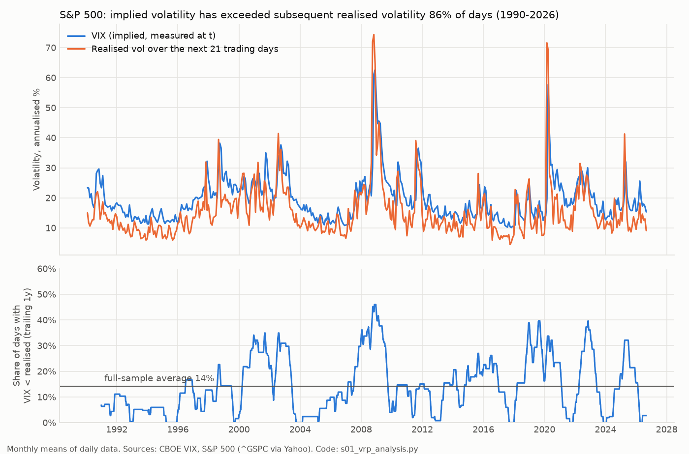
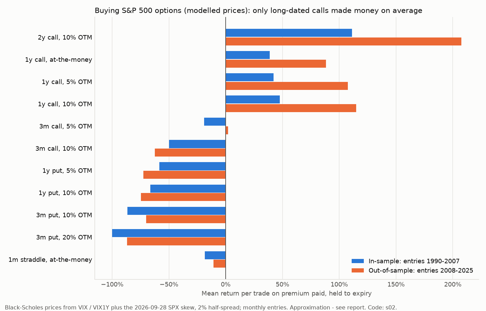
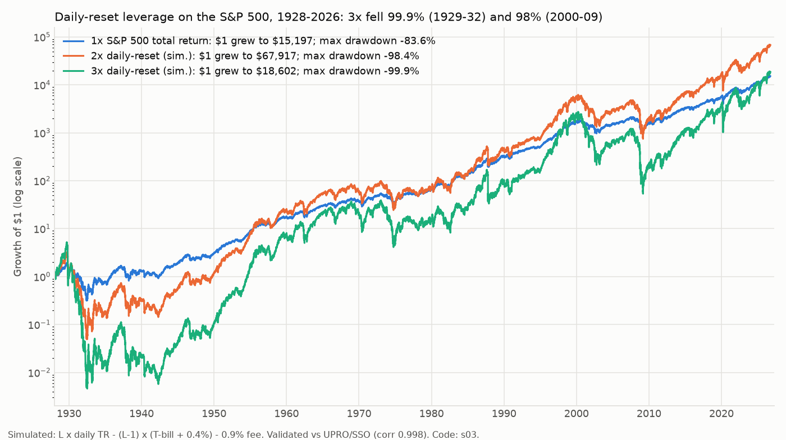

# 04: Derivatives, leverage and convexity. When is buying asymmetry positive expected value?

*Track 04 research report. Market data runs through 2026-09-25, and the live option-chain snapshot was taken at the 2026-09-28 close. Code and every table are in `research/code/04-derivatives/` and can be re-run with `python run_all.py`. All returns are in USD, before tax, and include the modelled transaction costs stated in each section.*

---

## TL;DR

1. **Options are overpriced insurance on average. On the index the premium is large, persistent and almost never negative.** From 1990 to 2026, the VIX exceeded the S&P 500's realised volatility over the following 21 trading days on **86% of days**. The mean gap was **+4.1 vol points** (median +4.7). A buyer of 1-month variance lost **28% of notional on average** (median −47%). The literature agrees and has been replicated many times (Coval & Shumway 2001; Bakshi & Kapadia 2003; Carr & Wu 2009; Bondarenko 2014).
2. **No simple observable condition reliably makes index options cheap.** The best screens raise the chance that implied vol ends below realised from 14% to roughly 23–41%: deep VIX backwardation (VIX/VIX3M > 1.1), widening credit spreads, or SPX below its 200-day average with VIX below trailing realised vol. Even so, the average premium stays positive in every bucket except extreme backwardation, which covered only 133 days concentrated in 2008 and 2020. A logistic model fitted on 1990–2007 scored an **out-of-sample AUC of 0.54** on 2008–2026 (0.5 is a coin flip). **A low VIX does not mean cheap options.** In the bottom decile of VIX, implied still beat realised 88% of the time.
3. **Puts and short-dated OTM options are negative EV in every test.** Bought unconditionally, modelled SPX puts (1y 5–10% OTM, 3m 10–20% OTM) and 3-month 10% OTM calls lost **50–100% of premium per trade on average** in both the 1990–2007 and 2008–2025 halves (base pricing). No complacency, trend or credit condition made puts profitable. The best, downtrend-filtered puts, still lost about 5–8%. The CBOE PPUT index, which uses real prices (S&P plus monthly 5% OTM puts), trailed the S&P total return by **3.5% a year from 1988 to 2026** and beat it in only **5 of 38 calendar years**.
4. **The only robust positive-EV convex trade on the index is long-dated calls (1–2 years, at-the-money to 20% OTM).** Examples: 1y ATM calls averaged **+39% per trade in-sample and +88% out-of-sample**, and 2y 10% OTM calls averaged +111% and +207%. The result is positive under all three pricing assumptions, and the IV would have had to be **6–17 vol points higher** to erase it. **But the delta-hedged P&L is negative** (−12% to −27% of premium), so the profit comes from the equity risk premium, not from mispriced options. LEAPS are equity beta with a floor under the loss, not free convexity.
5. **Buy time, not strikes.** The variance premium is a similar fraction of the price at every tenor (a 1-year variance swap lost 21–34% to the buyer). Rolling 1-month options therefore bleeds roughly √12 ≈ 3.5× more premium per year than holding a 1-year option. Rolling 1-month ATM straddles cost about 6–7% of spot a year, against about 1–2% for 1-year options.
6. **Leveraged ETFs are path-dependent beta, not magic.** TQQQ returned +43% a year (2010–26) and UPRO +33% a year, but with drawdowns of −82% and −77%, in one of the best equity windows on record. TQQQ beat 3× QQQ's return in only **34% of rolling 1-year windows**. A validated 1928–2026 simulation (correlation 0.998 with UPRO) gives **3× S&P a 10.5% CAGR against 10.2% for 1×**, with a **−99.9%** drawdown (1929–32) and −98% (2000–09). The Gayed–Bilello 200-day-moving-average rule helped in-sample but **lagged buy-and-hold after publication** (2016–26, 3×: 23.6% versus 30.1% CAGR), though with a smaller drawdown.
7. **Vol products and high leverage destroy capital.** VIXY returned **−67% a year** (log) since 2011 while the VIX itself was flat, and was positive in only 10% of 12-month windows. Short-vol products blew up: SVXY fell 88% in two days in February 2018 and XIV was terminated. BTC at **10× long was liquidated within 30 days 43% of the time**, and at 100× within one day 73% of the time. EUR/USD at 50:1 hit a 50% margin close-out within a month 58% of the time. These figures are lower bounds from daily bars.
8. **Frictions are small only in the right products.** One-year 5–10% OTM SPX and SPY options quote **0.2–0.5% of premium wide**. QQQ and IWM LEAPS quoted 4–14%, and short-dated far-OTM options 20–100% (snapshot taken after the close). SPX box spreads lend and borrow at **about 4.8–5.3%**, close to Treasuries, far below retail margin rates.
9. **Design implication.** Express most views with spot, futures or box-financed leverage, or with 1–2y calls and call spreads on liquid indices. Buy puts or volatility only as a budgeted, explicitly negative-EV hedge, or when a measured IV-versus-forecast edge exceeds costs. Treat LETFs as tactical tools with hard exits. Never sell naked tails. The objective is expected log growth, not the maximum single-trade multiple: over 36 years the best index-option trades returned only **6–20×**.

---

## Contents

1. [Question, data and method](#1-question-data-and-method)
2. [What the literature says](#2-what-the-literature-says)
3. [Empirical check 1: is S&P 500 implied volatility ever cheap?](#3-empirical-check-1-is-sp-500-implied-volatility-ever-cheap)
4. [Empirical check 2: synthetic Black-Scholes-priced option strategies](#4-empirical-check-2-synthetic-black-scholes-priced-option-strategies)
5. [Cross-checks with real prices: CBOE indices and tail-hedge funds](#5-cross-checks-with-real-prices-cboe-strategy-indices-and-tail-hedge-funds)
6. [When has buying convexity been positive EV?](#6-when-has-buying-convexity-been-positive-ev-synthesis)
7. [Instrument-by-instrument assessment](#7-instrument-by-instrument-assessment)
8. [Retail execution costs, access and jurisdiction](#8-retail-execution-costs-access-and-jurisdiction)
9. [Implications for the system design](#9-implications-for-the-system-design)
- [Appendix A: sources and verification status](#appendix-a-sources-and-verification-status)
- [Appendix B: reproducibility](#appendix-b-reproducibility)
- [Appendix C: limitations](#appendix-c-limitations)

---

## 1. Question, data and method

**Question.** Which leveraged or convex instruments can give a retail investor payoffs of 3× to 100× with *positive* expected value? Under what conditions, and at what cost? How should a "few trades, maximum % return" recommendation engine choose between spot, leverage, options and spreads?

**Approach.**
- A literature review of option returns, the variance risk premium, leverage and retail outcomes (§2).
- Two pre-specified empirical checks:
  - VIX against subsequent realised volatility, 1990–2026 (§3).
  - A Black-Scholes-priced synthetic back-test of buying SPX options under simple conditions, with an in-sample/out-of-sample split (§4).
- Cross-checks against indices built from **real** traded option prices (CBOE PPUT, VXTH, PUT, BXM, CLL; §5).
- Instrument-level data work (§7):
  - Leveraged ETFs, both their actual history and a 1928–2026 simulation.
  - VIX exchange-traded products (ETPs).
  - BTC and FX liquidation statistics.
  - Box-spread rates and the cost of LEAPS used as stock replacement.
  - A live option-chain snapshot of spreads and skew.

**Data** (all public):

| Series | Source | Coverage used |
|---|---|---|
| S&P 500 price (^GSPC), total return (^SP500TR), Nasdaq-100 (^NDX) | Yahoo via yfinance | 1928–2026, 1988–2026, 1985–2026 |
| VIX, VIX9D, VIX3M, VIX6M, VIX1Y, VVIX, SKEW | CBOE CSVs, plus ^VIX3M from Yahoo (from 2006-07) | 1990–2026 (VIX), 2007+ (VIX1Y) |
| CBOE PPUT, VXTH, PUT, BXM, CLL strategy indices | CBOE CSVs | 1986/1991/2002/2006/2008 to 2026 |
| T-bills (DTB3, TB3MS, NBER M1329A), 1y Treasury (DGS1), Moody's Baa−10y (BAA10Y) | FRED | 1920–2026 |
| ICE BofA HY OAS (BAMLH0A0HYM2) | FRED | **FRED now serves only the last ~3 years (2023-09 onward)**, so Baa−10y is the long-history credit proxy |
| Shiller dividend yield | Yale (ie_data.xls) | 1871–2023 |
| LETFs, VIX ETPs, credit ETFs, BTC-USD, IBIT, option chains | Yahoo | Inception to 2026-09-25; chain snapshot 2026-09-28 |
| EUR/USD | FRED DEXUSEU. Yahoo EURUSD=X was rejected for bad 2008/2012 prints, such as a fake 16% "daily move". | 1999–2026 |
| BTC perpetual funding | Kraken Futures public API (returns only the last year) | 2025-09 to 2026-09 |

**Discipline against data-mining.**
- Conditions and exits were fixed before looking at results, and **every** combination is reported in the CSV outputs.
- The in-sample/out-of-sample split was chosen before running: entries **1990–2007 versus 2008–2025**.
- Overlapping trades are handled with Newey-West t-statistics.
- Out-of-sample is not the same as independent. 2008–2025 contains one of the strongest US equity runs on record, and the whole sample contains only about 5–6 independent crises. Every result below should be read with that in mind.

---

## 2. What the literature says

| Claim | Key evidence | Strength | Sources |
|---|---|---|---|
| Index options are overpriced on average (the variance risk premium, VRP) | Zero-beta ATM S&P straddles lost **about 3% per week**. Delta-hedged index options lose money, more so for OTM strikes. Synthetic variance swaps show a strongly negative variance risk premium on the S&P 500 and S&P 100. | **Strong.** Replicated across decades, markets and methods. | Coval & Shumway (2001) ✓; Bakshi & Kapadia (2003); Carr & Wu (2009) ✓ |
| OTM index **puts** are the most overpriced | Put returns sit far below the risk-free rate and are "too negative" for standard pricing models. Once crash, volatility-jump and liquidity factors are priced, short-dated OTM put alphas become insignificant. The puts are expensive *because* they hedge crash states, and that is still a cost to the buyer. Average returns are very noisy in short samples. | Strong on sign; magnitude is sample-dependent. | Bondarenko (2014); Constantinides, Jackwerth & Savov (2013) ✓; Broadie, Chernov & Johannes (2009) |
| Investors overpay for **embedded leverage** (options, LETFs) | Long low-leverage / short high-leverage portfolios earn large abnormal returns: t = 8.6 for equity options and t = 2.5 for ETFs. | Strong | Frazzini & Pedersen (2012, NBER w18558) ✓ |
| Lottery-like payoffs are the worst buys | Equity options with high expected skewness earn large negative average returns. Across asset classes, selling insurance and lottery tickets has been rewarded. | Strong | Boyer & Vorkink (2014); Ilmanen (2012) |
| The VRP is concentrated at **short** maturities | Investors pay a large premium for exposure to near-term realised variance and roughly zero for news about variance further out, so forward variance claims beyond about 1–2 months are close to fairly priced. | Moderate to strong (one main study plus consistent term-structure work) | Dew-Becker, Giglio, Le & Rodriguez (2017) |
| **Low VIX does not mean cheap protection** | Implied vol is low when realised vol is low, so the premium stays and protection remains expensive relative to what it pays. Protective puts have delivered poor risk-adjusted outcomes compared with simply holding less equity. | Moderate to strong | Israelov & Nielsen (2015); Israelov (2019, "Pathetic Protection") |
| Cheap vol exists in the **cross-section** of single stocks | Stocks where historical vol is well above implied vol (IV cheap) earned large long-straddle and delta-hedged returns, and the reverse held for rich IV. Delta-hedged returns are lower for high idiosyncratic-vol stocks. Profits are large before costs, but single-stock option spreads are wide. | Moderate (strong in-sample; cost-sensitive) | Goyal & Saretto (2009); Cao & Han (2013) |
| Event vol: IV **runs up** before earnings | Straddles bought a few days before earnings and sold *before* the announcement earned positive returns. Holding through the announcement did not (IV crush). Implied earnings moves carry information. | Moderate | Gao, Xing & Zhang (2018); Dubinsky, Johannes, Kaeck & Seeger (2019) |
| **Retail** option buyers lose | Retail flow is concentrated in short-dated, cheap OTM options and loses in aggregate. Retail buying before earnings overpays for vol and spreads, and losses are largest where IV is highest. 0DTE retail flow also loses, mostly to spreads. Traders who time their executions pay lower effective spreads. | Strong on sign | Bryzgalova, Pavlova & Sikorskaya (2023); de Silva, Smith & So (WP); Beckmeyer, Branger & Gayda (WP, 2023); Muravyev & Pearson (2020) |
| LETFs are path-dependent (volatility drag) | Over a horizon, log return ≈ L·(index log return) − ½(L²−L)·σ²·t − costs. | Exact mathematics, empirically confirmed | Cheng & Madhavan (2009); Avellaneda & Zhang (2010) |
| Trend-filtered leverage | Holding 2×/3× S&P only above the 200-day moving average (T-bills otherwise) improved return and drawdown, 1928–2015. | Moderate. In-sample; **lagged buy-and-hold after publication** (§7.3). | Gayed & Bilello (2016) |
| Leverage caps help retail | The 2010 US 50:1 forex cap reduced trading and losses. In the EU, 74–89% of retail CFD accounts lose money (disclosures required by ESMA). | Strong | Heimer & Simsek (2019); ESMA product intervention (2018) |
| Deep-OTM puts as a credit-protection proxy | Deep-OTM American equity puts behave like a default claim, so they approximate credit protection. | Moderate | Carr & Wu (2011) |

✓ means the abstract was re-read during this session. Other rows are well-known results cited from memory; see Appendix A for full citations and the verification caveat. I did not re-verify the exact magnitudes in Bondarenko (2014), Goyal & Saretto (2009), Gao, Xing & Zhang (2018) and the retail papers, so the table gives direction and approximate size only. The system should re-verify before quoting their numbers to the user.

---

## 3. Empirical check 1: is S&P 500 implied volatility ever cheap?

**Definitions.**
- Forward realised vol: RV_fwd(h) = 100·√(252/h · Σ r²) over the next h trading days, using daily log close-to-close returns.
- VRP = VIX_t − RV_fwd(21).
- A negative VRP means implied ended below realised, so a buyer of 1-month variance would have profited.
- Code: `s01_vrp_analysis.py`. Outputs: `output/vrp_*.csv`.

### 3.1 Headline

| Period | Days | Mean VIX | Mean fwd RV | Mean VRP (vol pts) | Median VRP | Share of days implied < realised | Variance-swap buyer mean return | Mean VRP when negative |
|---|---|---|---|---|---|---|---|---|
| **1990–2026** | 9,226 | 19.4 | 15.3 | **+4.1** | +4.7 | **14.1%** | **−28.5%** | −6.5 |
| 1990–1999 | 2,524 | 18.5 | 13.0 | +5.4 | +5.5 | 7.5% | −46.4% | −3.5 |
| 2000–2009 | 2,515 | 22.1 | 18.8 | +3.4 | +4.0 | 18.5% | −23.1% | −6.5 |
| 2010–2019 | 2,516 | 16.9 | 13.2 | +3.7 | +4.5 | 15.7% | −27.6% | −5.6 |
| 2020–2026 | 1,671 | 20.8 | 16.9 | +3.8 | +4.8 | 15.1% | −11.2% | −10.0 |

- Realised vol exceeded the VIX by more than 10 points on **2.5%** of days. Those are the crash onsets that make option buyers rich.
- The premium is positive in every decade.
- The 2020s show a smaller variance-swap loss because of 2020 and 2025: those rare episodes carry the whole payoff to buyers.

### 3.2 Which conditions predict "cheap" options (negative VRP)?

Selected rows. The full tables are `output/vrp_bucket_*.csv`.

| Condition at t | Days | P(implied < realised) | Mean VRP | Median VRP |
|---|---|---|---|---|
| All days | 9,226 | 14.1% | +4.1 | +4.7 |
| VIX ≤ 12 | 809 | 10.9% | +2.5 | +3.1 |
| VIX in bottom 10% of trailing year | 1,687 | 11.6% | +3.5 | +3.8 |
| VIX > 40 | 207 | 21.7% | +5.8 | +8.6 |
| VIX/VIX3M ≤ 0.85 (steep contango, "complacent") | 1,240 | 15.6% | +3.3 | +4.0 |
| VIX/VIX3M 1.0–1.1 (backwardation) | 421 | 17.1% | +5.3 | +6.2 |
| **VIX/VIX3M > 1.1 (deep backwardation)** | **133** | **41.4%** | **−6.7** | **+3.5** |
| VIX9D/VIX > 1.1 | 226 | 27.0% | +1.2 | +5.4 |
| SPX > 10% below its 200-day average | 466 | 24.7% | +4.0 | +5.8 |
| SPX 21-day return < −10% | 189 | 30.2% | +2.6 | +4.7 |
| VIX below trailing 21-day RV | 1,036 | 18.5% | +3.7 | +5.3 |
| SPX < 200-day average **and** VIX < trailing RV | 547 | 23.2% | +3.5 | +6.2 |
| Baa−10y spread up > 25 bp over 21 days | 527 | 24.3% | +3.5 | +6.2 |
| Baa−10y spread down > 20 bp over 21 days | 771 | 9.7% | +6.0 | +6.1 |
| VVIX > 125 | 196 | 6.1% | +8.3 | +10.0 |
| HY OAS < 3% (2023–26 only) | 347 | 12.1% | +4.5 | +5.0 |

**Interpretation.**
- Every stress indicator (backwardation, drawdown, widening spreads, realised vol above implied) raises the chance that implied vol ends up too low. That makes sense: crashes cluster.
- In every bucket except deep backwardation, the **mean** premium stays positive, and even there the **median** is positive.
- Only the tail pays. A buyer who follows stress signals collects a few large wins and many small losses.
- "Complacency" signals (low VIX, steep contango, tight credit) do **not** predict cheap options. They predict a *smaller* premium in vol points but a *larger* one as a fraction of variance: 30–35% versus 28% on average.

### 3.3 Regression and out-of-sample test

- **OLS of VRP on the features**, full sample with Newey-West errors (25 lags). Only three terms matter:
  - log VIX: +5.5, t = 5.6. The premium grows with the vol level.
  - 21-day return: +13.6, t = 2.2. The premium shrinks after sell-offs.
  - Change in Baa spread: −3.1, t = −1.9.
  - VIX percentile, trend, VIX minus trailing RV, and the spread level are all insignificant.
- **Logistic model of P(implied < realised).** It had an in-sample AUC of 0.68 (1990–2007) but **0.54 out-of-sample (2008–2026)**. Adding the VIX/VIX3M term structure (fitted 2006–2015, tested 2016–2026) scored 0.62 in-sample and **0.55** out-of-sample.
  - In the out-of-sample top decile of predicted probability, implied ended below realised on only 22% of days, and the mean VRP was still **+1.9 vol points**.
  - Only on 95 out-of-sample days (about 2% of days, all in crisis clusters) did the model exceed 50%. On those days the mean VRP was −1.3.

**Conclusion for index options:** timing volatility purchases with observable signals is not reliably positive EV. The best a system can realistically do is identify the rare crisis-onset states, where buying is roughly break-even with a fat right tail.

### 3.4 Is the premium smaller per unit of time for longer-dated options?

The comparison below matches each implied-vol index to realised vol over its own horizon. VIX-style indices are variance-swap rates, so they include the skew premium.

| Horizon (common sample 2011–2026) | Mean implied | Mean realised | Implied − realised (pts) | Variance-swap buyer return | P(implied < realised) |
|---|---|---|---|---|---|
| 9 days (VIX9D) | 17.5 | 13.8 | +3.6 | −28.5% | 17.6% |
| 30 days (VIX) | 18.2 | 14.6 | +3.6 | −20.1% | 15.6% |
| 3 months (VIX3M) | 20.1 | 15.2 | +4.9 | −21.2% | 13.8% |
| 6 months (VIX6M) | 21.5 | 15.7 | +5.8 | −28.5% | 14.7% |
| 1 year (VIX1Y) | 22.6 | 16.1 | +6.5 | −34.2% | 10.0% |
| 1 year, 2007–2026 (includes 2008) | 23.6 | 18.1 | +5.5 | −20.7% | 16.9% |

**Reading.**
- *Per contract*, long-dated options are **not** cheaper. The buyer loses a similar 20–34% of the variance notional at every tenor.
- *Per unit of time*, they are much cheaper. For an ATM option the VRP loss is roughly vega × (IV − RV). Vega scales with √T and the premium also scales with √T, so the loss is about the same fraction (≈ (IV−RV)/IV) of each option's premium.
- Rolling 1-month options pays that fraction 12 times a year, on premiums each worth 1/√12 of a 1-year option. The annual bleed is therefore about 12/√12 ≈ **3.5×** larger.
- The trade data agree. Rolled monthly, 1-month ATM straddles lost 11–18% of premium **per month** (§4.5), about 6–7% of spot a year. The delta-hedged loss on 1-year ATM calls was about 12% of premium **per year** (§4.2), about 1% of spot a year.
- This matches Dew-Becker et al. (2017): the premium is concentrated at the front of the curve.

---

## 4. Empirical check 2: synthetic Black-Scholes-priced option strategies

> **This is an approximation.** No free historical option-price database was available, so prices are modelled, not observed. Every result is also shown as a **break-even IV markup**: how many vol points the entry IV could rise before the average trade stops making money. Treat the conclusions as directional. The real-price CBOE indices in §5 check the direction.

### 4.1 Method (`s02_synthetic_options_backtest.py`)

- **Implied vol model.**
  - 1-month ATM IV = a1m × VIX.
  - 1-year ATM IV = a1y × VIX1Y. VIX1Y exists only from 2007. Earlier values come from a regression of log VIX1Y on log VIX and the log of VIX's 1-year mean (R² = 0.89, fitted 2007–2026).
  - Tenors in between are interpolated in total variance. Beyond 1 year, the snapshot's term slope is applied.
- **Skew.** The shape comes from the **real 2026-09-28 SPX surface**, taken from the live chain in `s06`. On the 1-year expiry the 90% put carried 1.21× the ATM vol, the 110% call 0.86× and the 80% put 1.45×. The shape was applied proportionally, in vol points, or as the average of the two.
- **Calibration from the snapshot:**
  - a1m = 0.80 (ATM 30-day 12.8% with VIX 16.05)
  - a1y = 0.74 (ATM 1-year 16.1% with VIX1Y 21.64)
- **Three pricing variants:**

| Variant | a1m | a1y | Skew | Half-spread h |
|---|---|---|---|---|
| **base** | 0.88 | 0.80 | average | 2% of premium |
| **cheap** | 0.80 | 0.74 | proportional | 2% |
| **dear** | 0.95 | 0.85 | vol points | 5% |

- **Costs.** Premium paid = model mid × (1 + h). Early sales = mid × (1 − h). SPX options are European and cash-settled, so there is no cost at expiry. The snapshot shows real SPX 1y OTM spreads of only 0.2–0.5% of mid, so h = 2% is conservative.
- **Carry inputs.** Rates from the 3-month T-bill and 1-year Treasury. Dividend yield implied by ^SP500TR against ^GSPC.
- **Trades.** Entry at the close on the first trading day of each month, from 1990-01 to 2025-09 (about 430 entries per instrument). The main exit is hold to expiry. Two alternatives were tested: take profit at 3× cost, and sell at half the tenor.
- **Delta-hedged P&L.** Also computed Bakshi-Kapadia style: daily model-delta hedge, financing and dividends. This separates the volatility premium from the equity drift.

### 4.2 Unconditional results (bought every month, held to expiry)

Mean return per trade on premium paid:

| Instrument | Mean premium (% spot) | Mean IS (base / cheap / dear) | Mean OOS (base / cheap / dear) | Median IS / OOS (base) | Hit IS / OOS | Break-even IV markup (all periods) | Delta-hedged P&L, % of premium (all, t) |
|---|---|---|---|---|---|---|---|
| **1y call ATM** | 7.9% | +39 / +47 / +28% | +88 / +104 / +71% | +16 / +87% | 56 / 70% | **+12.3 pts** | −12% (−3.1) |
| **1y call 5% OTM** | 5.3% | +42 / +55 / +28% | +108 / +134 / +82% | −19 / +76% | 45 / 66% | +9.2 | −18% (−2.9) |
| **1y call 10% OTM** | 3.3% | +48 / +68 / +28% | +115 / +156 / +78% | −100 / +16% | 38 / 54% | +6.4 | −27% (−2.7) |
| **2y call 10% OTM** | 7.0% | +111 / +132 / +89% | +207 / +253 / +165% | +22 / +173% | 54 / 72% | **+17.3** | −15% (−1.3) |
| **2y call 20% OTM** | 3.9% | +167 / +209 / +128% | +252 / +334 / +182% | −100 / +42% | 38 / 52% | +12.2 | −22% (−1.1) |
| 3m call 5% OTM | 1.5% | −19 / −3 / −33% | +2 / +25 / −17% | −100 / −100% | 24 / 33% | −0.7 | −39% (−8.4) |
| **3m call 10% OTM** | 0.5% | **−50 / −28 / −64%** | **−62 / −45 / −73%** | −100 / −100% | 8 / 8% | −3.1 | −66% (−6.3) |
| **1y put 5% OTM** | 5.4% | **−58 / −54 / −62%** | **−72 / −70 / −75%** | −100 / −100% | 14 / 7% | **−9.0** | −12% (−2.0) |
| 1y put 10% OTM | 4.2% | −66 / −63 / −69% | −75 / −72 / −77% | −100 / −100% | 12 / 6% | −9.5 | −15% (−1.8) |
| 3m put 10% OTM | 1.5% | −87 / −86 / −87% | −70 / −65 / −73% | −100 / −100% | 5 / 4% | −8.3 | −41% (−8.1) |
| 3m put 20% OTM | 0.8% | −100 / −100 / −100% | −87 / −85 / −86% | −100 / −100% | 0 / 2% | −11.4 | −55% (−6.3) |

IS = in-sample (1990–2007 entries); OOS = out-of-sample (2008–2025 entries).

**What the table says.**

1. **Long-dated index calls were positive EV in both halves and under every pricing variant.** The break-even markups of 6–17 vol points are far larger than any plausible pricing error.
2. **But the options were not cheap.** Delta-hedged P&L is negative everywhere. The profit is the equity risk premium, earned through a leveraged, loss-capped position.
   - Full-sample Newey-West t-statistics on the unhedged means are 2.5–3.6. The in-sample halves alone are only 1.0–1.6.
   - With about 36 independent one-year periods, this is **evidence that the equity drift was strong, not that calls were mispriced**.
3. **Short-dated OTM calls, the retail "lottery ticket", lose about 30–70% per trade** (−50% to −62% under base pricing), with 8% hit rates.
4. **Puts lose everywhere.** Pricing them fairly for a buyer would require IVs **8–11 vol points lower** than the model's. That is the skew premium.
5. **Payoff multiples** (`output/best_multiples.csv`):

| Instrument | Best trade | 99th percentile |
|---|---|---|
| 1y ATM call | ×6.0 (bought April 2020) | ×4.7 |
| 1y 10% OTM call | ×9.8 | ×9.2 |
| 2y 20% OTM call | ×19.8 (bought November 2019) | ×18.5 |
| 3m 10% OTM call | ×19.3 (1997) | ×9.9 |
| 3m 20% OTM put | ×14.9 (September 2008) | Total loss (−100%) |
| 3m 10% OTM put | ×17.2 (January 2020) | ×4.2 |

   **Over 36 years of index options, 20× was about the ceiling. 100× payoffs require single names or crypto, where average returns are the most negative (Boyer & Vorkink 2014).**

### 4.3 Do conditions X help? (base pricing, hold to expiry, mean return per trade)

| Condition at entry | 1y ATM call IS / OOS | 1y 10% OTM call IS / OOS | 2y 10% OTM call IS / OOS | 1y 5% OTM put IS / OOS | n (IS / OOS) |
|---|---|---|---|---|---|
| Always | +39 / +88% | +48 / +115% | +111 / +207% | −58 / −72% | 216 / 213 |
| VIX in bottom 20% of year ("cheap") | +17 / +97% | −7 / +126% | +82 / +230% | −52 / −88% | 58 / 54 |
| VIX < 15 | +60 / +98% | +82 / +130% | +212 / +282% | n/a | 72 / 65 |
| SPX > 200-day average | +47 / +91% | +57 / +119% | +131 / +211% | n/a | 165 / 164 |
| **SPX < 200-day average & VIX > 25** (buy after a crash) | **+41 / +107%** | **+56 / +134%** | +44 / +206% | n/a | 24 / 26 |
| VIX < trailing 21-day RV | −22 / +122% | −6 / +179% | −1 / +260% | +33 / −55% | 17 / 30 |
| VIX/VIX3M > 1 (2006+) | n/a / +114% | n/a / +144% | n/a / +174% | n/a | 5 / 24 |
| VIX < 13 & SPX > 200-day average ("complacency") | n/a | n/a | n/a | **−96 / −98%** | 42 / 26 |
| SPX < 200-day average (for puts) | n/a | n/a | n/a | −8 / −5% | 51 / 49 |
| Baa spread up > 10 bp over 21 days | n/a | n/a | n/a | −30 / −41% | 38 / 45 |
| VIX/VIX3M < 0.85 (for puts, 2006+) | n/a | n/a | n/a | n/a / −85% | 0 / 50 |

- **The "cheap VIX" condition did not help.** For OTM calls it was worse in-sample. This is consistent with §3 and with Israelov & Nielsen (2015).
- **Buying calls after crashes** (SPX below its 200-day average with VIX above 25) was positive in both halves.
  - The samples are small and clustered: roughly 2–4 episodes per half.
  - Delta-hedged P&L stayed clearly negative (−16% to −35% of premium) because IV is high after crashes.
  - The edge is the post-crash equity premium. **Stock, futures or call spreads capture it more cheaply than outright calls** (§4.7).
- **"VIX below trailing realised"** flipped sign between the halves, a classic in-sample/out-of-sample failure.
- **Complacency puts lost almost 100%.** The best put condition (downtrend) was roughly break-even: −5% to −8% per trade.

### 4.4 Exit rules Y (base, all periods)

| Instrument | Hold to expiry: mean / median / hit | Take profit at 3×: mean / median / hit | Sell at half tenor: mean / median / hit | Kelly growth per trade (hold vs 3×) |
|---|---|---|---|---|
| 1y ATM call | +63% / +55% / 63% | +56% / +58% / 64% | +24% / +18% / 60% | 0.137 vs 0.125 |
| 1y 10% OTM call | +81% / −38% / 46% | +47% / +10% / 51% | +36% / +5% / 52% | 0.082 vs 0.058 |
| 2y 10% OTM call | +158% / +73% / 62% | +83% / +134% / 66% | +58% / +34% / 62% | 0.293 vs 0.200 |
| 3m 10% OTM call | −56% / −100% / 8% | −30% / −100% / 21% | −12% / −62% / 27% | negative in all cases |
| 3m 20% OTM put | −94% / −100% / 1% | −68% / −100% / 8% | −43% / −66% / 10% | negative in all cases |

- For positive-EV LEAPS, **holding beats taking profits early**. The right tail drives both the mean and the growth rate. Take-profit rules raise the median and hit rate but lower expected growth.
- For negative-EV options, early monetisation *reduces* losses: the logic behind tail-hedge funds' "monetise into the spike". It does not make them profitable.

### 4.5 One-month ATM straddles under VRP screens (daily entries, 1% half-spread)

| Pricing | Screen | IS 1990–2007 mean (t) | OOS 2008–2026 mean (t) |
|---|---|---|---|
| ATM = 0.88 × VIX | All days | −18% (−6.6) | −11% (−3.2) |
| | VIX bottom 10% | −23% | −16% |
| | VIX < trailing RV | −16% | −4% |
| | SPX < 200-day average & VIX < trailing RV | −7% | −3% |
| | VIX/VIX3M > 1.1 | n/a | +14% (t = 0.6, 118 clustered days) |
| ATM = 0.80 × VIX (the cheapest assumption) | All days | −10% (−3.2) | −1% (−0.4) |
| ATM = VIX | All days | −28% | −21% |

Short-dated straddles lose under realistic pricing. No screen produces a statistically reliable profit.

### 4.6 Portfolio level: does convexity beat plain leverage?

Monthly purchases, each costing f% of equity (about 12 overlapping positions), with the rest in T-bills. Base pricing, positions marked to model.

| Strategy, 1990–2025 | CAGR | Max drawdown | Vol | Comparator |
|---|---|---|---|---|
| S&P 500 TR 1× | 10.7% | −55% | 18% | n/a |
| S&P 1.5× daily (T-bill + 0.4% financing) | 13.3% | −73% | 27% | n/a |
| S&P 2× daily | 14.0% | −88% | 36% | n/a |
| S&P 3× daily | 14.5% | −98% | 54% | n/a |
| 1y ATM calls, f = 2% per month | 13.3% | **−58%** | 25% | Same CAGR as 1.5× with a smaller drawdown |
| 1y 5% OTM calls, f = 1% / 2% / **5%** | 9.5% / 13.6% / 12.2% | −33% / −65% / **−99%** | 16% / 30% / 72% | Over-betting ruins |
| 3m 10% OTM calls, f = 2% | **−11.5%** | −99% | 18% | n/a |
| 1y 10% OTM puts, f = 1% | −6.5% | −92% | 12% | n/a |

"Few trades" variant: **one 1-year call each January** (36 trades), f% of equity, the rest in 1-year T-bills (`one_trade_per_year.csv`):

| Call | f = 10% | f = 20% | f = 30% | f = 50% | Per-trade mean / median / hit |
|---|---|---|---|---|---|
| ATM | 8.6% (DD −17%) | 12.5% (−42%) | 15.1% (−61%) | 15.7% (−88%) | +67% / +73% / 64% |
| 5% OTM | 9.9% (−17%) | 14.4% (−48%) | 16.9% (−72%) | 16.1% (−95%) | +87% / +66% / 58% |
| 10% OTM | 10.7% (−31%) | 14.9% (−70%) | 16.4% (−89%) | 12.6% (−99%) | +105% / −13% / 47% |

The S&P 500 total return over the same span was 10.8% a year. Growth peaks around 30% of equity per trade (30–50% for ATM), which is about the full-Kelly level. That estimate is in-sample on a strong US equity window, so the system should use **at most a quarter to half of Kelly**. Drawdowns above 40% are otherwise near-certain.

### 4.7 Spreads and risk reversals (base, legs from the same dates)

| Structure (1y, hold to expiry) | Mean IS / OOS | Median | Hit | Max multiple | Debit (% spot) |
|---|---|---|---|---|---|
| Call spread 100/110 | +30% / +67% | +84% | 73% | ×3.1 | 4.8% |
| Call spread 105/110 | +28% / +84% | +97% | 66% | ×4.5 | 2.1% |
| Put spread 95/90 | −37% / −69% | −100% | 14% | ×5.3 | 1.4% |
| Risk reversal: short 90% put, long 110% call (P&L as % of spot, needs margin) | +3.8% / +6.8% of spot | +2.7% | 82% | Worst −36% of spot (2008) | n/a |

- Call spreads trade mean for **higher median and hit rate** and less vega. They suit high-IV entries such as post-crash buying.
- Put spreads cut the loss on hedges but remain negative EV.
- Risk reversals harvest the put-skew premium but are **short the crash tail**. That is levered equity, not convexity, and it is out of scope for a no-ruin mandate.

### 4.8 IV-versus-forecast screen

The screen compares 1y ATM IV with a heterogeneous-autoregressive (HAR)-style forecast: the mean of 21-, 63- and 252-day realised vol. Results are split into terciles of IV minus forecast (`iv_vs_forecast_terciles.csv`).

- **Delta-hedged P&L of 1y ATM calls** was consistently less negative in the "IV cheap" tercile:
  - In-sample −15% versus −20% in the rich tercile.
  - Out-of-sample −3% versus −7%.
  - All periods −6% versus −15%.
- **Unhedged returns** were **not** consistently better (in-sample −13% versus +86%), because rich-IV dates are post-crash dates with high subsequent equity returns.
- **Lesson.** The IV check decides *which vehicle* to use (option or stock), not *whether* to be long. On the index, 1-month implied vol was below this forecast on only **12% of days**.

---

## 5. Cross-checks with real prices: CBOE strategy indices and tail-hedge funds

### 5.1 CBOE indices built from traded option prices (`s04_cboe_strategy_indices.py`)

| Index (strategy) | Period | CAGR | S&P TR CAGR | Gap/yr | Vol | Sharpe (S&P TR) | Max DD (S&P TR) |
|---|---|---|---|---|---|---|---|
| **PPUT**: S&P + monthly 5% OTM puts | 1988–2026 | 8.0% | 11.5% | **−3.5%** | 11.9% | 0.46 (0.62) | −42% (−55%) |
| **VXTH**: S&P + 1-month 30-delta VIX calls | 2006–2026 | 9.9% | 11.2% | −1.3% | 17.2% | 0.53 (0.67) | −43% (−55%) |
| PUT: short ATM puts, cash-secured | 1991–2026 | 9.3% | 11.1% | −1.7% | 10.7% | 0.56 (0.66) | −37% (−55%) |
| BXM: buy-write | 2002–2026 | 6.2% | 10.1% | −3.9% | 10.7% | 0.46 (0.61) | −40% (−55%) |
| CLL: 95–110 collar | 2008–2026 | 7.0% | 12.6% | −5.7% | 12.3% | 0.49 (0.70) | −26% (−47%) |

| Crisis window | PPUT | VXTH | S&P TR |
|---|---|---|---|
| October 1987 (S&P price) | −12% | n/a | −23% |
| GFC, 2007-10 to 2009-03 | −42% | −43% | −55% |
| COVID, 2020-02-19 to 2020-03-23 | −12% | **+28%** | −34% |
| 2022 bear | −22% | −29% | −25% |
| Tariff shock, 2025-02-19 to 2025-04-08 | −11% | −10% | −19% |

- PPUT beat the S&P TR in only **13% of calendar years**: 2001, 2002, 2008, 2018 (barely) and 2020.
- VXTH beat it in 35% of years. Its whole long-run case rests on **2020 (+114% versus +18%)** and 2008.
- This is the real-price version of §4: **continuous tail hedging costs 1.3–3.5% a year**. It pays in one or two years a decade, and the total cost-benefit depends on those few years.

### 5.2 Tail-hedge funds: claims and critiques

- **Universa** (Spitznagel, advised by Taleb). The following were reported by the WSJ and Bloomberg, summarised on Wikipedia and verified in this session:
  - More than 100% in 2008.
  - About 20% in August 2015.
  - **+3,612% in March 2020** on invested capital. Bloomberg Opinion noted the figure carries "an asterisk".
  - A WSJ report (2018) of a claim that a **3.3% Universa + 96.7% S&P 500** mix compounded at 12.3% a year for 10 years to February 2018.
  - CalPERS hired Universa in 2017 and ended the programme in early 2020, weeks before the crash, "citing cheaper and better alternatives".
- **How to read the claims.**
  - The 3,612% is the return on a small premium sleeve, not on a portfolio.
  - The figures are self-reported, unaudited in public and specific to their period.
  - The overlay claim depends on a window containing one or two crashes.
  - Transparent proxies (PPUT, VXTH, and our modelled deep-OTM puts, 3m 20% OTM at −87% to −100% per trade) show a steady drag in normal years.
  - AQR research argues protective puts have been a poor use of capital compared with simply holding less equity (Israelov & Nielsen 2015; Israelov 2019).
  - A counterpoint deserves a fair hearing. A *very* convex, cheaply bought hedge that is **actively monetised** in crashes can raise geometric returns at the portfolio level by allowing more equity exposure or rebalancing into the crash. This is Spitznagel's "cost-effective" argument. Our exit-rule results support one part of it: monetising early cut put losses from −94% to −43%. But it requires execution skill, a cheap source of convexity and patience, and the evidence is anecdotal and fund-specific.
- **Artemis Capital** (Chris Cole, "The Allegory of the Hawk and Serpent", 2020) proposes a "Dragon Portfolio". The weights are about 24% equity, 18% bonds, 19% gold, 18% commodity trend and 21% long volatility, from memory. Its 1928–2019 back-test shows better risk-adjusted growth. That is a **simulated** diversification argument: long vol alone is negative carry, and its value is as a portfolio component. It is not a recommendation to buy options as standalone trades.

**Verdict for the system.** Tail hedging is insurance with a negative expected return. Include it only as an explicitly budgeted cost (for example ≤ 1–2% of equity a year) when the user's portfolio needs crash protection. Never present it as a return-seeking recommendation.

---

## 6. When has buying convexity been positive EV? (synthesis)

| Situation | Why it can work | Evidence | Verdict for the engine |
|---|---|---|---|
| **Long-dated (1–2y) index calls, ATM to 20% OTM** | Equity premium × embedded leverage with a floor. The VRP bleed per year is small at long tenors. | §4: positive in both halves and all variants (break-even markups +6 to +17 pts). Delta-hedged P&L negative. | **Yes, as a way to hold beta.** Compare with futures or stock (§9 checklist). |
| Calls after crashes (SPX < 200-day average, VIX > 25) | Post-crash equity premium | §4.3: positive in both halves, small clustered samples, options expensive | Prefer stock/futures or **call spreads**. Outright calls only if the loss must be capped. |
| Single-stock options where IV is well below forecast vol | Cross-sectional mispricing of vol | Goyal & Saretto (2009); Cao & Han (2013). Before costs. | Only with a validated vol forecast and spreads ≤ 5%. Needs many small trades (a poor fit for "few trades"). |
| Pre-event IV run-up (buy 3–5 days before earnings, sell *before* the report) | IV rises into the event | Gao, Xing & Zhang (2018) | Small edge per trade, needs many trades and costs dominate. **Not** a fit. |
| Holding options through events, lottery OTM, 0DTE | None | Retail loses (Bryzgalova et al. 2023; de Silva et al.; Beckmeyer et al.) | **Never.** |
| Low VIX / steep contango before a regime shift | "Cheap insurance" intuition | §3 and §4: does not predict a negative VRP. Complacency puts −96% to −98%. | **No.** |
| Crisis-onset states (VIX/VIX3M > 1.1, spreads widening) | Vol clustering | §3: implied < realised 41% of the time, median VRP still positive. §4.5: not significant. | Only as short-dated hedges already in place, not new speculative buys. |
| Tail hedges (OTM puts, VIX calls) | Portfolio insurance | PPUT −3.5%/yr, VXTH −1.3%/yr, modelled puts −50% to −100% per trade | Budgeted cost only. |
| Commodities and crypto where **calls** carry the skew | Upside-crash assets (supply shocks, squeezes) | Snapshot: IBIT's smile is roughly symmetric with 37–50% IV. Oil vol (OVX) was 55 on 2026-09-25. | Do not assume equity-style "cheap calls". Check skew per asset. |

---

## 7. Instrument-by-instrument assessment

### 7.0 Summary table

| Instrument | Payoff | Realistic max multiple | Evidence on EV | Costs / frictions | Failure modes | Access (US retail) | Fit for "few trades, high %" |
|---|---|---|---|---|---|---|---|
| Long index calls, 1–2y (SPX/XSP/SPY) | Convex, loss limited to premium | ~5–20× | **Positive** (drift); VRP negative | 0.2–0.5% of premium (SPX/SPY); 60/40 tax on SPX | Theta if the thesis is late; long flat or down markets | Options approval, usually "Level 2" | **Good.** 1–12 trades a year. |
| Short-dated OTM options (< 3m) | Lottery | 10–100× (single names) | **Strongly negative** | 5–100% of premium far OTM | Decay; IV crush | Level 2 | **No** |
| Long puts / VIX calls | Crash convexity | 5–20× in crashes | Negative (−1.3 to −3.5%/yr as overlay) | High skew and vol-of-vol premium | Years of bleed | Level 2 | Hedge only |
| Debit spreads (call/put verticals) | Capped convex | 2–5× | Calls positive (median > outright); puts negative | Two spreads to cross | Capped upside | Usually Level 3 | Good for high-IV entries |
| Calendars/diagonals | Short front, long back vol | Low | Structural front-end VRP harvest; short gamma | 4 legs over time | Gap moves | Level 3 | Poor (many adjustments) |
| Deep-ITM LEAPS (stock replacement) | Near-linear, floored | ~Leverage 3–5× notional | Pays implied financing + embedded put | Embedded put about 1.3–2.9% of spot a year (1y, 78–91% strikes) | Large spreads on some expiries | Level 2 | OK as a leverage tool |
| Micro/E-mini futures | Linear | Notional 10–20× margin | Equal to the underlying's premium minus financing | Cheapest leverage (≈ T-bill + small basis); 60/40 tax | Margin calls; gaps; forced liquidation | Futures account | Good for leveraged beta |
| Portfolio margin | Linear, high leverage | Up to ~12× on broad indices | n/a (a funding tool) | Low rates at some brokers | Stress-based margin calls exactly when it hurts | $100k+ equity, broker approval | Tool only |
| Box spreads (borrowing) | Fixed-rate loan | n/a | Cheap financing (≈ Treasury + 0.3–0.8%) | 4 legs; SPX only | Early assignment if American-style (never use SPY) | Level 3 plus margin | Tool only |
| 2× LETFs | Daily 2× | Multi-year 5–20× in bull runs | ≈ 2× beta minus drag (½σ²·2) minus fees | ER ~0.9% plus swap financing | Vol decay; −98% drawdowns historically | Brokerage (not in EU) | Tactical |
| 3× LETFs | Daily 3× | 50–400× (TQQQ 2010–26) | Long-run ≈ 1× CAGR with −99.9% DD (1928–2026 sim) | Drag 3σ²/yr (12%/yr at σ = 20%) | Gap risk: −20% day costs −60% | Brokerage | Tactical with hard exits |
| Inverse LETFs | Daily −1×/−2×/−3× | Rare | Deeply negative long-run (SQQQ −53%/yr) | Drift plus drag | Nearly guaranteed decay | Brokerage | Days to weeks only |
| Long VIX ETPs (VIXY, VXX, UVXY) | Convex to vol spikes | 4–10× in weeks (2020) | −53% to −161%/yr (log) | Contango roll 5–10%/month | Near-certain decay | Brokerage | ≤ 1 month hedges only |
| Short VIX ETPs (SVXY) | Concave | n/a | Positive carry with ruin (−88% in 2 days) | n/a | XIV-style termination | Brokerage | **Never** |
| CDS | Credit protection | High | n/a | **Not retail-accessible** (ISDA; must be an eligible contract participant) | n/a | No | n/a |
| Credit proxies (short HYG/JNK, HYG puts) | Crash beta about 0.7× SPY | Low | Carry cost ≈ HY yield (~5–7%/yr) | Borrow fees | Squeeze | Brokerage | Poor |
| Crypto perpetuals | Linear, high leverage | 10–100× margin | Negative for retail at leverage > 3× (liquidations) | Funding 3–30%/yr to longs; fees | Liquidation cascades, auto-deleveraging (ADL), venue risk | US: CFTC venues only (verify) | **No** above 2× |
| Retail FX | Linear, 50:1 | High | Negative for retail (74–89% lose on CFDs) | Spreads, swaps | Margin close-outs | US: 50:1 majors (CFTC) | **No** |

### 7.1 Listed options: index versus single stock, SPX versus SPY

- **SPX and XSP** (1/10 size) are European and cash-settled. There is no early assignment, and they are **Section 1256 contracts**: 60% long-term / 40% short-term gains regardless of holding period, marked to market at year-end. They are the preferred vehicle for index views.
- **SPY and QQQ options** are American, deliver physically and are taxed as ordinary equity options.
- **Liquidity in the 2026-09-28 snapshot** (post-close quotes; see §8):
  - SPX and SPY 1y 5–10% OTM calls quote about 0.3–0.5% of mid.
  - QQQ 1y is 5–6%, IWM 1y 4–8%.
  - Single names: AAPL 1y 3–4%, NVDA 1.5–2%, TSLA 1–1.5%.
- **Skew on 1y SPX** is steep: 110% call 13.9%, ATM 16.1%, 90% put 19.6%, SKEW index 145. Index calls are the cheap wing in IV terms. That still does not make them positive EV on a delta-hedged basis.

### 7.2 LEAPS and deep-ITM "stock replacement"

- **Put-call parity:** deep-ITM call = underlying + put at the same strike − financed cash.
- The **time value of a deep-ITM call equals the price of the embedded put**. That put is bought at a high IV because of the skew.
- SPX snapshot (`spx_stock_replacement_20260928.csv`), about 1-year expiry:

| Strike | Call delta | Embedded put | Put IV | Notional leverage |
|---|---|---|---|---|
| 78% | ≈ 0.91 | 1.35% of spot/yr | 25% | ~3.4× |
| 85% | ≈ 0.85 | 1.97%/yr | 22.7% | ~4.1× |
| 91% | ≈ 0.78 | 2.9%/yr | 20.4% | ~5× |

- For the 2027-12 expiry (809 days), the embedded put costs 1.3–2.0% a year.
- **Implied financing** comes from the box rate, about 5.1% (§7.6).
- **Expected cost against futures.** Modelled 1y OTM puts lost ~60–75% of premium on average. The "insurance" part therefore costs roughly **1–2% of notional a year** more than futures or box financing, in exchange for a hard floor.
- **Reg T.** Options with more than 9 months to expiry can be bought on margin (up to 25% loan value). Shorter options must be paid in full.

### 7.3 Leveraged ETFs (`s03_letf_analysis.py`)

**Actual history** (adjusted prices to 2026-09-25):

| Fund (underlying) | Start | CAGR (underlying) | Total return (underlying; L × underlying) | Max DD (underlying) | Beats L × underlying return, share of 1y windows | Realised log gap vs L × log (theory drag) |
|---|---|---|---|---|---|---|
| **TQQQ** (3× QQQ) | 2010-02 | **43.2%** (19.6%) | +38,694% (+1,868%; +5,605%) | **−81.7%** (−35.1%) | 34% (3y: 54%) | −17.9%/yr (−12.8%) |
| QLD (2× QQQ) | 2006-06 | 25.4% (16.6%) | +9,768% | −83.1% | 29% | −8.1%/yr (−4.9%) |
| **UPRO** (3× SPY) | 2009-06 | **32.9%** (15.1%) | +13,395% (+1,037%) | **−76.8%** (−33.7%) | 26% (3y: 27%) | −13.8%/yr (−8.7%) |
| SSO (2× SPY) | 2006-06 | 15.8% (11.4%) | +1,852% | −84.7% | 21% | −7.0%/yr |
| SQQQ (−3× QQQ) | 2010-02 | **−52.9%** | −100% | −100% | n/a | n/a |
| SPXU (−3× SPY) | 2009-06 | −42.4% | −100% | −100% | n/a | n/a |

- Daily tracking is tight: daily betas were 2.96–2.99. The costs relative to L × the daily return run 3–6% a year (fees plus financing).
- **Sample bias.** 2009/2010–2026 is one of the best, lowest-vol bull markets in US history. The same products over 2000–2002 would have been wiped out: simulated 3× NDX fell **−99.9%** from March 2000 to October 2002 (`letf_ndx3x_sim.csv`).

**Long-run simulation, S&P 500 1928–2026.** Each day the fund returns L × the total return, minus (L−1) × (T-bill + 0.4%), minus a 0.9% fee. The simulation matched actual UPRO/SSO with correlation 0.998 and CAGR within 0.4–0.8% a year.

| Period | 1× TR CAGR (DD) | 2× CAGR (DD) | 3× CAGR (DD) |
|---|---|---|---|
| **1928–2026** | 10.2% (−84%) | 11.9% (−98%) | **10.5% (−99.9%)** |
| 1928–1949 | 5.3% | 0.8% | **−9.7%** ($1 → $0.11 after 22 years) |
| 1950–1979 | 10.7% | 14.6% | 18.0% |
| 1980–1999 | 17.8% | 24.7% | 29.3% |
| 2000–2012 | 1.7% | −4.6% | **−13.8%** |
| 2013–2026 | 15.1% | 24.9% | 32.8% |

| Crash episode | 1× | 2× | 3× |
|---|---|---|---|
| September 1929 to June 1932 | −83% | −98% | **−99.9%** |
| 19 October 1987 (one day) | −20.5% | −41% | **−61%** |
| March 2000 to October 2002 | −47% | −79% | −92% |
| October 2007 to March 2009 | −55% | −84% | −95% |
| February to March 2020 | −34% | −59% | −77% |

**When do 3× funds beat 3× the index over a year?** Only in two cases: strong, calm uptrends (index up more than 20–30% with realised vol below 16%), or in deep declines (index down more than 20%), where the fund loses *less* than 3× the drop because its exposure shrinks. Overall 24% of 1-year windows; median shortfall −9.5% (`letf_beats_3x_by_ret_vol.csv`). The drag of about ½(L²−L)σ² per year (3σ² for 3×) is:

| Realised vol σ | 3× drag per year |
|---|---|
| 15% | 7% |
| 20% | 12% |
| 30% | 27% |

**Gayed & Bilello (2016) 200-day moving-average rule.** Hold L× when the S&P closed above its 200-day average the day before, otherwise T-bills. Cost 0.05% per switch, about 6 switches a year.

| Variant | 1928–2015 (paper's sample) CAGR / DD | 2016–2026 (post-publication, out-of-sample) CAGR / DD |
|---|---|---|
| 1× buy-and-hold | 9.7% / −84% | 15.2% / −34% |
| 1× + 200-day rule | 10.0% / −48% | 10.8% / −19% |
| 2× buy-and-hold | 10.6% / −98% | 23.9% / −59% |
| 2× + 200-day rule | 14.5% / −77% | 17.4% / −36% |
| 3× buy-and-hold | 8.3% / −99.9% | 30.1% / −77% |
| **3× + 200-day rule** | 18.1% / **−92%** | 23.6% / −50% |

The rule roughly halved drawdowns but **gave up 4–7% a year after publication**. It also does not avoid ruin: 3× with the rule still suffered a −92% drawdown in-sample, from September 1929 to May 1935, through Depression whipsaws. No moving-average rule can sidestep a one-day gap like 19 October 1987. This is a risk-control tool, not a return enhancer.

### 7.4 Futures and micro futures

- **Contract sizes.** Micro E-mini S&P (MES) = $5 × index, about $38k notional at 7,684. Micro Nasdaq (MNQ) = $2 × NDX. Micro contracts also exist for gold, crude oil and Bitcoin.
- **Margin.** Exchange-set, typically about 5–10% of notional for equity indices, which permits 10–20× gross leverage. Leverage should be set by the risk rules, not by margin.
- **Financing.** Equity-index futures embed financing at roughly the risk-free rate plus a small basis. This is the cheapest leverage available to retail and sits close to box rates (§7.6).
- **Roll yield.** Negligible for equity indices beyond financing. It matters for commodities (curve shape) and VIX futures (contango: VIXY's median 21-day return was −6% to −10% when VIX/VIX3M < 1).
- **Tax.** Section 1256 60/40.
- **Failure modes.** Daily variation margin and forced liquidation on gaps. A 1987-style −20% day at 5× gross wipes out 100% of margin equity.

### 7.5 Portfolio margin and Reg T

| Regime | Stock margin | Leverage | Other rules |
|---|---|---|---|
| Reg T | 50% initial; FINRA 25% maintenance (brokers often 30%+) | 2× overnight | Pattern-day-trader (PDT) rule, below |
| Portfolio margin (FINRA 4210(g)) | Margin by stress test: roughly ±15% for equities, about −8%/+6% for high-cap broad-based index products | Up to ~6–12× on diversified index positions | Requires about **$100k–$150k** equity and broker approval (e.g. IBKR ~$110k to open). Stress margins can jump in volatile markets exactly when losses mount. |

**PDT rule change (time-sensitive).** According to Wikipedia's summary, retrieved 2026-09-28:
- FINRA proposed in January 2026 to replace the $25,000 pattern-day-trader minimum with intraday margin standards.
- The SEC approved it in April 2026, **effective 4 June 2026**.
- Brokers may phase implementation in until 20 October 2027.

Check with the user's broker.

### 7.6 Box-spread financing

A long box on SPX is a synthetic zero-coupon bond: a long call spread plus a long put spread at the same strikes. **Selling** the box borrows cash at the implied rate. From the 2026-09-28 SPX chain (`spx_box_rates_20260928.csv`):

| Expiry | 184d | 275d | 367d | 480d | 809d |
|---|---|---|---|---|---|
| Implied rate (mid) | 4.84% | 4.92% | 5.06% | 5.19% | 5.25% |

- That compares with a 3-month bill at 4.06% and a 1-year Treasury at 4.51%. **Retail margin loans often cost 8–13%** at full-service brokers for smaller balances; IBKR-type brokers charge roughly benchmark + 1–1.5%.
- Box interest is treated as a 60/40 capital loss on SPX (1256). Check with a tax adviser.
- **Failure mode:** use **European** SPX/XSP only. A 2019 Robinhood user lost more than 100% of their account with American-style SPY "box spreads" that were assigned early.

### 7.7 Volatility products (`s05_vol_crypto_fx_credit.py`)

| ETP | Start | Log return per year | Total | Max DD | Share of positive 12m windows | 2020-02-19 to 03-18 | 2018-02-02 to 02-06 |
|---|---|---|---|---|---|---|---|
| VIXY (1× short-term VIX futures) | 2011 | **−67%** | −100% | −100% | 10% | **+405%** | +30% |
| UVXY (1.5–2×) | 2011 | −161% | −100% | −100% | 4% | +932% | +11% |
| VXX (series B) | 2018 | −53% | −99% | −99.6% | 15% | +409% | +31% |
| SVXY (−1×, then −0.5×) | 2011 | +12% | +510% | **−95%** | 64% | −61% | **−88%** |

- The VIX went from 17.4 to 14.9 over VIXY's life. The −67% a year is **roll cost, not falling vol**.
- On **5 February 2018** the VIX rose from 17.31 to 37.32 (+116%, its largest one-day percentage rise). XIV lost about 96% after hours and was terminated through an acceleration event. SVXY lost 88% over two sessions and was cut to −0.5×.
- **VIX options** price off VIX *futures*, not spot VIX. The spot/futures gap is a common retail misunderstanding. They carry a steep call skew and a vol-of-vol premium. The VXTH index (real prices) cost about 1.3% a year as an overlay (§5).

### 7.8 CDS and credit proxies

- **CDS are not accessible to retail.** They require ISDA documentation and eligible-contract-participant status; for individuals that means roughly $10m in investments ($5m if hedging).
- **Proxies:**
  - Short HYG or JNK. The carry cost is roughly the high-yield yield, 5–7% a year.
  - HYG puts, inverse HY ETFs, puts on financials.
  - Deep-OTM equity puts, which act like a default claim (Carr & Wu 2011).
- **Data.** HYG fell **−31%** from October 2007 to December 2008 (SPY −42%) and −22% in the 2020 crash (SPY −33%), with a 4.8% CAGR since 2007.
- **Verdict.** Credit proxies deliver about 0.7× equity crash beta at a high carry. SPX put spreads are a cleaner hedge. Credit spreads are more useful as a *signal* (§3: widening Baa−10y spreads doubled the chance that implied vol ends up too low) than as an instrument.

### 7.9 Crypto perpetual futures and liquidation

- **Mechanics.** A perpetual has no expiry. A funding payment between longs and shorts, usually hourly or 8-hourly, keeps it near spot. Offshore venues offer up to 100×+. Liquidation happens when margin falls below maintenance. In cascades, auto-deleveraging (ADL) and insurance funds socialise losses.
- **BTC-USD daily bars, 2014-09 to 2026-09.** Annualised vol 67%, worst day −46.5%. Probability that a **long** position is liquidated within H days, assuming 0.5% maintenance margin (`btc_liquidation_probabilities.csv`):

| Leverage | 1 day | 7 days | 30 days | 90 days | 365 days |
|---|---|---|---|---|---|
| 2× | 0% | 0% | 1% | 7% | 25% |
| 3× | 0% | 1% | 6% | 18% | 37% |
| 5× | 0.2% | 5% | 21% | 40% | 54% |
| **10×** | 3% | 19% | **43%** | 63% | 70% |
| 20× | 12% | 43% | 65% | 75% | 78% |
| 50× | 43% | 73% | 84% | 88% | 90% |
| **100×** | **73%** | 88% | 92% | 94% | 95% |

- Shorts fare worse: 10× shorts were liquidated within 30 days 58% of the time.
- In 2023–2026 alone, 10× longs were liquidated within 30 days 37% of the time.
- Daily bars **miss exchange-specific intraday wicks**, so these are lower bounds.
- BTC's extreme realised drift (a survivor asset) inflates the *mean* equity multiple of levered longs. Medians and liquidation rates are the decision-relevant numbers.
- **Funding.** Kraken's public API returns only the last year: a mean of **+3.2% a year paid by longs**, positive 69% of hours. In bull phases, offshore funding has historically run much higher; not measured here.
- **Access (time-sensitive, verify):**
  - Offshore perpetual venues generally exclude US persons.
  - Since 2025, CFTC-regulated US venues (for example Coinbase Derivatives' "perpetual-style" BTC/ETH futures) offer perpetual-like products at modest leverage.
  - The UK FCA banned crypto derivatives for retail in 2021.
  - EU CFD rules cap crypto at 2:1.

### 7.10 Retail FX leverage

- **Leverage caps.**
  - US: 50:1 on majors and 20:1 on minors (CFTC, 2010).
  - EU: 30:1, 20:1, 10:1, 5:1 and 2:1 by asset class (ESMA), with a 50% margin close-out and negative-balance protection. ESMA-mandated disclosures show **74–89% of retail CFD accounts lose money**.
- **EUR/USD (FRED, 1999–2026).** Annualised vol 9.1%. Probability of a **50% margin close-out** on a long position within H trading days, using daily closes (a lower bound):

| Leverage | 1 week | 1 month | 3 months | 1 year |
|---|---|---|---|---|
| 10:1 | 0.1% | 4.5% | 22% | 49% |
| 20:1 | 3.7% | 24% | 46% | 70% |
| 30:1 | 11% | 40% | 61% | 78% |
| **50:1** | 27% | **58%** | 73% | 85% |

- **Verdict.** The expected return of FX is near zero before costs, apart from carry, while leverage converts noise into near-certain close-outs. Excluded above 5:1.

---

## 8. Retail execution costs, access and jurisdiction

**Quoted spreads, (ask − bid)/mid.** 2026-09-28 snapshot, taken about 15 minutes after the close, so some quotes may be wider than intraday. Full table: `chain_spread_pct_mid_20260928.csv`.

| Underlying | 1-month ATM | 1-month 10% OTM call | 1y ATM | 1y 5–10% OTM call | 1y 5–10% OTM put | 2y 10% OTM call |
|---|---|---|---|---|---|---|
| SPX | 0.4% | 20% | 0.2% | 0.3–0.5% | 0.2–0.3% | 1.9% |
| SPY | 0.2% | 10.5% | 0.2% | 0.3–0.4% | 0.3–0.4% | 0.4% |
| QQQ | 1.1% | 7.4% | 5.7% | 5.7–6.0% | 4.9–7.0% | 5.7% |
| IWM | 0.8% | 9.5% | 7.7% | 3.9–7.6% | 6.3–8.0% | 13.8% |
| AAPL / NVDA / TSLA | 1.6–5.8% | 2.1–8.9% | 1.2–2.5% | 1.1–3.7% | 1.3–4.1% | 2.2–3.8% |
| IBIT | 1.5% | 3.2% | ~2.3% | 2.4–3.2% | 2.3–3.8% | 3.4% |

**Premium as a share of spot**, to size positions. SPX 1-year calls cost:

| 1-year strike | ATM | 105% | 110% |
|---|---|---|---|
| SPX call premium | 6.5% | 3.9% | 2.2% |

For NVDA and TSLA the 1-year ATM call costs 15–18% of spot, and IBIT 19–29%. A 10× payoff on an SPX 110% 1-year call needs roughly a +32% index move. Base rate: about 9% of 1-year windows since 1928, 6% since 1990.

**Commissions and fees** are negligible for SPX-sized contracts: about $0.50–$0.65 per contract plus exchange fees. Both matter for small-premium options.

**Access requirements.**
- **Options approval tiers** are broker-specific under FINRA Rule 2360. Typically:

| Level | Permits |
|---|---|
| Level 1 | Covered calls, cash-secured puts |
| Level 2 | Buying calls and puts |
| Level 3 | Spreads |
| Level 4 | Naked writing |

- **Accounts.** IRAs generally allow long options and defined-risk spreads, but not naked shorts or margin loans. Futures in IRAs are available at some brokers.
- **Futures** need a separate futures account.
- **Portfolio margin** needs $100k–$150k.

**Jurisdiction notes.**
- EU/EEA retail investors cannot buy US-domiciled ETFs, including LETFs, because they lack a PRIIPs key information document (KID). European ETP/UCITS equivalents exist.
- The UK retail crypto-derivatives ban has been in force since 2021.
- ESMA CFD caps apply in the EU (§7.10).
- US taxes:
  - Section 1256: SPX/XSP/NDX/RUT/VIX options and futures get 60/40 treatment and year-end mark-to-market.
  - ETF/stock options and LETFs: ordinary short- or long-term rules.
  - Wash-sale rules apply to securities, not to 1256 contracts.
- The FINRA PDT change is described in §7.5.

---

## 9. Implications for the system design

### 9.1 Principles

1. **Pay the least premium per unit of exposure.** When the edge is directional drift (the usual case), rank vehicles by cost: spot < futures or box-financed leverage < 1–2y calls or call spreads < LETFs (for more than 3 months) < short-dated options. Choose options only when (i) a floor on losses is required, or (ii) there is a *measured* volatility edge.
2. **Never buy variance or insurance as a return-seeking trade.** Every tested put, straddle, VIX-ETP and complacency-timed purchase was negative EV. Signals did not rescue them.
3. **Buy time, not strikes.** Default to 12–24-month expiries. The premium bleed per year is about 3.5× lower than rolling monthly options.
4. **No ruin.** No position may lose more than its allocated capital: no naked short options, no short-vol ETPs, no perpetuals or FX above the caps below. LETF and futures exposure must survive a −20% one-day index gap.
5. **Optimise expected log growth, not the maximum multiple.** Index options topped out at 6–20× in 36 years. "1000%" comes from compounding several positive-EV convex bets sized at a fraction of Kelly, not from one lottery ticket.
6. **Attribute every option P&L.** Split it into delta, vega/VRP and theta so the monthly calibration learns whether the system is paying the volatility premium.

### 9.2 When to use each vehicle, and when never to

| Vehicle | Use when | Parameters (defaults, recalibrate monthly) | Never |
|---|---|---|---|
| **(a) Spot, unlevered** | Default for any view. Horizon ≥ 12 months with no volatility edge. Single stocks where IV ≥ forecast vol. Forecast probability of success below ~60%. | Position ≤ 20% of equity per single name (other tracks set concentration) | n/a |
| **(b) Leveraged spot, futures, LETFs** | High-conviction view on a liquid broad index or asset. Trend filter on (price > 200-day average). 20-day realised vol ≤ 20%. | Gross index exposure ≤ **2.0×**, vol-scaled as 2 × (16% / σ₂₀), capped at 2×. Prefer futures or box-financed leverage (cost ≈ T-bill + 0.3–0.8%). 2× LETFs for multi-month holds. 3× LETFs only ≤ 3 months, or with a 200-day exit. **Hard exits:** index closes below the 200-day average, σ₂₀ > 30%, or position drawdown > 35%. **Gap test:** a −20% index day must cost ≤ 25% of total equity (3× LETF weight ≤ ~40%). | Inverse LETFs for more than 1 month. LETFs on underlyings with vol > 35% or on single stocks. Crypto leverage > 2×. FX > 5:1. Offshore perpetuals. |
| **(c) Long options / LEAPS** | (i) Directional view on a liquid index/ETF/stock, horizon 6–24 months, loss must be capped. (ii) Post-crash re-entry (SPX < 200-day average and VIX > 25) when stock or futures are not allowed. (iii) Measured vol edge: IV(K,T) ≤ forecast σ − cost buffer. | **Expiry** ≥ max(2 × thesis horizon, 9 months), preferably 12–24 months. **Core strikes** at delta 0.40–0.65 (ATM to 5% OTM). **"Moonshot" sleeve:** 2y 10–20% OTM calls, ≤ 1% of equity per trade, ≤ 5% in total. **Exit:** hold; roll at 60–90 days to expiry if the thesis holds; close if the thesis is invalidated; optional partial take-profit (e.g. sell ⅓ at 3×). A full 3× take-profit lowered growth in tests. | OTM options with < 3 months to expiry without a dated catalyst **and** a passed IV check. OTM puts or VIX calls as a return trade. 0DTE or weekly options. Spread > 5% of mid (> 2% for LEAPS). Holding single-stock options through earnings as a vol bet. |
| **(d) Spreads** | **Call debit spreads** (1y 100/110 or 105/115): high IV (VIX > 25 or IV percentile > 80), bounded targets, post-crash buying. Tested: median +84%, hit rate 73%, capped ~3–4.5×. **Put spreads** instead of outright puts when a hedge is mandated. **Calendars/diagonals** only with an explicit term-structure view. | Width chosen so the short strike ≈ the thesis target. Debit ≤ 1/3 of width for about a 3× payoff. Cash-settled European index options preferred. | Naked short legs. Ratio spreads with naked risk. Risk reversals / short puts inside the "convexity" mandate (they are short the crash tail). Short VIX ETPs. |

### 9.3 Strike and expiry rules for long options

1. **Expiry.** T ≥ max(2 × expected thesis horizon, 9 months). Prefer 12–24 months, and 24 months for "moonshots". Buy the time.
2. **Strike.** Pick delta by the payoff target:

| Delta | Moneyness | Typical outcome |
|---|---|---|
| 0.50–0.65 | ATM | Best hit rate and Kelly growth in tests. Target 2–4×. |
| 0.30–0.45 | 5–10% OTM | Target 4–10×. Hit rate ~45–55%. |
| ≤ 0.25 | 20% OTM, 2y | Target 10–20×, hit rate ~40–50%. Sleeve sizing only. |

3. **Required move.** Break-even at expiry = K + premium (calls). Express it in σ units using the system's forecast: z = ln(BE/F) / (σ_f·√T). Require the system's forecast P(profit) ≥ 40% for core trades and ≥ 20% for sleeve trades, with expected return ≥ +25% of premium after costs.
4. **Underlying.** Prefer SPX/XSP (European, cash-settled, 1256 tax, 0.2–0.5% spreads) or SPY. For QQQ, IWM or single names, require a quoted spread ≤ 2% (LEAPS) and open interest ≥ 500 at the strike.

### 9.4 Checklist before recommending any option purchase

Every line must pass and be logged. Any "no" blocks the recommendation.

1. **Thesis.** Stated direction, target level, invalidation level and horizon H, with the forecast distribution (μ, σ_f) attached.
2. **Expiry rule.** T ≥ max(2H, 9 months), unless the thesis is a dated catalyst **and** item 5 passes with margin.
3. **Liquidity.** Quoted spread ≤ 2% of mid (T ≥ 6 months) or ≤ 5% (T < 6 months). Open interest ≥ 500 or an index product. The planned order is a limit at mid, conceding at most ⅓ of the spread.
4. **Implied vol measured.** IV at the chosen strike and expiry, from mid prices, plus the ATM IV, the skew and the underlying's historical IV − RV distribution for that tenor. Index prior: 1-month IV exceeds subsequent RV by ~+4 points on 86% of days. The 1-year variance swap loses 20–34% for the buyer.
5. **IV versus forecast.** Compute σ_f over [0, T] (HAR blend of 21/63/252-day realised vol, or the system's model, plus known event variance) and gap = IV − σ_f.
   - Options shorter than 3 months: gap ≤ −2 vol points.
   - LEAPS: the option's expected return under (μ, σ_f), priced at the actual ask, ≥ +25% of premium, **and** break-even IV markup ≥ +3 vol points.
   - If gap > +3 points, prefer a call spread (sell the rich IV) or the delta-equivalent stock or futures.
6. **Vehicle comparison.** Expected log-growth contribution of the option at the proposed size ≥ that of the delta-equivalent stock/futures position. Recommend the option only if it wins or if the floor on losses is *required* (margin constraints, gap risk, account type).
7. **Payoff table.** For the email: breakeven, required move (% and σ), P(ITM), P(profit), expected multiple, 90th-percentile multiple, and max loss (= 100% of premium).
8. **Sizing.** Premium ≤ min(¼ Kelly estimate, 3% of equity) per trade (1% for sleeve trades). Aggregate long-option premium ≤ 20% of equity. Aggregate sleeve ≤ 5%.
9. **Event scan.** Earnings, FOMC, CPI or other known events inside T are identified. The implied event move is compared with the historical average. Do not buy immediately before an event unless the event *is* the thesis and the implied move is below the historical median move.
10. **Instrument hygiene.** European cash-settled index options are preferred. For American-style options, check ex-dividend and early-exercise risk. **No** options on LETFs or VIX ETPs.
11. **Access and tax.** The user's approval level and account type allow it. Section 1256 versus ordinary treatment is noted. Jurisdiction check for non-US users.
12. **Exit plan in the email.** Roll date (60–90 days to expiry), invalidation trigger, optional partial take-profit, and what to do at expiry (SPX cash settlement; ETF/stock auto-exercise if ITM by $0.01).
13. **Logging.** Record for the monthly calibration: entry IV, σ_f, skew, realised vol to date, delta-hedged P&L attribution, and slippage against mid.

### 9.5 Default risk parameters (priors from this report; recalibrate monthly)

| Parameter | Default | Source in this report |
|---|---|---|
| Index 1-month VRP prior | +4 vol points mean; P(IV < RV) = 14% | §3.1 |
| Index 1-year variance-swap buyer return | −20% to −34% | §3.4 |
| Signals that raise P(cheap vol) | VIX/VIX3M > 1.1 (41%); Baa spread up > 25 bp over 21 days (24%); SPX < 200-day average and VIX < RV₂₁ (23%) | §3.2 |
| Minimum option expiry (directional) | 9 months; default 12–24 months | §3.4, §4 |
| Core call delta | 0.40–0.65 | §4.2, §4.4 |
| Per-trade premium cap | 3% of equity (moonshot 1%) | §4.6 |
| Aggregate long-premium cap | 20% of equity | §4.6 |
| Kelly multiplier | ≤ 0.25–0.5 × estimated full Kelly | §4.6 |
| Max gross index leverage | 2.0×, vol-scaled | §7.3, §7.4 |
| 3× LETF holding | Only with a 200-day and vol filter; ≤ 3 months otherwise | §7.3 |
| Tail-hedge budget (if the user wants one) | ≤ 1–2% of equity per year, put spreads, monetised on spikes | §4.4, §5 |
| VIX ETP holding | ≤ 21 trading days, hedges only; never short | §7.7 |
| Crypto leverage / FX leverage | ≤ 2× / ≤ 5:1 | §7.9, §7.10 |
| Maximum quoted spread | 2% (≥ 6 months), 5% (< 6 months) | §8 |

### 9.6 Monthly self-improvement hooks

- **Re-estimate:**
  - The VRP by underlying and tenor from the system's own fills: IV at entry against realised vol over the life.
  - Calibration of P(ITM) and P(profit) forecasts (Brier score, reliability curve).
  - Delta-hedged P&L per trade. If it runs persistently below −15% of premium, the engine is paying for vol it does not need, so shift to stock, futures or spreads.
  - Slippage against mid.
- **Evidence bar for new rules.** Only adopt a new condition or instrument rule if it shows an effect in at least **two independent regimes**: an in-sample/out-of-sample split of ≥ 15 years each, or ≥ 5 independent episodes. Shrink estimates toward the priors above. A condition like "VIX below trailing RV", which flipped sign between halves here, must never be adopted on one period's evidence.
- **Anomaly triggers.** Re-check a rule when its realised hit rate or mean deviates by more than 2 standard errors from its prior.

### 9.7 Illustration: how the rules read today (2026-09-25 close; chain snapshot 2026-09-28)

**Inputs:**

| Indicator | Value | Reading |
|---|---|---|
| VIX | 14.9–16.1 | 8th percentile of the past year |
| VIX/VIX3M | 0.83 | Steep contango |
| VIX9D/VIX | 0.86 | n/a |
| VIX − RV₂₁ | +4.3 | A normal premium |
| SKEW | 145 | Steep put skew |
| 1y SPX IV: ATM / 110% call / 90% put | 16.1% / 13.9% / 19.6% | n/a |
| Baa−10y spread | 1.39% | Tight, falling |
| HY OAS | 2.93% | Tight |
| SPX vs 200-day average | +7.5% | Uptrend |
| 1y SPX box rate | ~5.1% | n/a |

**How the rules apply:**
- **No "cheap options" condition is met.**
- Index puts are expensive (steep skew), so the engine should **not** recommend put or VIX purchases as trades.
- A bullish index view passes the vehicle rules for spot, futures (≤ 2×) or a 12–24-month ATM/5% OTM call or call spread. The LEAPS option must still clear checklist items 5–6 against the delta-equivalent futures position.

---

## Appendix A: sources and verification status

"✓" means the abstract or page was retrieved and checked in this session (2026-09-28). The rest are standard references cited from memory: titles and authors are reliable, but the specific magnitudes quoted from them were deliberately kept qualitative. The general web-search budget was exhausted by parallel agents, so several items could not be re-verified.

**Options and the volatility risk premium**
- Coval, J. & Shumway, T. (2001). "Expected Option Returns." *Journal of Finance* 56(3), 983–1009. ✓
- Bakshi, G. & Kapadia, N. (2003). "Delta-Hedged Gains and the Negative Market Volatility Risk Premium." *Review of Financial Studies* 16(2), 527–566.
- Carr, P. & Wu, L. (2009). "Variance Risk Premiums." *Review of Financial Studies* 22(3), 1311–1341. ✓
- Bondarenko, O. (2014). "Why Are Put Options So Expensive?" *Quarterly Journal of Finance* 4(3).
- Broadie, M., Chernov, M. & Johannes, M. (2009). "Understanding Index Option Returns." *Review of Financial Studies* 22(11), 4493–4529.
- Constantinides, G., Jackwerth, J. & Savov, A. (2013). "The Puzzle of Index Option Returns." *Review of Asset Pricing Studies* 3(1), 54–84. ✓
- Dew-Becker, I., Giglio, S., Le, A. & Rodriguez, M. (2017). "The Price of Variance Risk." *Journal of Financial Economics* 123(2), 225–250.
- Frazzini, A. & Pedersen, L. H. (2012). "Embedded Leverage." NBER Working Paper 18558. ✓
- Ilmanen, A. (2012). "Do Financial Markets Reward Buying or Selling Insurance and Lottery Tickets?" *Financial Analysts Journal* 68(5), 26–36.
- Israelov, R. & Nielsen, L. (2015). "Still Not Cheap: Portfolio Protection in Calm Markets." *Journal of Portfolio Management* 41(4).
- Israelov, R. (2019). "Pathetic Protection: The Elusive Benefits of Protective Puts." *Journal of Alternative Investments* 21(3).
- Goyal, A. & Saretto, A. (2009). "Cross-Section of Option Returns and Volatility." *Journal of Financial Economics* 94(2), 310–326.
- Cao, J. & Han, B. (2013). "Cross Section of Option Returns and Idiosyncratic Stock Volatility." *Journal of Financial Economics* 108(1), 231–249.
- Boyer, B. & Vorkink, K. (2014). "Stock Options as Lotteries." *Journal of Finance* 69(3), 1485–1527.
- Gao, C., Xing, Y. & Zhang, X. (2018). "Anticipating Uncertainty: Straddles around Earnings Announcements." *Journal of Financial and Quantitative Analysis* 53(6).
- Dubinsky, A., Johannes, M., Kaeck, A. & Seeger, N. (2019). "Option Pricing of Earnings Announcement Risks." *Review of Financial Studies* 32(2).

**Retail trading and costs**
- Bryzgalova, S., Pavlova, A. & Sikorskaya, T. (2023). "Retail Trading in Options and the Rise of the Big Three Wholesalers." *Journal of Finance* 78(6).
- de Silva, T., Smith, K. & So, E. "Losing is Optional: Retail Option Trading and Expected Announcement Volatility." Working paper.
- Beckmeyer, H., Branger, N. & Gayda, L. (2023). "Retail Traders Love 0DTE Options… But Should They?" Working paper.
- Muravyev, D. & Pearson, N. (2020). "Options Trading Costs Are Lower than You Think." *Review of Financial Studies* 33(11).

**Leverage and leveraged ETFs**
- Cheng, M. & Madhavan, A. (2009). "The Dynamics of Leveraged and Inverse Exchange-Traded Funds." *Journal of Investment Management* 7(4).
- Avellaneda, M. & Zhang, S. (2010). "Path-Dependence of Leveraged ETF Returns." *SIAM Journal on Financial Mathematics* 1, 586–603.
- Gayed, M. & Bilello, C. (2016). "Leverage for the Long Run: A Systematic Approach to Managing Risk and Magnifying Returns in Stocks." SSRN 2741701 (NAAIM Wagner Award).
- Heimer, R. & Simsek, A. (2019). "Should Retail Investors' Leverage Be Limited?" *Journal of Financial Economics* 132(3).

**Credit**
- Carr, P. & Wu, L. (2011). "A Simple Robust Link Between American Puts and Credit Protection." *Review of Financial Studies* 24(2).

**Regulation**
- ESMA (2018). Product intervention measures on CFDs and binary options (leverage caps, 50% margin close-out, risk warnings of 74–89% losing accounts).
- CFTC (2010). Retail forex rule (50:1 majors, 20:1 others).

**Funds, regulatory updates and data sources**
- Universa performance and CalPERS termination: Wikipedia "Universa Investments", citing WSJ (Patterson 2008; Chung 2015; Jakab 2018) and Bloomberg (8 April 2020). ✓
- Cole, C. (2020). "The Allegory of the Hawk and Serpent." Artemis Capital Management letter. Portfolio weights quoted from memory.
- Pattern-day-trader rule change: Wikipedia "Pattern day trader" (FINRA proposal January 2026; SEC approval April 2026; effective 4 June 2026). ✓ Verify with FINRA and the broker.
- Data: CBOE index history CSVs; FRED; Yahoo Finance; Shiller (Yale) ie_data; Kraken Futures API.

## Appendix B: reproducibility

All code is in `research/code/04-derivatives/`; outputs are in `research/code/04-derivatives/output/`.

| Script | What it does | Key outputs |
|---|---|---|
| `common.py` | Data loaders (cached), Black-Scholes, statistics | n/a |
| `s01_vrp_analysis.py` | VIX vs realised vol, buckets, screens, HAC OLS, logistic in/out-of-sample, VRP term structure | `vrp_*.csv`, `vrp_panel.csv.gz` |
| `s02_synthetic_options_backtest.py` | Black-Scholes-priced option back-tests (3 pricing variants), exits, delta-hedged P&L, portfolio simulation, straddle screens | `options_backtest_summary.csv`, `options_backtest_trades.csv.gz`, `options_portfolio_sim.csv`, `straddle_1m_screens.csv` |
| `s03_letf_analysis.py` | Actual LETF history, 1928–2026 simulation, 200-day rule, NDX 3× | `letf_*.csv` |
| `s04_cboe_strategy_indices.py` | PPUT / VXTH / PUT / BXM / CLL vs S&P TR | `cboe_*.csv` |
| `s05_vol_crypto_fx_credit.py` | VIX ETPs, BTC liquidation, Kraken funding, EUR/USD excursions, credit ETFs | `vol_etps_summary.csv`, `btc_*.csv`, `eurusd_*.csv`, `credit_proxies.csv` |
| `s06_option_chain_snapshot.py` | Live chain: spreads, IV surface, premiums (2026-09-28) | `chain_*_20260928.csv` |
| `s07_figures.py` | Figures | `fig_*.png` |
| `s08_misc_checks.py` | IV-vs-forecast, box rates, stock replacement, spreads, one trade a year, regime snapshot | `iv_vs_forecast_terciles.csv`, `spx_box_rates_20260928.csv`, `spx_stock_replacement_20260928.csv`, `spreads_from_trades.csv`, `one_trade_per_year.csv`, `regime_snapshot.csv` |
| `run_all.py` | Runs everything in order (`--snapshot` also re-pulls a live chain) | n/a |

The raw data cache defaults to the session scratchpad; set `TRACK04_DATA` to relocate it. The end date is pinned in `common.END_DATE` (2026-09-25).

## Appendix C: limitations

- **Modelled option prices (§4).** The skew shape comes from a single, steep-skew day (SKEW 145). Before 2007, VIX1Y is regression-filled. Transaction costs are assumed. The conclusions are robust in *sign* across the three variants and the break-even markups. The levels are not.
- **Sample bias.**
  - 2008–2025 contains an exceptional US equity bull market, which inflates LEAPS and LETF results. The 1928–2026 LETF simulation and the 1990–2007 half partly correct for this.
  - Everything is US-centric. International and single-stock evidence is left to other tracks.
- **Few independent crises.** About 5–6 crises and about 36 independent one-year periods. Put and hedge results depend on the handful of crash years in the sample.
- **Daily bars understate intraday excursions.** Crypto and FX liquidation probabilities are lower bounds, and FX used closes only.
- **Coverage gaps.**
  - HY OAS history is truncated on FRED.
  - Kraken funding covers only one year.
  - The option-chain snapshot was taken after the close.
- **Literature magnitudes** not re-verified in this session are reported qualitatively.
