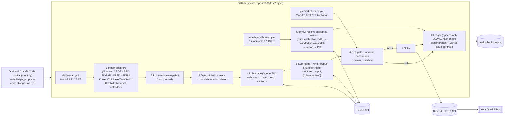

# 09 — Infrastructure: data sources, email delivery, scheduling, LLM layer, execution constraints, compliance

*Track 09 research report. Written 2026-09-28. Scope: design inputs only, nothing built or deployed. No accounts were created, no real email was sent, and no secrets were used.*

**Evidence legend** (used in every table):
- ✅ **Tested in this container** on 2026-09-28. The main probe ran at 20:18 UTC and follow-ups ran until about 20:50 UTC. Scripts are in `research/code/09-infra/`.
- 📄 **Documentation claim.** The official page was fetched on 2026-09-28. URLs are listed in [Sources](#sources).
- ⚠️ **Unverified.** This covers general knowledge, a third-party summary, or a page I could not fetch. Confirm before relying on it.

> Method note: this session shares a WebSearch budget across 10 parallel agents, and the budget ran out partway through this track. After that I verified facts by fetching official pages directly (WebFetch or `requests`). Facts that rest only on search-result summaries are marked ⚠️.

> Important context: this container **is a Claude Code cloud session**. It has 4 vCPU and 15 GB RAM, and CCR/CLAUDE_CODE environment variables are present. Its network policy lets it reach most finance hosts. So the reachability results below also show what a Claude Code *routine* running in a similarly configured environment could reach.

---

## TL;DR

1. **Recommended v1 runtime: GitHub Actions in a *private* repo, plus the Claude Messages API, plus the Resend HTTPS email API.** Expected running cost is **about $5–15/month** in the base case and **about $35 worst case**, and almost all of it is Claude API tokens. GitHub Actions costs $0 because roughly 300 min/month sits inside the 2,000 free minutes. Resend costs $0 (3,000 emails/month, 100/day). The data stack is free.
2. **A free data stack works today (✅).** It covers:
   - yfinance 1.7.0: 300 tickers × 1 month in 19.5 s, and options chains.
   - The CBOE delayed-quotes JSON: the full SPY chain of 13,294 contracts with IV and Greeks, no key.
   - SEC EDGAR: submissions, XBRL, full-text search, and Form 4 XML, no key, 10 req/s.
   - FRED, FINRA short interest and Reg SHO files, Kraken, Coinbase, Deribit, Kalshi and Polymarket market data, Treasury, CFTC COT, and the Nasdaq earnings calendar.
   - **Weak points:** Yahoo's raw API returned **HTTP 429** (only yfinance's browser-impersonating session worked). yfinance has shipped 27 releases since Jan 2025. GDELT and keyless CoinGecko throttled us. Stooq, Binance and Reddit are blocked. **Never let a trade-critical number come from one unofficial source.**
3. **SEC form-type gotcha (✅).** EDGAR full-text search returns **HTTP 500 for `SC 13D`**, while **`SCHEDULE 13D` returns 361 hits** in 30 days. Schedules 13D/G moved to new structured form types. `SC TO-T`, `SC 14D9`, `DEFM14A`, `8-K`, `4` and `425` still work under their old names.
4. **Email: SMTP is blocked here and in Claude Code cloud sessions**, whose egress is HTTP(S)-proxy only. Use an **HTTPS email API**.
   - **Resend free tier** can send from `onboarding@resend.dev` **only to your own account email**. That is exactly this use case: no domain or DNS work needed.
   - The best-deliverability alternative is the **Gmail API**. Publish the OAuth app "In production", otherwise refresh tokens die after 7 days.
   - SendGrid has **no free plan** since 2025. Postmark refuses gmail.com senders.
5. **Claude Code routines are viable but not my first choice for the daily job.**
   - In their favour: they are included in Pro ($20) or Max, and API credentials can be hidden from the VM.
   - Against them: they are a research preview with a 1-hour minimum interval and an undisclosed daily run cap. A "green" run does not mean the task succeeded. There is no SMTP, and the session is non-deterministic.
   - They are a good fit for the **monthly "engineer" step** that proposes code or parameter changes as a PR.
6. **LLM layer.**
   - Deterministic Python does every number. **Sonnet 5.5** handles triage with server-side `web_search_20260209` ($10 per 1,000 searches). **Opus 5.5** (`claude-opus-5-5`, $4/$20 per MTok) makes the final judgment and writes the plain-English email through **structured output with `{{placeholders}}`**.
   - A validator then re-checks every number. My prototype blocked a tampered close price and an invented "18%" (✅).
7. **Regulation changed in 2026 (📄 FINRA RN 26-10).**
   - The SEC approved removal of the **Pattern Day Trader $25k rule** on **2026-04-14**. It took effect on **2026-06-04**, and brokers may phase it in until **2027-10-20**. It is replaced by intraday-margin standards.
   - T+1 settlement applies (since 2024-05-28). Cash accounts still face good-faith and free-riding violations.
8. **Tax and product constraints the recommender must encode:**
   - The more-than-1-year long-term threshold. 2026 LTCG 0/15/20% thresholds are $49,450 and $545,500 for single filers.
   - Wash-sale ±30 days, including options and IRA purchases.
   - §1256 60/40 treatment for SPX-type index options and futures, but not SPY.
   - 1099-DA crypto reporting: basis reporting for crypto acquired from 2026.
   - Prediction markets are CFTC-regulated (Kalshi DCM; Polymarket US relaunched 2025-12-02), but **state-by-state litigation** is ongoing in 2026.
9. **Compliance: keep it strictly personal.**
   - Under the Advisers Act, an adviser is someone who *"for compensation … advis[es] others"*. Sending recommendations to yourself is outside that definition. Sharing them with others, especially for pay, is not.
   - Anthropic's AUP treats investment advice to consumers as high-risk (human-in-the-loop plus AI disclosure). Keep an AI disclosure in every email and keep the human as the decision-maker.
   - Most data licences are "individual/internal use only".
10. **Security posture for v1:**
    - No broker credentials at all.
    - Least-privilege keys: Resend sending-only, Gmail `gmail.send` only, and an Anthropic key in its own workspace with a spend limit.
    - An append-only, hash-chained ledger in git.
    - The LLM has no side-effecting tools, and all fetched web content is treated as untrusted.

---

## 1. Market & alternative data

### 1.1 Reachability probe (✅ `probe_data_sources.py`, run 2026-09-28T20:18:40Z)

| Endpoint (request made) | Result | Latency | Notes |
|---|---|---|---|
| yfinance 1.7.0 `Ticker("SPY").history(5d)` | ok, last bar 2026-09-28 | 0.43 s | yfinance uses `curl_cffi` browser impersonation |
| yfinance `option_chain` AAPL | ok: 24 expirations; bid/ask/OI/IV columns | 0.35 s | Snapshot only; no historical chains |
| yfinance `download` 300 tickers × 1 mo | **300/300** with data | 19.5 s | Follow-up test |
| yfinance `.options` for 40 tickers, sequential | 0 failures | 7.8 s | Follow-up test |
| yfinance `get_earnings_dates` / `.calendar` | ok | ≈1 s | |
| **Yahoo raw `query1…/v8/finance/chart` via `requests` + browser UA** | **HTTP 429** | 0.41 s | The raw endpoint is throttled without yfinance's cookie/crumb and TLS impersonation |
| FRED `fredgraph.csv?id=DGS10` (no key) | 200, history from 1962 | 0.26 s | FRED docs pages later hit intermittent proxy errors |
| FRED API without key | 400 "api_key is not set" | 2.0 s | A free key is required |
| SEC `company_tickers.json`, `submissions`, `companyfacts`, `frames` | 200 on all four | 0.24–0.84 s | No key; UA header required |
| SEC EFTS full-text search | 200 | 0.74 s | |
| SEC "current filings" Atom (Form 4) | 200 | **8.5 s** | Slow; prefer EFTS or daily index |
| SEC Form 4 XML fetch and parse | 200; issuer/owner/transactions parsed | — | Feasible with the stdlib XML parser |
| CBOE `cdn.cboe.com/api/global/delayed_quotes/options/SPY.json` | 200: **13,294 contracts** with bid/ask/IV/delta/gamma/theta/vega/rho/OI/volume, plus underlying `iv30` | 1.1 s | Undocumented website feed, 15-min delayed |
| CBOE AAPL chain | 3,534 contracts, 3,080 with IV>0, median IV 0.34 | — | |
| CBOE `VIX_History.csv` | 200, history from 1990 | 0.65 s | |
| CoinGecko `/ping` keyless | **429 "Throttled"** (`x-ratelimit-limit: 2`) | 0.24 s | Keyless limits are per shared IP |
| CoinGecko `simple/price` keyless | 200 | 0.24 s | |
| Kraken Ticker / OHLC | 200 / 200 | 0.19 s | OHLC returns at most **~720 candles** per call |
| Coinbase Exchange ticker, Coinbase spot | 200 / 200 | ≤0.54 s | |
| Deribit `get_index_price` | 200 | 0.23 s | Vol data only; US persons cannot trade there ⚠️ |
| Polymarket Gamma `markets`, CLOB `markets` and `book` | 200 / 200 / 200 | ≤0.34 s | Read-only, no key |
| Kalshi `/trade-api/v2/markets`, `/orderbook` | 200 / 200 | 0.18 s | Market data without auth |
| Alpha Vantage `demo` key (IBM daily; `EARNINGS_CALENDAR`) | 200 / 200 (CSV) | ≤0.53 s | |
| FMP `demo` | 401 | — | Free key needed |
| `api.polygon.io` and `api.massive.com` (no key) | 401 "API Key was not provided" on both | — | Both domains are live |
| Tiingo (no token) | 200 with error message | — | Token needed |
| EODHD `demo` key (AAPL.US EOD) | 200 | 0.6 s | |
| Nasdaq Data Link (no key) | 403 "valid API key required" | — | |
| OpenFIGI mapping (no key) | 200; `ratelimit: 25;w=60` | 0.35 s | |
| FINRA Reg SHO daily file `CNMSshvol20260925.txt` | 200 | 0.61 s | |
| FINRA API `consolidatedShortInterest` (no auth) | 200 | 0.57 s | Needs date filters (the default returns old records) |
| GDELT DOC API | **429 twice** ("one request every 5 seconds") | 11–17 s | Unreliable from shared IPs |
| Google News RSS search | 200 | 0.72 s | |
| SEC press-release RSS | 200 | 0.4 s | |
| openFDA `drugsfda` | 200 | 0.47 s | Approvals after the fact, not PDUFA dates |
| Nasdaq `api.nasdaq.com/api/calendar/earnings` (browser UA) | 200 | 3.2 s | Unofficial website API |
| Finnhub (no key) | 401 | — | Free key needed |
| US Treasury daily yield-curve CSV | 200 | 0.64 s | |
| CFTC COT (Socrata) | 200 | 6.4 s | |
| Finviz quote page | 200 (HTML) | 0.32 s | Scraping is ToS-restricted ⚠️ |
| BiopharmCatalyst / FDATracker / RTTNews FDA-calendar pages | 200 (HTML) | — | Scraping/ToS: prefer paid access |
| stooq CSV | 404 (connection reset earlier) | — | ✗ |
| `api.anthropic.com/v1/models` (no key) | 401 | 0.09 s | Reachable; bypasses the proxy (noProxy list) |
| Email APIs: Resend, Postmark, Mailgun, SendGrid, SES v2, Gmail API (no credentials) | 401 on all except SES (403) | ≤0.57 s | All reachable over HTTPS |
| **SMTP** `smtp.gmail.com:587/465`, `smtp.resend.com:587/465`, `email-smtp.us-east-1.amazonaws.com:587` | **all fail** (EAFNOSUPPORT or timeout) | 8–24 s | **SMTP is blocked** |

SEC EDGAR full-text search counts for 2026-08-29 → 2026-09-28 (✅). These show how many event-driven raw candidates exist per month:

| Form (EFTS `forms=`) | Hits in 30 days | Use |
|---|---|---|
| `SC TO-T` / `SC TO-I` | 7 / 104 | Third-party / issuer tender offers |
| `SC 14D9` | 7 | Target's response to a tender offer |
| `SC 13D` | **HTTP 500** | Old name is broken |
| `SCHEDULE 13D` / `SCHEDULE 13D/A` | 361 / 277 | Activist stakes (new structured form type) |
| `DEFM14A` / `PREM14A` | 23 / 14 | Merger proxies (definitive / preliminary) |
| `S-4` / `425` | 67 / 311 | Stock-deal registration and communications |
| `8-K` containing `"Item 1.01"` | 751 | Material agreements (incl. merger agreements) |
| `4` | 9,924 | Insider transactions |
| `8-K` containing `"PDUFA"` | 11 | FDA-catalyst dates from company press releases |

### 1.2 Source-by-source assessment

| Source | What it gives | Key? | Limits | History | Licence / ToS | Fragility | Verdict |
|---|---|---|---|---|---|---|---|
| **yfinance (Yahoo)** | EOD/intraday prices for stocks, ETFs, indices, FX and crypto; option chains; fundamentals; earnings dates | No | Undocumented IP throttling; raw API 429 ✅; data-center IP blocks reported Sept 2026 ⚠️ | Decades of daily bars; options current-only | "Intended for personal use only" 📄 | **High**: 27 releases since 2025-01-01, v1.x in 2026 ✅ (PyPI) | Free primary for EOD prices in v1 with caching, backoff and a fallback |
| **SEC EDGAR** (data.sec.gov, EFTS, Archives) | Filings, XBRL facts, Form 4, 13D/G, 8-K, merger proxies, tender offers | No (UA with contact required) | **10 req/s** 📄 | 1993+ | Public domain | Low: official APIs update in <1 s (submissions) and <1 min (XBRL) 📄. EFTS is an internal UI API (medium) | **Core source** for event-driven strategies |
| **CBOE delayed quotes JSON** | Full US option chains with IV and Greeks; VIX history | No | Undocumented | Current snapshot only: store daily snapshots yourself | Website terms ⚠️ (personal use) | Medium (undocumented) | Use for chain snapshots and to cross-check yfinance |
| **FRED** | Rates, macro, spreads | Free key | **120 req/min** 📄 | Long | Mostly public | Low | Use |
| **FINRA** | Short interest (twice monthly), Reg SHO daily short volume | No (tested endpoints) | Up to 5,000 records per request (response header) ✅ | Multi-year | FINRA terms ⚠️ | Low | Use |
| **Kraken / Coinbase** public | Crypto spot, order books, OHLC | No | Kraken OHLC ≈720 candles per call ✅ | Limited per call | Exchange ToS | Low | Use for executable crypto prices at US venues |
| **CoinGecko** | Broad crypto market data | Free **Demo key** | Demo **100 calls/min**; keyless is IP-shared and gave 429 ✅📄 | ⚠️ Demo history limits | Attribution ⚠️ | Low with a key | Use the Demo key |
| **Deribit** public | BTC/ETH options and IV | No | — | — | Not for US trading ⚠️ | Low | Vol signals only |
| **Kalshi** | Event-contract markets and order books | No for reads ✅ | Basic tier 200 read tokens/s (≈20 req/s) 📄 | — | — | Low | Use (read-only) |
| **Polymarket** Gamma/CLOB | Prediction-market prices and books | No for reads ✅ | ⚠️ | — | Jurisdiction limits for trading | Medium | Read-only signals |
| **Alpha Vantage** | Prices, fundamentals, earnings calendar, news sentiment | Free key | **25 req/day** free; premium $49.99/mo (75/min) up to $249.99/mo (1,200/min) 📄 | 20+ yrs | ⚠️ | Low | Earnings-calendar backup |
| **Financial Modeling Prep** | Fundamentals, calendars, insider, 13F, transcripts | Free key | Basic 250 calls/day; Starter **$22/mo** (billed annually; 300/min, 5 y, US); Premium $59; Ultimate $149 (3,000/min, transcripts, 13F, bulk) 📄 | Up to 30+ y | "Individual" plans | Low | Paid upgrade candidate |
| **Massive (ex-Polygon.io)** (rebranded 2025-10-30) | Stocks, options, indices, futures, crypto | Key | Stocks Basic free (5/min, 2 y, EOD); Starter **$29** (unlimited, 15-min delayed, 5 y, flat files, websockets); Developer $79 (10 y, trades); Advanced $199 (real-time, 20 y+, quotes). Options ladder exists but prices were not captured ⚠️ | Up to 20 y+ | "**Individual use only**" 📄 | Low | Paid upgrade for reliable prices and options history |
| **Tiingo** | EOD prices, IEX, news | Free key | Free: 50 req/h, 1,000/day, 500 symbols/mo; Power **$30/mo** (individual) with 10k/h and 100k/day 📄 | 30+ y | "Internal use only; may not display or share" 📄 | Low | Cheapest reliable EOD fallback |
| **EODHD** | Global EOD, intraday, fundamentals, options, news, calendars | Key | Free 20 calls/day; EOD All World $19.99; EOD+Intraday $29.99; Fundamentals $59.99; **All-in-One $99.99/mo** 📄 | 30+ y | ⚠️ | Low | One-vendor paid option |
| **Nasdaq Data Link** | Premium datasets | Key | Per dataset ⚠️ | — | — | — | Low priority |
| **OpenFIGI** | Identifier mapping | Optional key | 25 req/min without key ✅📄 | — | Free | Low | Use for symbology |
| **Earnings calendars** | Nasdaq JSON ✅ (unofficial), AV ✅, yfinance ✅, Finnhub (key), FMP (key) | — | — | — | Website ToS ⚠️ | Medium | Combine two sources |
| **FDA / PDUFA** | openFDA ✅ (post-approval only); **EFTS "PDUFA"** in 8-Ks ✅ (free and legal); third-party calendars reachable ✅ | — | — | — | Scraping ToS ⚠️ | Medium | Use EDGAR full-text search first |
| **News** | Google News RSS ✅; SEC and company RSS ✅; GDELT (429) ✅; **Claude `web_search`** (📄 $10/1k) | — | — | — | Personal use | Medium | Claude web search is the primary synthesis tool; RSS for candidate discovery |
| Treasury CSV, CFTC COT | Yield curve, futures positioning | No | — | Long | Public | Low | Use |
| stooq, Binance, Reddit | — | — | — | — | — | **Blocked** ✅ | Don't use |

### 1.3 Recommended data stacks

**Free starter stack ($0):**
- SEC EDGAR (APIs, EFTS, Form 4 XML).
- yfinance for EOD prices, cached, with CBOE as a second source for options.
- CBOE delayed chains, snapshotted daily.
- FRED with a key.
- FINRA short interest and Reg SHO.
- Kraken, Coinbase and CoinGecko (Demo key) for crypto.
- Kalshi and Polymarket for reads.
- Nasdaq, AV and yfinance for earnings dates.
- The Treasury CSV.
- Google News RSS.
- Claude `web_search` for news synthesis.

**Paid upgrade stack.** Add it once real money follows the recommendations:
- **Tiingo Power $30/mo** or **Massive Stocks Starter $29/mo** as an independent EOD price source. Either removes the single-point-of-failure on Yahoo.
- **FMP Starter $22/mo** (billed annually) for fundamentals and calendars, *or* **EODHD All-in-One $99.99/mo** for one vendor covering prices, fundamentals, options, news and calendars.
- Options history for backtests: the Massive Options ladder or a specialist such as ORATS or ThetaData. Prices were not verified ⚠️.

Typical upgrade cost: **$50–130/month**.

**Data hygiene the architecture must enforce:**
- Point-in-time snapshots, stored so that monthly calibration has no look-ahead.
- Two-source agreement for any price used in an order ticket.
- Staleness checks (timestamp within N hours).
- Throttling: EDGAR ≤10 req/s, FRED ≤120/min, and a per-host token bucket everywhere.
- A descriptive SEC User-Agent.
- Never redistribute the data.

---

## 2. Email delivery

### 2.1 Provider comparison (status as of 2026-09-28)

| Provider | Free tier | Send to **own** inbox **without owning a domain**? | Credentials the user creates | Transport | From GitHub Actions | From Claude Code routine / this container | Verdict |
|---|---|---|---|---|---|---|---|
| **Resend** | **3,000/mo, 100/day**, 3 domains, 30-day logs 📄 | **Yes.** `onboarding@resend.dev` can send only to the account's own email ("You can only send testing emails to your own email address…") 📄 | 1 API key (restrict to *Sending access*) | HTTPS API (SMTP relay also offered) | ✅ | ✅ over HTTPS (API reachable ✅) | **Primary** |
| **Gmail API** | Free (Gmail quotas ⚠️) | **Yes**: from your Gmail to your Gmail, with the best deliverability | Google Cloud project, Gmail API, OAuth consent screen (External) **published "In production"**, Desktop OAuth client, one-time consent for a refresh token with scope `gmail.send` | HTTPS | ✅ | ✅ | **Alternative** (more setup) |
| Gmail SMTP + **app password** | Free | Yes | 2-Step Verification plus a 16-character app password 📄 | SMTP 465/587 | Works in common practice 📄 (`dawidd6/action-send-mail` uses smtp.gmail.com:465) ⚠️ not tested here | **✗ SMTP blocked** ✅ | Fallback only inside GitHub Actions |
| Amazon SES | $0.10 per 1,000 ⚠️; sandbox limits: verified recipients only, 200/day, 1/s 📄 | Yes in the sandbox if you verify your own address. A `@gmail.com` From fails DMARC alignment | AWS account plus IAM keys (SigV4) | HTTPS / SMTP | ✅ | ✅ (HTTPS) | Overkill |
| Postmark | 100/mo developer plan ⚠️ | **No**: sender signatures cannot be public domains such as gmail.com 📄; account approval ⚠️ | Server token and your own domain | HTTPS | ✅ | ✅ | Needs a domain |
| Mailgun | 100/day free ⚠️ | Sandbox domain with authorised recipients ⚠️ | API key | HTTPS / SMTP | ✅ | ✅ | Possible, less simple |
| SendGrid | **No free plan.** Retired 2025-05-27; new accounts get a 60-day trial ⚠️ (Twilio changelog via search) | — | — | — | — | — | Avoid |

DMARC policies (✅ DNS-over-HTTPS lookup):

| Domain | DMARC policy |
|---|---|
| `gmail.com` | `p=none; sp=quarantine` |
| `yahoo.com` | `p=reject` |
| `outlook.com` | `p=none; sp=quarantine` |
| `icloud.com` | `p=quarantine` |

This is why third-party ESPs refuse to send "From: you@gmail.com". Use either the provider's own domain (Resend's `resend.dev`) or a domain you own.

**Gmail API gotchas (📄 Google):**
- If the consent screen is in *Testing* status, refresh tokens **expire in 7 days**.
- Tokens die if unused for 6 months.
- Tokens with Gmail scopes are **revoked on password change**.
- There is a limit of 100 refresh tokens per client.
- An unverified app in production shows a warning screen. That is fine for single-user personal use.

**App passwords (📄 Google):**
- They require 2-Step Verification.
- They are unavailable with Advanced Protection, security-key-only 2SV, or work/school accounts.
- Google says they "aren't recommended".
- They are revoked on password change.

### 2.2 Recommended setup
1. **Resend free**, `From: TradeRec <onboarding@resend.dev>`, `To:` the Resend account's own email, stored as secret `ALERT_TO_EMAIL`.
   - Send with an `Idempotency-Key` equal to the recommendation ID. Keys are valid for 24 h 📄, so a retried job cannot double-send.
   - Leave open and click tracking **off**.
2. In Gmail, add a filter: `from:(onboarding@resend.dev)` → *Never send to Spam*, *Mark as important*, label `TradeRec`.
3. **Upgrade path.** Buy a cheap domain (about $10–15/yr ⚠️) and verify it in Resend with SPF, DKIM and DMARC. You then get a custom From address and are no longer restricted to the account email.
4. **Fallbacks:**
   - (a) Gmail SMTP with an app password, from GitHub Actions only.
   - (b) A GitHub issue per recommendation, created by the workflow using the `github-actions` bot. GitHub notifies watchers by email, so this doubles as a zero-credential channel and as the place where you record fills.
   - (c) A healthchecks.io alert if the daily job fails to report.

### 2.3 Trade-alert email format and deliverability (prototype ✅ `render_email_example.py`)

**Subject line.**
- Pattern: `[TR-2026-0007] BUY EXMPL | limit $12.40 | valid to Sep 30 4pm ET` (64 chars).
- ASCII only. In my test a "·" separator forced RFC 2047 encoding of the subject header, so I switched to "|".
- Make the subject unique per trade, because Gmail threads by subject.
- Follow-ups for the same trade (EXIT, CANCEL, UPDATE) should reuse the subject with `Re:` and set `In-Reply-To`/`References`, so they thread with the original on purpose.
- Avoid spam-trigger styling: ALL CAPS, "!!!", "$$$", "guaranteed", "risk-free", "act now".

**Structure and deliverability:**
- `multipart/alternative` with **text/plain first** and HTML second. The HTML should be simple: inline CSS, a hidden preheader, no images, no JavaScript, no web fonts, no tracking pixels, and no URL shorteners.
- Only link to authoritative URLs such as sec.gov filings.
- Stay well under about 100 KB. Gmail clips larger messages ⚠️. The prototype is 4.2 KB.

**Required content blocks** (plain English, numbers with units, times in ET):
1. A one-line summary.
2. An **order ticket**: action, symbol (OCC symbol for options), quantity, order type, limit, time-in-force, "valid until", and "do not chase above/below X".
3. **Execution steps.**
4. **Exit plan**: target, stop, time stop, and event exits.
5. **Sizing**: amount, % of equity, and maximum loss.
6. **Why**: the thesis and catalyst, with source links.
7. **Risks and what would prove this wrong.**
8. A **calibrated probability**, clearly labelled as a model estimate.
9. **Costs and tax notes**: short- vs long-term holding period, wash-sale window, §1256.
10. **Data snapshot time** and an "all numbers auto-checked" stamp.
11. The **recommendation ID** and how to record a fill.
12. An **AI-generated, personal-use disclosure**.

**Volume.** Aim for *few* emails: trade alerts, plus a monthly report and a weekly "system alive, N candidates reviewed, 0 trades" heartbeat. That keeps the channel trusted and avoids silent failure.

---

## 3. Runtime & scheduling

### 3.1 Options compared

| Option | Monthly cost | Schedule semantics | Reliability notes | Run limits | Secrets | SMTP | LLM web research at run time | Ledger persistence | Ops burden |
|---|---|---|---|---|---|---|---|---|---|
| **GitHub Actions** (private repo) | **$0** within **2,000 min/mo** (Free plan; Pro 3,000). Linux 2-core overage **$0.006/min** 📄. Public repos are free | cron ≥ every 5 min, **IANA `timezone:` key supported** 📄; runs only on the default branch 📄 | "Can be delayed during periods of high loads… start of every hour… some queued jobs may be dropped" 📄. The 60-day inactivity auto-disable applies to **public** repos only 📄 | Job ≤ 6 h (GITHUB_TOKEN lifetime) 📄 | Encrypted repo/environment secrets | Yes in practice ⚠️ | Yes, through Claude API server tools (any host) | Commit with `GITHUB_TOKEN`; its pushes **do not trigger new workflow runs** 📄 | Low |
| **Claude Code routine** (cloud session) | Included in **Pro $20/mo** (annual $17) or **Max from $100/mo** 📄; draws on plan usage plus a **daily run cap** (shown in-app, not published) 📄 | Presets or cron, **minimum 1 h**; "on the hour… can start several minutes late" 📄 | **Research preview**. "Green status… does not mean the task… succeeded" 📄. If GitHub is disconnected, runs are skipped for up to 72 h and then the routine turns off 📄 | 4 vCPU / 16 GB / 30 GB 📄✅ | Env vars are **visible to anyone using the environment**. **API credentials** (Pro/Max) are injected by the proxy and **never enter the VM** 📄 | **No** (HTTP(S) proxy) ✅ | Yes: built-in WebSearch/WebFetch/Bash. Network must allow the hosts (Default *Trusted* excludes finance sites) 📄 | Pushes to `claude/*` branches always; other branches only if unprotected 📄 | Very low, but the agent is non-deterministic |
| **Managed Agents** scheduled deployment | Tokens + **$0.08/session-hour** + $10 per 1,000 searches 📄 | Cron + IANA tz; **jitter up to 9 min** 📄 | Beta | — | **Vaults** (substituted at egress) 📄 | ⚠️ | Yes | Files / GitHub / memory stores | Low–medium |
| **Small VPS** (DigitalOcean) | **$4/mo** (512 MiB) or **$6/mo** (1 GiB) 📄 | Exact cron | You patch and secure it | Unlimited | Files / env | Usually OK ⚠️ | Through the API | Local disk plus backups | Medium |
| **Cloudflare Workers** cron | Free plan: **10 ms CPU** (unusable). Paid: cron CPU up to 15 min for ≥1 h intervals 📄 | Cron (5 triggers free / 250 paid) 📄 | High | 15 min wall clock, 128 MB 📄 | Secrets | No | Through the API | KV/R2/D1 | Medium; pandas/yfinance are a poor fit |
| **AWS Lambda + EventBridge Scheduler** | Lambda free tier 1M requests + 400k GB-s/mo; Scheduler 14M invocations/mo free 📄 | Cron | High | 15 min ⚠️ | SSM / Secrets Manager | Via SES | Through the API | S3 / DynamoDB | Medium–high (IAM, packaging) |

### 3.2 Why GitHub Actions for the daily job
- **Deterministic and inspectable.** Every run has logs, pinned code and a commit.
- **Free.** A daily run of about 5–10 min × 22 days, plus a pre-market check and the monthly job, comes to about 300 min/month, well under 2,000.
- **Unrestricted egress** to data hosts, HTTPS email and the Claude API.
- **Schedule delays are harmless.** Schedule off-the-hour, for example `17 22 * * 1-5` with `timezone: "America/New_York"`. The email is read the next morning anyway.
- **Private repo.** No 60-day auto-disable, and the ledger (your positions) stays private.
- **Watch for silent misses.** A dropped scheduled job produces no failure notice. Add a **healthchecks.io** dead-man's switch (free: 20 checks 📄).

### 3.3 Where Claude Code routines fit
- **Best use: the monthly "engineer" pass.** The routine reads the ledger and metrics, runs the calibration scripts, and opens a PR on a `claude/` branch with proposed code or config changes. It then summarises them by email through Resend, with the key stored as an API credential. You approve or merge.
- This uses the subscription rather than API tokens, and it plays to Claude Code's strength (editing code).
- **Environment requirements:**
  - A Custom network allowlist containing: `query1.finance.yahoo.com`, `query2.finance.yahoo.com`, `fc.yahoo.com`, `*.sec.gov`, `fred.stlouisfed.org`, `api.stlouisfed.org`, `cdn.cboe.com`, `api.kraken.com`, `api.coinbase.com`, `api.exchange.coinbase.com`, `api.coingecko.com`, `gamma-api.polymarket.com`, `clob.polymarket.com`, `api.elections.kalshi.com`, `api.finra.org`, `cdn.finra.org`, `api.resend.com`, `home.treasury.gov`, and `api.nasdaq.com`, together with the defaults.
  - Keys stored as **API credentials**, not environment variables.
- **Not recommended for the daily job:** 1 h minimum interval, undisclosed daily cap, research-preview status, no SMTP, and a "green" status that does not mean success.

---

## 4. LLM layer (Claude API)

### 4.1 Models and prices (📄 platform.claude.com pricing page; model notes from the bundled Claude API skill, cached 2026-09-25)

| Model | API ID | Input $/MTok | Output $/MTok | 5-min cache write | Cache read | Batch in/out | Role |
|---|---|---|---|---|---|---|---|
| Claude Opus 5.5 | `claude-opus-5-5` | 4.00 | 20.00 | 5.00 | **0.20** (0.05×) | 2 / 10 | Final judgment, email writing, monthly calibration |
| Claude Sonnet 5.5 | `claude-sonnet-5-5` | 2.00 | 10.00 | 2.50 | 0.20 | 1 / 5 | Daily triage with web search |
| Claude Haiku 4.5 | `claude-haiku-4-5` (snapshot `claude-haiku-4-5-20251001`) | 1.00 | 5.00 | 1.25 | 0.10 | 0.5 / 2.5 | Cheap extraction (e.g., parsing filings) |

- **Server tools:** `web_search_20260209` costs **$10 per 1,000 searches** plus result tokens. `web_fetch_20260209` has **no extra charge**, only tokens. Code execution is **free** when used with those two tools 📄.
- **Other price modifiers:** the Batch API gives 50% off. The 1M-token context is billed at the standard rate. `inference_geo:"us"` adds a 1.1× multiplier 📄.

API behaviours to design around (from the skill docs):
- **Opus 5.5:** thinking cannot be disabled. Effort **defaults to `medium`**, so set it explicitly: `high` for the final judgment, `low`/`medium` for bulk work.
- **Forced `tool_choice` returns a 400 on both Opus 5.5 and Sonnet 5.5.** Use **structured outputs** (`output_config.format` / `client.messages.parse`) or `strict: true` tools with `auto`.
- **Server-tool errors arrive in-band** (HTTP 200 with an error block). Handle `stop_reason == "pause_turn"`, cap `max_uses`, and restrict domains with `allowed_domains` or `blocked_domains` where sensible.
- **Refusals:** check `stop_reason == "refusal"`. You can opt into server-side `fallbacks: "default"` (beta header `server-side-fallback-2026-07-01`).
- **Web search results count as input tokens** 📄. Prompt-cache the static system prompt and tool definitions.
- **Citations are incompatible with `output_config.format`.** So do *research* (web search with citations, free text) and *decision* (structured JSON, no tools) as **two separate calls**.

### 4.2 Estimated monthly LLM cost (✅ `cost_model.py`; token volumes are assumptions, prices 📄)

Assumptions: 21 trading days. The writer and calibration steps run on Opus 5.5. Each trade write-up allows +50% retries for validator rejections.

| Scenario (candidates/day, searches/day, trades/month) | Triage on Haiku 4.5 | Triage on **Sonnet 5.5** | Triage on Opus 5.5 |
|---|---|---|---|
| Lean (few, 2, 2) | $4.23 | **$5.18** | $7.07 |
| **Base** (≈5, 6, 4) | $7.50 | **$9.98** | $14.54 |
| Heavy (≈15, 15, 8) | $15.39 | **$22.05** | $33.92 |

Unit costs:
- One base triage run on Sonnet: ≈$0.30.
- One Opus trade write-up: ≈$0.30.
- Monthly calibration: ≈$1.97, or ≈$1.01 via the Batch API.

**Budget guidance:** plan for $10–25/month, and set a **$50/month hard spend limit** on the Anthropic workspace.

### 4.3 Anti-hallucination pattern ("data layer computes, LLM narrates and judges")

1. **Fact sheet.** The data layer produces one JSON document per candidate containing every number that may appear in an email. Each number carries a source and timestamp, and the whole document is stored in the ledger.
2. **Research call.** Sonnet or Opus uses `web_search` / `web_fetch` with `max_uses` to gather news. The free-text notes and their citations (URLs) are stored.
3. **Decision call.** Opus, at effort `high`, with **structured output** (a Pydantic schema) and no tools. It returns:
   - a verdict (trade / no trade);
   - probability estimates as numbers in dedicated JSON fields, which are logged for calibration;
   - prose fields that may reference numbers **only via `{{key|format}}` placeholders**.
   **Reject any prose that contains bare digits.**
4. **Renderer.** Fills placeholders from the fact sheet. An unknown placeholder is a hard error.
5. **Validator** (✅ `validate_numbers.py`):
   - Re-extracts every number from the subject, text and HTML. Each must match a snapshot value within the rounding implied by the digits shown (percent/fraction aware).
   - Trusted snapshot strings (IDs, timestamps) are scrubbed first.
   - In the self-test it **blocked** a changed close price ($12.52 vs $12.45) and an invented "18%". It also caught unscrubbed identifiers and our own boilerplate example numbers, which shows it is strict by default.
6. **Deterministic risk gate** after the LLM:
   - Enforces position size, maximum loss, liquidity, account capabilities, wash-sale window, holding-period warnings and a per-day and per-month trade cap. That cap serves the "as few trades as possible" goal.
   - The LLM may veto or downsize a trade, never upsize it.
7. **Provenance and idempotency.** Record the model ID, prompt version hash, code SHA, token usage and cost per call. Record a `rec_id` idempotency key per recommendation.

---

## 5. Execution constraints for the human (US)

### 5.1 Brokers (capabilities relevant to "any trade type")

| Broker | Options | Margin / portfolio margin | Futures | Crypto | Prediction markets | Notes |
|---|---|---|---|---|---|---|
| Interactive Brokers | All strategies subject to permissions ⚠️ | Reg T; PM (≈$100–110k minimum ⚠️) | Yes ⚠️ | **Yes**: "execution and custody provided by Paxos Trust Company or Zero Hash LLC" ✅(site) | **ForecastEx** forecast contracts ✅(site) | Broadest product set |
| Charles Schwab | Tiered approval levels ⚠️ | Margin; PM ⚠️ | **Yes**: "around-the-clock", micros to crypto futures ✅(site) | **Spot BTC/ETH "coming soon"** via Charles Schwab Premier Bank, 0.75% fee ✅(site, 2026-09-28); crypto ETPs available | None known ⚠️ | |
| Fidelity | Levels 1–5 ⚠️ | Margin | No ⚠️ | **Fidelity Crypto** (BTC, ETH, SOL) and crypto IRA ✅(site) | None known ⚠️ | |
| tastytrade | Yes: **$1/contract to open (max $10/leg), $0 to close** ✅(site) | **PM: fund $125,000 to activate, keep $100,000** ✅(site) | Yes ✅ | Yes ✅ | **Yes** (economic event contracts) ✅(site) | Implemented the PDT change on day 1 📄 |
| Robinhood | Levels 2–3 ⚠️ | Margin (Gold) ⚠️ | Yes ⚠️ | Yes ⚠️ | **Yes**: event contracts via Robinhood Derivatives, LLC (FCM) ✅(site) | |
| Alpaca | Levels 0–3 (L1 covered call / cash-secured put; L2 long options; L3 spreads) 📄 | Margin ⚠️ | No ⚠️ | Yes ⚠️ | No ⚠️ | API-first; paper trading ⚠️ |

**Design implication.** The recommender must read an `account.yaml` describing:
- broker, account type (cash / margin / IRA), options level, PM (yes/no);
- futures, crypto and prediction-market access;
- state of residence;
- current positions and tax lots.

It must then never emit a trade the user cannot execute.

### 5.2 Rules that changed or matter now

- **PDT rule gone (📄 FINRA RN 26-10).**
  - The SEC approved SR-FINRA-2025-017 on **2026-04-14**. It took effect on **2026-06-04**, with an **18-month phase-in allowed until 2027-10-20**.
  - The rule removes the day-trade count designation and the **$25,000** minimum. Firms now compute an **intraday margin deficit**, either in real time or end of day.
  - Customers who repeatedly fail to meet deficits within five business days face a **90-day restriction**.
  - At brokers that have implemented it (tastytrade 📄, Firstrade 📄), day trading in margin accounts is limited only by intraday buying power. Firstrade notes the standard **$2,000** margin minimum still applies.
  - **Cash accounts are unchanged:** T+1 settlement, good-faith and free-riding violations.
  - *Check your own broker's implementation date.*
- **Settlement: T+1** for most broker-dealer securities transactions since **2024-05-28** 📄 (SEC 2023-29).
- **Taxes (US federal; confirm with a tax professional):**
  - **Holding period.** *More than one year* is long-term; one year or less is short-term, taxed as ordinary income 📄 (IRS Topic 409).
  - **2026 LTCG brackets** 📄 (Tax Foundation): 0% / 15% / 20%. Single: 15% from $49,450, 20% over $545,500. Married filing jointly: 15% from $98,900, 20% over $613,700.
  - **2026 single ordinary brackets** run from 10% up to 37% (above $640,600) 📄.
  - **NIIT** of 3.8% applies above $200k (single) / $250k (MFJ) ⚠️.
  - **Capital losses:** $3,000/yr deductible against ordinary income, with indefinite carryforward 📄.
  - **Wash sale (§1091).** Buying substantially identical securities (including options) within 30 days before or after a loss sale defers the loss into the new basis. **Buying in an IRA makes the loss permanent** 📄 (Wikipedia summary of Rev. Rul. 2008-5). Brokers don't track across accounts, so the system must, using a "no re-entry in the same underlying for 31 days after a loss" rule.
  - **Crypto and wash sales.** §1091 covers "stock or securities". The 1099-DA instructions apply wash-sale reporting only to *tokenized securities* 📄. Spot crypto is therefore currently outside it ⚠️ (watch for legislation). **Spot-crypto ETFs are securities and are covered.**
  - **§1256.** Regulated futures and **non-equity (broad-based index) options** such as SPX-style options get **60% long-term / 40% short-term treatment regardless of holding period** and are **marked to market at year-end** 📄. ETF options such as SPY are equity options and do not qualify ⚠️.
  - **Form 1099-DA.** Broker reporting of digital-asset gross proceeds started with the 2025 tax year (forms early 2026). **Cost-basis reporting applies to digital assets acquired on or after 2026-01-01 in custodial accounts.** De-minimis thresholds are $10,000 for qualifying stablecoins and $600 for specified NFTs 📄.
  - **Event contracts.** Tax treatment is not settled ⚠️. Get advice before using them at size.

### 5.3 Prediction-market legality (📄 Wikipedia pages, accessed 2026-09-28)

- **Kalshi.**
  - It has been a CFTC **designated contract market since Nov 2020**. Election contracts were allowed after the 2024 D.C. court ruling.
  - Sports contracts face heavy 2025–26 state litigation:
    - Arizona: charges dismissed in May 2026 on preemption grounds.
    - Massachusetts: injunction in Jan 2026 requiring geofencing.
    - Nevada: agreed to halt in July 2026.
    - Minnesota: ban blocked in July 2026.
    - Washington: injunction in July 2026.
    - New York: AG suit in July 2026.
- **Polymarket.**
  - It acquired **QCEX** (a CFTC-licensed exchange and clearinghouse) after the DOJ and CFTC closed their probes in July 2025.
  - A CFTC amended designation in Nov 2025 enabled **intermediated US access**, and **US operations resumed 2025-12-02**.
  - State suits followed: Nevada (Jan 2026) and Massachusetts. Minnesota banned prediction markets effective 2026-08-01, and the federal government sued to block that ban.
- **Implication.** Treat event contracts as in scope **only on a US-regulated venue available in the user's state**: Kalshi, Polymarket US, or the Robinhood, tastytrade and IBKR ForecastEx front-ends. Put a state check in `account.yaml`.

---

## 6. Compliance position

- **Personal use only.**
  - The Advisers Act defines an investment adviser as one who *"for compensation, engages in the business of advising others … as to the advisability of investing in, purchasing, or selling securities"* 📄 (15 U.S.C. 80b-2(a)(11)).
  - A tool that emails recommendations only to its owner is outside that definition.
  - Forwarding the emails to others, especially for compensation, or publishing them could trigger state or SEC adviser registration. The publisher exclusion covers only a *"bona fide … publication of general and regular circulation"* 📄, which is narrow.
  - **Hard-code a single recipient.**
- **Anthropic Usage Policy** (effective 2025-09-15 📄).
  - "Finance: … investment advice" is a **high-risk use case**. When outputs are presented to individuals or consumers, it requires a qualified human in the loop and an AI-use disclosure.
  - For a single user who makes every decision and executes manually, the practical reading is: keep the **AI-generated disclosure** in every email, keep the human as final decision-maker, and do not distribute.
- **Data licences:** Yahoo "personal use", Tiingo "internal use… may not display or share", Massive "Individual use only" 📄. Don't share the emails or data.
- **Records.** The ledger doubles as a trade journal for taxes. No regulatory record-keeping applies to personal use ⚠️.

---

## 7. Security

| Area | Decision |
|---|---|
| Broker access | **None in v1.** The user executes manually. Later, read-only statements or positions only (e.g., broker flex/statement exports ⚠️). Never trading scopes. |
| Secrets | GitHub **environment** secrets (e.g., environment `prod`), referenced only in the steps that need them. Never echo them. Rotate every 6–12 months. For the Claude Code routine: **API credentials**, not environment variables 📄. |
| Least privilege | Resend key with *Sending access* only. Gmail scope `gmail.send` only. Anthropic key in a dedicated workspace with a monthly **spend limit**. Workflow `permissions: {contents: write, issues: write}` only where needed; default read. Pin third-party actions by commit SHA. No `pull_request_target`. |
| Prompt injection | News, filings and web pages are untrusted input. The LLM has **no side-effecting tools**: it cannot send email, choose recipients, write files, or trade. The recipient is fixed in a secret. All LLM output passes schema validation, the number validator and the risk gate. Use `max_uses` on search and optional domain allowlists on `web_fetch`. |
| Audit trail | Append-only JSONL ledger with a **SHA-256 hash chain** (`prev_hash`). A run manifest records code SHA, config hash, model IDs, prompt hashes, data-snapshot hashes, token usage and cost. Store the exact `.eml` sent. Git history is immutable in practice; protect `main`. |
| Data integrity | Two-source cross-check for order-ticket prices; staleness and range checks; the snapshot is stored before the LLM runs. |
| Accounts | 2FA on GitHub, Google, Anthropic, Resend and brokers. Keep the repo **private**. |
| Supply chain | `requirements.txt` with hashes, Dependabot alerts, and CI tests on every PR. Monthly self-improvement lands only via PR. |
| Failure handling | healthchecks.io ping at the end of each run. Workflow failure notifications ⚠️. Weekly heartbeat email. |

---

## 8. Test scripts written (all under `research/code/09-infra/`)

| File | What it does | Result |
|---|---|---|
| `probe_data_sources.py` | One small request per data, email or LLM endpoint, plus SMTP TCP checks and yfinance checks. Writes JSON. | See §1.1. Raw output: scratchpad `09-infra/probe_results.json` |
| `cost_model.py` | Monthly Claude API cost by scenario and model, from official prices | See §4.2 |
| `validate_numbers.py` | Placeholder renderer plus number-provenance validator, with a self-test | Clean draft passes; tampered draft blocked (2 issues); unknown placeholder rejected |
| `render_email_example.py` | Builds a *fictional* multipart trade alert, validates it, writes `.eml`, and prints the Resend payload shape and Gmail `raw` size. **Sends nothing.** | 4.2 KB `.eml`, 64-character ASCII subject |

---

## 9. Implications for the system design

### 9.1 Recommended reference architecture (v1)



ASCII fallback:
```
 cron (GitHub Actions, America/New_York)
   ├─ 22:17 Mon-Fri  daily-scan ─► ingest ─► snapshot ─► screens ─► Sonnet triage (web search)
   │                                  ─► Opus judge/writer (JSON + {{placeholders}})
   │                                  ─► risk gate + number validator ─► Resend email (+ GitHub issue)
   │                                  ─► ledger append + commit ─► healthchecks ping
   ├─ 08:47 Mon-Fri  premarket-check (optional) ─► re-price open recs ─► email ONLY if invalidated
   └─ 07:13 on 1st   monthly-calibration ─► resolve outcomes ─► metrics ─► bounded param update
                                            ─► monthly report email ─► PR for anything beyond params
 optional: Claude Code routine (monthly) = "engineer" that opens improvement PRs; human merges
```

Timing notes:
- The 22:17 ET daily run comes after EDGAR's 22:00 ET close ⚠️, so the day's Form 4 and 8-K filings are in. The email is waiting before the next open.
- Off-the-hour minutes avoid GitHub's top-of-hour congestion 📄.
- GitHub cron cannot say "last day of month", so the monthly job runs on the 1st and covers the previous month.

### 9.2 Component list (Python package `traderec/`)
- `config/`: `account.yaml` (broker capabilities, account type, options level, state, equity), `risk.yaml` (per-trade maximum loss, maximum trades per month, liquidity floors), `strategies.yaml`, `calibration_params.json` (auto-tuned, versioned).
- `data/`: one adapter per source behind a common interface. Each has retries with backoff, per-host rate limits, an on-disk cache, source and timestamp stamping, and a second-source check.
- `snapshot.py`: point-in-time fact sheets, gzip JSON, SHA-256.
- `screens/`: deterministic strategy scanners, supplied by the other research tracks.
- `llm/`:
  - `client.py`: Anthropic SDK; streaming for large outputs; handling for refusal, `pause_turn` and 429; usage and cost logging.
  - `prompts/` (versioned) and `schemas.py` (Pydantic).
- `risk.py`: sizing plus executability, wash-sale, holding-period and concentration checks.
- `render/`: text and HTML templates and `validate_numbers.py`.
- `notify/`: `resend.py` (primary), `gmail_api.py` (alternative), `smtp.py` (GitHub Actions fallback), `github_issue.py`.
- `ledger/`: hash-chained JSONL writer and readers. Record types: `recommendation`, `forecast`, `no_trade_decision`, `fill` (parsed from issue comments), `outcome`, `param_change`, `run_manifest`.
- `calibrate/`:
  - Outcome resolution, metrics (Brier, log-loss, reliability bins, realized vs expected return, per-strategy attribution), and guard-railed parameter updates.
  - Guardrails: a minimum sample size, a maximum change per month, and holdout checks.
  - The monthly report.
- `cli.py`: `scan --dry-run` (writes `.eml`, sends nothing), `calibrate`, `backfill`.
- `.github/workflows/`: `daily-scan.yml`, `premarket-check.yml`, `monthly-calibration.yml`, `ci.yml`.

Workflow skeleton (illustrative):
```yaml
on:
  schedule:
    - cron: '17 22 * * 1-5'
      timezone: "America/New_York"
  workflow_dispatch: {}
permissions: { contents: read }
concurrency: { group: daily-scan, cancel-in-progress: false }
jobs:
  scan:
    runs-on: ubuntu-latest
    environment: prod
    permissions: { contents: write, issues: write }
    steps:
      - uses: actions/checkout@<pinned-sha>
      - uses: actions/setup-python@<pinned-sha>
        with: { python-version: '3.11', cache: pip }
      - run: pip install --require-hashes -r requirements.txt
      - run: python -m traderec.cli scan
        env:
          ANTHROPIC_API_KEY: ${{ secrets.ANTHROPIC_API_KEY }}
          RESEND_API_KEY:    ${{ secrets.RESEND_API_KEY }}
          ALERT_TO_EMAIL:    ${{ secrets.ALERT_TO_EMAIL }}
          FRED_API_KEY:      ${{ secrets.FRED_API_KEY }}
          COINGECKO_DEMO_KEY: ${{ secrets.COINGECKO_DEMO_KEY }}
          SEC_USER_AGENT:    ${{ vars.SEC_USER_AGENT }}
          HC_PING_URL:       ${{ secrets.HC_PING_URL }}
      - run: python -m traderec.cli commit-ledger   # pushes to the 'ledger' branch
```

### 9.3 Key decisions
- **D1 Runtime.** GitHub Actions in a private repo is the system of record. A Claude Code routine is optional, for the monthly code-improvement PR only.
- **D2 LLM.** Claude Messages API with Sonnet 5.5 for triage and Opus 5.5 for judgment, writing and calibration.
  - Structured outputs and placeholders. No bare numbers from the LLM, ever.
  - Web search capped by `max_uses`.
  - Batch API for the monthly calibration.
- **D3 Email.** Resend over HTTPS (free, own address, no domain) with Idempotency-Key and no tracking. Gmail API as the alternative. Never depend on SMTP.
- **D4 Data.** Start with the free stack, requiring two-source agreement for order-ticket prices. Budget about $30–100/month for a paid EOD and fundamentals vendor before trading real size.
- **D5 Ledger.**
  - Append-only, hash-chained JSONL on a dedicated `ledger` branch. Code lives on protected `main`.
  - One GitHub issue per recommendation, where the user comments `filled <qty> @ <price>` or `skipped`.
  - The calibration evaluates **both** hypothetical fills (rule-based) and actual fills.
- **D6 Self-improvement.**
  - Deterministic recalibration of probabilities and thresholds, auto-applied within guardrails and logged as `param_change`.
  - Anything else (code, new strategies, prompt changes) arrives as a PR that the user merges.
- **D7 Safety.** No broker write access. Least-privilege keys, spend caps, and treating all fetched content as untrusted. The risk gate cannot be overridden by the LLM.
- **D8 Compliance.** Single hard-coded recipient, AI disclosure in each email, personal use only, and tax- and PDT-aware constraint checks from `account.yaml`.

### 9.4 Estimated monthly running cost

| Item | Free starter | With paid data upgrade |
|---|---|---|
| GitHub Actions (≈300 min/mo, private repo) | $0 | $0 |
| Email (Resend free, ≤100/day) | $0 | $0 |
| Market data | $0 | +$30–100 (Tiingo Power $30 / Massive Starter $29, optionally FMP $22 or EODHD All-in-One $99.99) |
| Claude API (base scenario; heavy in brackets) | ~$10 (≤$35) | ~$10–25 (≤$35) |
| Monitoring (healthchecks.io free) | $0 | $0 |
| Domain for custom From address (optional) | — | ≈$1/mo ⚠️ |
| Claude Pro, only if using the optional monthly routine | ($20, if not already subscribed) | ($20) |
| **Total** | **≈$5–35 / month** | **≈$45–160 / month** |

### 9.5 Accounts and keys the user must create
1. **GitHub** (the existing repo `sol008/testProject`):
   - Make the repo **private**, enable 2FA, and create an Actions environment `prod`.
   - Add the secrets listed below and a variable `SEC_USER_AGENT` in the form "Your Name your@email". SEC fair-access policy asks for a real contact.
   - Protect `main`.
2. **Anthropic Console** (platform.claude.com):
   - Add billing (prepaid credits) and create a workspace `traderec`.
   - Create an **API key** and store it as `ANTHROPIC_API_KEY`.
   - Set a **monthly spend limit** (e.g., $50).
3. **Resend:**
   - Sign up **with the email address that should receive the alerts**.
   - Create an API key with *Sending access* and store it as `RESEND_API_KEY`.
   - Store that email as `ALERT_TO_EMAIL`. `From` = `onboarding@resend.dev`.
   - In Gmail, add a "never spam" filter.
   - *Optional later:* verify your own domain.
4. **Alternative to 3, Gmail API** (choose one):
   - Create a Google Cloud project and enable the Gmail API.
   - Configure the OAuth consent screen (External), then **Publish → In production**.
   - Create an OAuth client of type *Desktop*.
   - Run a one-time local consent for scope `https://www.googleapis.com/auth/gmail.send`.
   - Store `GMAIL_CLIENT_ID`, `GMAIL_CLIENT_SECRET` and `GMAIL_REFRESH_TOKEN` as secrets.
   - Remember: a password change revokes the token.
5. **FRED** API key (free account) → `FRED_API_KEY`.
6. **CoinGecko Demo** API key (free) → `COINGECKO_DEMO_KEY`, sent in header `x-cg-demo-api-key`.
7. **Alpha Vantage** free key → `ALPHAVANTAGE_API_KEY` (earnings-calendar backup).
8. **healthchecks.io** free account: create one check per workflow and store the ping URL(s) as `HC_PING_URL`.
9. *Optional paid data:* `TIINGO_API_KEY`, `MASSIVE_API_KEY`, `FMP_API_KEY` or `EODHD_API_KEY`, and `FINNHUB_API_KEY` / `OPENFIGI_API_KEY` (free tiers).
10. *Optional:* Claude Pro/Max, for the monthly Claude Code routine. Store keys as **API credentials** on its environment and set a Custom network allowlist (§3.3).
11. **Brokers:** no API keys in v1. Fill in `account.yaml`: broker, cash/margin/IRA, options level, PM, futures, crypto and prediction-market access, state, equity, and current lots.

### 9.6 Open risks to track
- yfinance or Yahoo breakage, and data-center IP blocks. Mitigation: a paid fallback source.
- The CBOE JSON endpoint is unofficial.
- GitHub cron delays or drops. Mitigation: the healthchecks dead-man's switch.
- Resend deliverability through the shared `resend.dev` domain. Mitigation: a Gmail filter, or your own domain.
- Claude Code routines are in research preview, with an undisclosed run cap.
- Prediction-market legality varies by state and is changing monthly.
- Unsettled tax treatment of event contracts.
- The PDT change is being phased in broker by broker.

---

## Sources

All accessed 2026-09-28 unless marked "via search summary".

- Claude API pricing: https://platform.claude.com/docs/en/about-claude/pricing
- Claude plans: https://claude.com/pricing
- Claude Code cloud sessions: https://code.claude.com/docs/en/claude-code-on-the-web
- Routines: https://code.claude.com/docs/en/routines
- Cloud environments: https://code.claude.com/docs/en/cloud-environments
- Managed Agents scheduled deployments, and model behaviours: bundled `claude-api` skill docs (cached 2026-09-25)
- Anthropic Usage Policy: https://www.anthropic.com/legal/aup
- GitHub Actions:
  - Schedule event: https://docs.github.com/en/actions/reference/workflows-and-actions/events-that-trigger-workflows
  - Workflow syntax (timezone, permissions, concurrency): https://docs.github.com/en/actions/reference/workflows-and-actions/workflow-syntax
  - Billing: https://docs.github.com/en/billing/concepts/product-billing/github-actions
  - GITHUB_TOKEN: https://docs.github.com/en/actions/concepts/security/github_token
- Resend:
  - https://resend.com/pricing
  - https://resend.com/docs/knowledge-base/what-is-resend-pricing
  - https://resend.com/docs/api-reference/errors (testing-email restriction)
  - https://resend.com/docs/api-reference/emails/send-email (Idempotency-Key)
- Google:
  - OAuth refresh-token expiry: https://developers.google.com/identity/protocols/oauth2
  - App passwords: https://support.google.com/accounts/answer/185833
- Amazon SES sandbox: https://docs.aws.amazon.com/ses/latest/dg/request-production-access.html
- SES pricing (via search summary): https://aws.amazon.com/blogs/messaging-and-targeting/introducing-amazon-simple-email-service-ses-pricing-plans/
- SendGrid free-plan retirement (via search summary): https://www.twilio.com/en-us/changelog/sendgrid-free-plan and https://support.sendgrid.com/hc/en-us/articles/35270136965403-Twilio-SendGrid-Trial-Account-Plan
- Postmark (via search summary): https://postmarkapp.com/pricing and https://postmarkapp.com/blog/why-cant-i-use-gmail-address
- Mailgun (via search summary; page returned 403): https://help.mailgun.com/hc/en-us/articles/203068914-What-does-the-Free-plan-offer
- `dawidd6/action-send-mail`: https://github.com/dawidd6/action-send-mail
- Cloudflare Workers limits: https://developers.cloudflare.com/workers/platform/limits/
- AWS:
  - EventBridge pricing: https://aws.amazon.com/eventbridge/pricing/
  - Lambda pricing: https://aws.amazon.com/lambda/pricing/
- DigitalOcean: https://www.digitalocean.com/pricing/droplets
- healthchecks.io: https://healthchecks.io/pricing/
- Massive (Polygon): https://massive.com/pricing
- Massive rebrand (via search summary): https://massive.com/blog/polygon-is-now-massive
- Tiingo: https://www.tiingo.com/about/pricing
- EODHD: https://eodhd.com/pricing
- FMP: https://site.financialmodelingprep.com/pricing-plans
- Alpha Vantage: https://www.alphavantage.co/support/ and https://www.alphavantage.co/premium/
- CoinGecko: https://docs.coingecko.com/docs/common-errors-rate-limit
- SEC:
  - Fair access: https://www.sec.gov/search-filings/edgar-search-assistance/accessing-edgar-data
  - APIs: https://www.sec.gov/search-filings/edgar-application-programming-interfaces
- FRED:
  - Rate limit: https://fred.stlouisfed.org/docs/api/fred/errors.html
  - API: https://fred.stlouisfed.org/docs/api/fred/
- OpenFIGI: https://www.openfigi.com/api/documentation
- Kalshi rate limits: https://docs.kalshi.com/getting_started/rate_limits
- yfinance:
  - README: https://github.com/ranaroussi/yfinance
  - Releases: https://pypi.org/pypi/yfinance/json
  - Rate-limit reports: https://github.com/TauricResearch/TradingAgents/issues/1425 and https://github.com/ranaroussi/yfinance/issues/2480 (via search summary)
- FINRA Regulatory Notice 26-10: https://www.finra.org/rules-guidance/notices/26-10
- tastytrade:
  - PDT: https://tastytrade.com/learn/markets/industry/pattern-day-trading/
  - Pricing: https://tastytrade.com/pricing/
  - Portfolio margin: https://tastytrade.com/portfolio-margin/
  - Prediction markets: https://tastytrade.com/prediction-markets/
- Firstrade PDT change: https://help.firstrade.info/en/articles/15073346-important-changes-to-the-pattern-day-trader-pdt-rule
- Alpaca options: https://docs.alpaca.markets/docs/options-trading
- Robinhood prediction markets: https://robinhood.com/us/en/prediction-markets/
- Schwab:
  - Crypto: https://www.schwab.com/crypto
  - Futures: https://www.schwab.com/futures
- Fidelity crypto: https://www.fidelity.com/crypto/overview
- IBKR crypto: https://www.interactivebrokers.com/en/trading/products-cryptocurrencies.php
- SEC T+1: https://www.sec.gov/newsroom/press-releases/2023-29
- IRS:
  - Topic 409: https://www.irs.gov/taxtopics/tc409
  - Form 1099-DA: https://www.irs.gov/forms-pubs/about-form-1099-da and https://www.irs.gov/instructions/i1099da
- Tax Foundation 2026 brackets: https://taxfoundation.org/data/all/federal/2026-tax-brackets/
- 26 U.S.C. 1256: https://www.law.cornell.edu/uscode/text/26/1256
- 15 U.S.C. 80b-2: https://www.law.cornell.edu/uscode/text/15/80b-2
- Wash sale: https://en.wikipedia.org/wiki/Wash_sale
- Polymarket: https://en.wikipedia.org/wiki/Polymarket
- Kalshi: https://en.wikipedia.org/wiki/Kalshi
- DMARC lookups (tested): https://dns.google/resolve?name=_dmarc.gmail.com&type=TXT, and the same for yahoo.com, outlook.com and icloud.com
