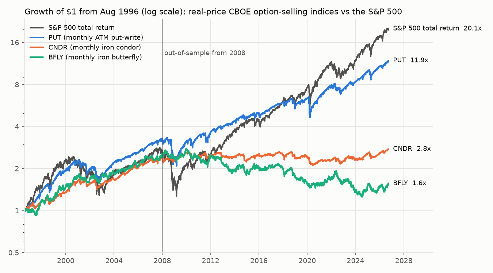
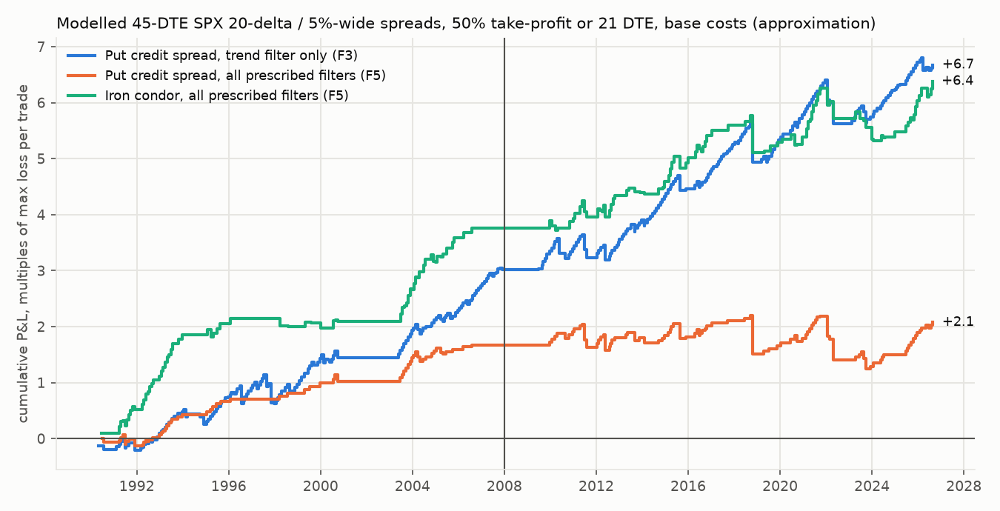

# 14 — Options and volatility strategies for 1–60 day trades

*Track 14 research report, 28 September 2026. It extends track 04 (`04-derivatives-leverage-convexity.md`, long horizons) to holding periods of 1–60 days, under the user's new mandate: few trades, maximum percentage return, a monthly retrospective calibration, paper trading first. Market data runs to the 2026-09-25 close; the live option-chain snapshot was taken after the 2026-09-28 close. All code is in `research/code/14-short-options/` (`python run_all.py`) and every table below is a CSV in `research/code/14-short-options/output/`.*

**How to read the evidence.** Two kinds of evidence appear here, and they are labelled everywhere:

- **Real prices.** CBOE strategy indices built from traded SPX option prices, plus VIX-family, equity-VIX and Deribit DVOL implied-volatility indices.
- **Modelled prices (approximation).** No free history of option quotes exists. Spreads, condors and straddles are therefore priced with Black-Scholes on a surface built from the VIX term structure and the real 2026-09-28 SPX smile. The surface is calibrated to four real-price CBOE indices before 2008 and checked against them after 2008. Treat modelled levels as ±1–2% of max loss per trade (§3.1).

---

## TL;DR

1. **Selling index options no longer earns a premium beyond equity beta after 2008, even at the index providers' mid-quote fills (no retail costs).**

   | Index (real prices) | Alpha before 2008 | Alpha 2008–2026 | Alpha after 2010 |
   |---|---|---|---|
   | PUT (monthly at-the-money put-write) | **+4.0%/yr (t 2.4)** | **−0.2%/yr (t −0.1)** | −0.4% |
   | Iron condor (CNDR) | +3.8% (t 2.7) | −1.0% | −1.8% |
   | Iron butterfly (BFLY) | +4.4% (t 2.3) | −3.7% | −4.3% |
   | Weekly put-write (WPUT) | not available (history starts 2006) | −2.5% (t −1.9) | −3.3% (t −2.4) |

   - Per monthly trade, the real iron condor went from +4.0% of max loss before 2008 to −0.1% after 2008.
   - The edge that the published option-selling research documented has decayed after publication, as most anomalies did (track 02).

2. **The prescribed rule was the best of the grid before 2008 and nearly the worst after it.**
   - The rule: an SPX put credit spread entered at 45 days to expiry, short leg at 20 delta, long leg 5% of spot lower, entered only when VIX/VIX3M < 0.9, 12 ≤ VIX ≤ 30, SPX is above its 200-day average and the week has no FOMC or CPI release. It takes profit at 50% of the credit or closes at 21 days to expiry.
   - It earned **+2.5% of max loss per trade before 2008 (t 4.0) but +0.4% (t 0.4) in 2008–2026**, at 4.9 trades a year and base costs. With harsher (natural-quote) fills it lost money in both periods.
   - Stacking four filters overfitted. **The 200-day trend filter alone was the only condition that helped in both halves:** +1.9% (t 3.5) before 2008 and +2.1% (t 2.9) after, about 9 trades a year, worst trade −68% of max loss.
   - After the data-mining haircut (840 variants), **no variant's Sharpe survives**: deflated-Sharpe probability ≤0.10 out-of-sample, and nothing clears a Bonferroni t of 3.3–4.0 after 2008.

3. **Tail risk is real even with defined risk and every filter.**
   - The real monthly iron condor lost ≥80% of its max loss in **8 of 437 monthly cycles** (1990–2026), about once every 4–5 years, and ≥50% in 16 cycles.
   - Measured over each whole crisis window, it lost ≈99% of its at-risk capital in October 1987, ≈92% in March 2020 and ≈100% in the April 2025 tariff shock.
   - Filters and management stretch that interval in the model but do not remove it. Plan on a full max loss every 5–15 years.
   - The modelled trend-filtered spreads lost 68–79% of max loss in Q4 2018 and in 2022. The 10-delta hold-to-expiry version lost 100% in August 2011 and March 2020.
   - The short-VIX-futures index (VPD) had a **−62%** drawdown and fell 31% on 16 March 2020.

4. **Sizing: the Kelly fraction is dominated by the unseen tail.**
   - The sample Kelly for the trend-filtered put spread exceeds 100% of capital at max loss, because no full loss occurred in the sample.
   - Adding one synthetic full loss per 100 trades cuts full Kelly to 0.34–0.45, so quarter Kelly is 8–11% at max loss.
   - Given the model's +0.6–1.2% of max loss per trade optimism and the deflated Sharpe near 0, we cap it at **2% of the portfolio at max loss per trade (3% hard cap)**.
   - At that size the sleeve adds roughly **+0.36–0.55% a year** before tax and before the model-bias haircut. That is about +0.25–0.39% after the haircut, and about **+0.2–0.3% after 60/40 tax** at the top bracket. It is a harvest, not a return engine.

5. **Buying options for 1–60 day trades is negative EV in every event test.**
   - **Index event days (2022–2026, priced off VIX1D):** 1-day straddles lost 14% (CPI), 5% (FOMC) and 13% (normal days); NFP was +4% (t 0.3).
   - **Index IV run-up trades (2011–2026, model):** −1.3% to −2.5% per trade after costs.
   - **Single-stock earnings (5 mega-caps, 310 events, 2011–2026, real equity-VIX IV):**
     - Straddles held through the report returned **−5.4% (t −3.7)**; 74% lost.
     - The pre-earnings IV run-up (Gao, Xing & Zhang 2018) was **−2.5% (t −2.9)** after a 3% round-trip cost.
   - **"Buy only when the implied move is below the historical median move"** made it worse: −7.2% per trade (−47% on CPI).

6. **The only buy-side exception is post-crash call *spreads*, and they only tie with stock.**
   - Signal: SPX ≥15% below its 1-year high with VIX ≥30 (26 events since 1990).
   - A 60-day at-the-money / +5% call spread (debit ≈2.4% of spot, 2.1× max payoff) returned +28% (before 2008) and +40% (after) per trade.
   - Its Kelly-growth is similar to simply buying the index for 60 days (+5.6% / +4.6%), so it is a loss-capped way to take that exposure, not an extra edge.
   - Outright calls did worse because post-crash IV is expensive: median −35% before 2008.

7. **0DTE and weekly options: veto confirmed.**
   - Retail lost **$241k a day in SPX 0DTE (Feb 2021–Sep 2023), and $350k a day after daily expiries began** (Beckmeyer, Branger & Gayda 2023 ✓). About 60% of that came from transaction costs.
   - Selling 0DTE options was profitable before 2022, but that mispricing "dissipates after the daily availability of 0DTEs" (Almeida, Freire & Hizmeri 2025 ✓).
   - Our VIX1D test agrees:
     - A short 1-day straddle nets about 0 after a 5.5% effective spread.
     - Long 1-day straddles return −5.8% a day.
     - The weekly put-write returned 4.8% a year against 7.5% for the monthly version (2006–2026).
   - It would also mean about 250 trades a year with intraday monitoring. That is incompatible with emailed, manually executed trades.

8. **Practicalities decide who can do this at all.**
   - **SPX** (European, cash-settled, Section 1256 60/40 tax) is the right vehicle. But one 5%-wide SPX spread risks **$32k**, so at a 3% cap it needs a **≈$1.1M portfolio**.
   - **XSP** (1/10 size, also 1256) needs ≈$110k. After-hours quotes showed natural fills 22% worse than mid; this must be measured intraday.
   - **SPY** is the cheapest to trade (0.9% of credit) but is American-style with physical delivery (assignment and pin risk) and taxed as ordinary short-term gains.
   - Below ≈$100k the structure cannot be sized under the cap, so it is vetoed.

9. **Recommendation.** Allow exactly two option structures for 1–60 day trades, both on SPX/XSP (paper-trade first):
   - **(a) Trend-filtered 45-day put credit spreads** as a small, capped "variance-premium harvest" sleeve.
   - **(b) Post-crash 60-day call debit spreads** as the loss-capped rebound vehicle.

   Everything else goes on the hard veto list (§7.5). Two modules go to the incubator (paper only): premium-selling after a volatility spike fades, and Bitcoin/IBIT put spreads.

---

## Contents

1. [Question, data, method](#1-question-data-method)
2. [Real-price evidence: CBOE strategy indices](#2-real-price-evidence-cboe-strategy-indices-1986-2026)
3. [Defined-risk premium selling, modelled (30–45 DTE SPX)](#3-defined-risk-premium-selling-modelled-3045-dte-spx)
4. [Buying options for 1–60 day trades](#4-buying-options-for-160-day-trades-when-is-it-positive-ev)
5. [0DTE and weekly options](#5-0dte-and-weekly-options)
6. [Practicalities](#6-practicalities)
7. [Implications for the system design](#7-implications-for-the-system-design)
- [Appendix A: sources](#appendix-a-sources-and-verification-status)
- [Appendix B: reproducibility](#appendix-b-reproducibility)
- [Appendix C: limitations](#appendix-c-limitations)

---

## 1. Question, data, method

**Question.** Which option structures, if any, should a few-trades, growth-maximising system use for trades lasting 1–60 days, and under what rules?

**Data** (all public; raw files cached in the session scratchpad):

| Series | Source | Coverage |
|---|---|---|
| CBOE strategy indices, built by CBOE from traded SPX option prices: PUT, PUTY, WPUT, PUTD, BXM, BXMD, BXY, CNDR, BFLY, CLL, PPUT, PUTR, VPD, VPN | CBOE CSVs; methodology PDFs read this session | 1986 (CNDR, BFLY, PUTY, BXMD, PPUT) or later, to 2026-09. PUT: the CBOE file is daily from 2007, spliced with Yahoo ^PUT 1996–2006 (identical on the overlap) |
| VIX, VIX9D, VIX3M, VIX6M, VIX1D, SKEW | CBOE CSVs (VIX3M 2006–09 from Yahoo) | VIX 1990+, VIX3M 2006-07+, VIX9D 2011+, **VIX1D 2022-05+** |
| Equity VIX indices: VXAPL, VXGOG, VXAZN, VXGS, VXIBM | CBOE CSVs | 2011+ |
| S&P 500 price and total return, SPY, single stocks, BTC-USD | Yahoo (yfinance) | 1927+ / 1988+ |
| Earnings dates and times (before open / after close) | Yahoo `get_earnings_dates` | 2002+ |
| FOMC announcement dates | Track 02 (federalreserve.gov) | 1994+ |
| CPI and jobs-report (NFP) release dates | Parsed from the BLS archive link filenames (`cpi_MMDDYYYY`, `empsit_MMDDYYYY`); 391 CPI and 259 NFP dates, none on a weekend | CPI 1994+, NFP 2005+ |
| T-bills | FRED DTB3 | 1954+ |
| BTC implied volatility (DVOL) | Deribit public API | 2021-03+ |
| Live option chains (^SPX, ^XSP, SPY, QQQ, IWM; all expiries ≤70 DTE; 25,000 quotes) | Yahoo, pulled after the 2026-09-28 close | Snapshot |

**Method.**

- **Real-price indices first (§2).** Then the synthetic back-test (§3), calibrated to those indices. Then event, crash and 0DTE studies (§4–5).
- **Out-of-sample split fixed in advance.** Design on entries up to 2007; test on 2008–2026. Where data start later (VIX3M 2006, VIX9D 2011, VIX1D 2022, equity-VIX 2011), this is flagged, and the sample is split by sub-period instead.
- **Costs are always included.** Base fills are mid ∓ 25% of the summed quoted leg spreads on every open and early close. Harsh fills use 50% (the natural quote); zero means mid. Commissions are $1.30 per SPX leg (commission plus index fees). Cash settlement at expiry is free.
- **Spread model.** The quoted spread is the median from the 2026-09-28 SPX snapshot for that premium level, scaled by √(VIX/16). It is also multiplied by 2 before 2008 and by 1.5 for 2008–2012, an assumption that quoting was wider in the pre-electronic era.
- **Data-mining disclosure.** The spread/condor grid has **840 variants** (§3.4), and every one is in `s03_variant_stats.csv`. Haircuts: the deflated Sharpe ratio (Bailey & López de Prado 2014) and Bonferroni thresholds. The event, crash and 0DTE studies are pre-specified single tests (each variant listed).
- **Returns are in units of risk.**
  - Spreads and condors: per unit of **max loss** (R, where −1 = the whole max loss).
  - Long options: per unit of premium.
  - Stock: per unit of notional.
  - Kelly fractions are in those same units, so a Kelly of 0.4 means "risk 40% of the portfolio at max loss".

---

## 2. Real-price evidence: CBOE strategy indices (1986–2026)

These indices trade real SPX option prices at mid or VWAP (volume-weighted average price), with **no retail costs and no management**. The weekly put-write (WPUT) is the exception: it sells at the bid and buys back at the ask. The iron condor (CNDR) and iron butterfly (BFLY) hold T-bills equal to **10× the maximum loss**, so only about 10% of their capital is at risk. Multiply their returns by 10 to express them per unit of max loss.

Code: `s01_cboe_indices.py`. Outputs: `cboe_index_stats.csv`, `cboe_index_crises.csv`. Three data errors were fixed: one-day reverting spikes in BXY (2013-03-11) and CLL (2020-02-28), and a permanent −19.8% jump in CLL on 2009-10-16 that no S&P 500 move matches.

### 2.1 Before 2008, from 2008, after 2010

Alpha is the CAPM alpha of monthly excess returns on the S&P 500 total return, with Newey-West t-statistics in parentheses.

| Index (strategy) | Period | CAGR | S&P TR CAGR | Sharpe (S&P) | Max DD (S&P) | Worst month | Alpha %/yr (t) |
|---|---|---|---|---|---|---|---|
| **PUT** (sell 1-month ATM put, cash-secured) | 1996–2007 | 10.9% | 9.0% | 0.76 (0.43) | −31% (−47%) | −13.1% | **+4.0 (2.4)** |
| | 2008–2026 | 7.2% | 11.5% | 0.59 (0.71) | −37% (−52%) | −17.6% (Oct 2008) | **−0.2 (−0.1)** |
| | 2010–2026 | 8.2% | 14.3% | 0.75 (0.93) | −29% (−34%) | −13.4% (Mar 2020) | −0.4 (−0.3) |
| **PUTY** (2% OTM put-write) | 1986–2007 | 8.3% | 11.1% | 0.48 (0.49) | −41% (−47%) | −22.1% (Oct 1987) | +1.0 (0.7) |
| | 2008–2026 | 5.3% | 11.5% | 0.49 (0.71) | −33% | −17.1% | −0.5 (−0.3) |
| **WPUT** (sell 1-week ATM put) | 2008–2026 | **4.2%** | 11.5% | 0.34 (0.71) | −29% | −14.1% | **−2.5 (−1.9)** |
| | 2010–2026 | 4.8% | 14.3% | 0.41 (0.93) | −26% | −10.3% | −3.3 (−2.4) |
| PUTD (dynamic put-write; backfilled from 2006) | 2008–2026 | 9.7% | 11.5% | 0.72 (0.71) | −44% | −15.1% | +0.6 (0.6) |
| **BXM** (buy-write, ATM calls) | 2002–2007 | 6.8% | 6.2% | 0.48 (0.34) | −24% | −8.3% | +1.6 (1.0) |
| | 2008–2026 | 6.1% | 11.5% | 0.49 (0.71) | −40% | −15.0% | −1.4 (−1.0) |
| BXMD (buy-write, 30-delta calls) | 1986–2007 | 12.5% | 11.2% | 0.65 (0.49) | −40% | −19.6% | **+2.3 (3.6)** |
| | 2008–2026 | 8.7% | 11.5% | 0.62 (0.71) | −46% | −15.6% | −0.7 (−0.7) |
| **CNDR** (20/5-delta iron condor; 10% at risk) | 1986–2007 | 9.6% | 11.2% | 0.73 (0.49) | −20% | −9.9% (Oct 1987) | **+3.8 (2.7)** |
| | 2008–2026 | **0.7%** | 11.5% | **−0.00** (0.71) | −20% | −7.9% | −1.0 (−0.6) |
| | 2010–2026 | 0.4% | 14.3% | −0.13 (0.93) | −20% | −7.9% | −1.8 (−1.0) |
| **BFLY** (ATM iron butterfly, 5% wings; 10% at risk) | 1986–2007 | 9.4% | 11.2% | 0.51 (0.49) | −18% | −5.6% | +4.4 (2.3) |
| | 2008–2026 | **−2.6%** | 11.5% | −0.27 (0.71) | **−55%** | −8.6% | −3.7 (−1.5) |
| CLL (95/110 collar) | 2008–2026 | 8.3% | 12.6% | 0.65 (0.70) | −24% (−47%) | −10.7% | +1.1 (0.6) |
| PPUT (S&P + 5% OTM puts) | 1986–2026 | 8.0% | 11.2% | 0.45 (0.58) | −42% (−55%) | −10.6% | −1.1 (−1.1) |
| PUTR (Russell 2000 put-write) | 2008–2026 | 6.1% | 11.5% | 0.41 (0.71) | −46% | −23.6% | −2.1 (−0.9) |
| **VPD** (short front-month VIX futures) | 2008–2026 | 10.6% | 11.5% | 0.54 (0.71) | **−62%** | **−41.3%** (Oct 2008) | +0.1 (0.0) |

**What the table says.**

1. **Before 2008, systematic index option selling earned roughly +2–4% a year of alpha**, with t-statistics of 2.3–3.6. That matches the benchmark literature (Whaley 2002; Ungar & Moran 2009 [unverified]; Bondarenko 2019 [unverified]).
2. **From 2008 the alpha is zero or negative for every single index.**
   - For the plain put-write, the post-2008 Sharpe (0.59) is below the S&P 500's (0.71).
   - What remains is **equity beta sold as "income"**: PUT's beta is about 0.6.
   - This is the post-publication pattern track 02 found for other anomalies.
   - Mechanically, it is also what a concave payoff suffers in a strong bull market (capped upside), so part of the decay may be regime rather than arbitrage.
3. **Weekly is worse than monthly.** WPUT, which pays bid/ask, returned 4.8% against PUT's 7.5% over their common 2006–2026 window.
4. **Short-VIX-futures products carry equity-like returns with worse drawdowns.** VPD fell 18% on 5 February 2018 and 31% on 16 March 2020.

### 2.2 Crisis behaviour (index change over the window)

For CNDR and BFLY, multiply by 10 to get the loss as a share of the capital actually at risk.

| Window | PUT | PUTY | WPUT | BXM | CNDR (×10 = % of max loss) | BFLY | VPD | S&P TR |
|---|---|---|---|---|---|---|---|---|
| Oct 1987 (month) | n/a | −22.1% | n/a | n/a | −9.9% (**≈−99%**) | −5.6% | n/a | −21.5% (price) |
| Sep–Nov 2008 | −33.2% | −31.0% | −28.0% | −33.4% | −8.6% (−86%) | −2.1% | **−60.7%** | −41.0% |
| GFC peak to trough | −34.8% | −31.0% | −23.6% | −39.1% | +1.8% | −1.3% | n/a | −55.2% |
| Aug–Oct 2011 | −14.6% | −13.2% | −9.0% | −14.4% | −7.8% (−78%) | −5.8% | −30.0% | −17.9% |
| Feb 2018 (Volmageddon) | −7.6% | −6.0% | −9.2% | −7.7% | −4.7% (−47%) | −3.8% | −15.8% | −10.1% |
| Q4 2018 | −15.4% | −11.5% | −17.1% | −15.2% | −9.4% (−94%) | −11.6% | −16.2% | −19.4% |
| **COVID, Feb–Mar 2020** | −28.9% | −27.3% | −25.3% | −30.2% | −9.2% (**−92%**) | −3.2% | **−46.6%** | −33.8% |
| 2022 bear | −13.8% | −8.6% | −18.5% | −17.2% | −5.6% | −4.9% | −5.9% | −24.5% |
| Aug 2024 (yen carry) | −4.4% | −3.4% | −5.1% | −5.1% | −0.5% | +2.4% | −18.1% | −8.5% |
| **Apr 2025 tariffs** | −15.0% | −12.7% | −12.3% | −15.5% | −10.2% (**≈−100%**) | −7.0% | −23.0% | −18.8% |

**Defined-risk structures lose roughly their whole max loss in every major shock** (1987, 2008, Q4 2018, 2020, 2025). Selling puts protects only by about the premium: PUT lost 29% in COVID against 34% for the index.

### 2.3 Per trade: one monthly cycle = one trade (`s01b_cboe_per_trade.py`)

| Real index, per unit of risk | Period | Trades | Win rate | Avg win | Avg loss | Mean | Median | Worst | t | Kelly |
|---|---|---|---|---|---|---|---|---|---|---|
| CNDR (per unit max loss) | 1990–2007 | 215 | 81% | +11.9% | −30.5% | **+4.0%** | +11.4% | −86% | 2.9 | 0.63 |
| | 2008–2026 | 222 | 68% | +10.6% | −23.2% | **−0.1%** | +9.1% | −94% | −0.05 | **0** |
| | 2010–2026 | 198 | 66% | +10.2% | −22.5% | −0.9% | +8.7% | −94% | −0.6 | 0 |
| BFLY (per unit max loss) | 1990–2007 | 215 | 57% | +26.2% | −23.1% | +4.9% | +7.1% | −65% | 2.4 | 0.54 |
| | 2008–2026 | 222 | 46% | +27.4% | −28.1% | −2.6% | −6.4% | −73% | −1.2 | 0 |
| PUT (per unit notional) | 2008–2026 | 224 | 80% | +1.8% | −4.4% | +0.57% | +1.3% | −27.9% | 2.3 | (equity beta) |

- A typical retail iron condor has an 80% win rate and a median of about +10% of max loss, and after 2008 its mean was about zero.
- **The tail is the whole story.** Real CNDR lost ≥80% of max loss in 8 of 437 cycles (Jul 1990, Feb and Aug 2001, Dec 2007, Sep 2008, Apr 2010, Jul 2011, Feb 2020) and ≥50% in 16. BFLY never lost 80% in one cycle but lost ≥50% in 20.

---

## 3. Defined-risk premium selling, modelled (30–45 DTE SPX)

### 3.1 The pricer and how well it tracks real prices (`optmodel.py`, `s02_calibrate_model.py`)

- **Surface.** For a strike K and tenor τ:
  - ATM(τ) = ratio(skew) × VIX_τ × (1 + markup). VIX_τ is interpolated in total variance from VIX9D, VIX, VIX3M and VIX6M. Proxies fill VIX9D before 2011 and VIX3M before 2006-07.
  - The smile *shape* comes from the real 2026-09-28 SPX chain (4 buckets by days to expiry) and is scaled over time by the CBOE SKEW index.
  - The ATM/VIX ratio is solved so that the model's own variance swap equals VIX_τ, which reproduces the snapshot's 30-day ATM/VIX ratio of about 0.8.
- **Calibration.** Eight settings (skew mode × markup) were scored on **1990–2007 only**, by replicating the monthly overlay returns of PUT, PUTY, CNDR and BFLY. The winner was "blend, −5% IV": a skew scale halfway between today's shape and the SKEW-index-scaled shape, with implied vols 5% below the variance-swap-consistent level.

| Model vs real index: monthly overlay return (basis points) | 1990–2007 model / real (corr.) | 2008–2026 model / real (corr.) |
|---|---|---|
| PUT (ATM put-write) | 43 / 55 (0.98) | 55 / 57 (0.98) |
| PUTY (2% OTM put-write) | 47 / 36 (0.98) | 37 / 40 (0.98) |
| CNDR (20/5-delta condor, ×10 collateral) | 38 / 39 (0.92) | **12 / −1** (0.87) |
| BFLY (ATM iron fly) | 45 / 49 (0.88) | −18 / −26 (0.91) |

- The model reproduces the **collapse** of condor and butterfly returns after 2008 and the stability of the put-write.
- **Known bias:** after 2008 it is about **+1.2% of max loss per cycle too generous to condors**, and presumably about half that (≈+0.6%) to one-sided put spreads. Results below are pre-bias; the report subtracts this bias where it matters.

### 3.2 The prescribed rule, as specified in the brief

**The rule.**
- **Structure:** SPX put credit spread, entered at the close about 45 calendar days before a monthly expiry. Short put at 0.20 delta; long put 5% of spot lower.
- **Entry filters (F5):** VIX/VIX3M < 0.9; 12 ≤ VIX ≤ 30; SPX above its 200-day average; not in a week with an FOMC announcement or CPI release.
- **Exit (tp21):** take profit when the spread can be bought back for ≤50% of the credit; otherwise close at 21 DTE.
- **Scale:** one cycle a month at most.

| PCS 20Δ/5%/45d, F5, tp21 | Fill | Trades (per yr) | Win | Avg win | Avg loss | Mean R | Median R | Worst | t | Kelly |
|---|---|---|---|---|---|---|---|---|---|---|
| **1990–2007** | mid | 66 (3.7) | 89% | +5.7% | −6.3% | +4.4% | +5.6% | −12% | 8.6 | >1 |
| | **base** | 66 | 80% | +4.7% | −6.3% | **+2.5%** | +4.5% | −16% | **4.0** | >1 |
| | harsh | 66 | 67% | +3.4% | −7.2% | −0.1% | +2.2% | −20% | −0.2 | 0 |
| **2008–2026** | mid | 91 (4.9) | 82% | +5.3% | −19.8% | +0.9% | +5.1% | −67% | 0.7 | 0.52 |
| | **base** | 91 | 82% | +5.0% | −20.7% | **+0.4%** | +4.9% | **−68%** | **0.4** | 0.28 |
| | harsh | 91 | 75% | +4.8% | −16.2% | −0.5% | +4.6% | −69% | −0.4 | 0 |
| Same with an iron condor (both sides 20Δ/5%) | base, 2008–2026 | 91 | 71% | +9.2% | −13.0% | +2.9% (≈+1.7% after model bias) | +8.7% | −66% | 2.1 | 1.0 |

**Verdict.**
- The prescribed put-spread rule passed in-sample and **failed out-of-sample**: +0.4% of max loss per trade, t 0.4. At 3% of the portfolio at risk per trade that is about **+0.06% a year**.
- The iron-condor version looked better on the model but not on real prices (CNDR, §2.3). Its call side lost money in 2008–2026, a strongly trending market.

### 3.3 What each filter and management rule actually did (put spread 20Δ/5%, 45 DTE, base costs)

**Filters** (exit rule tp21). Each cell is mean R per trade (t) and number of trades.

| Filter at entry | 1990–2007 | 2008–2026 |
|---|---|---|
| F0 none | +0.7% (1.0), n 215 | +1.5% (2.0), n 223 |
| F1 VIX/VIX3M < 0.9 (a proxy before 2006-07) | +1.6% (2.4) | +1.2% (1.2) |
| F2 12 ≤ VIX ≤ 30 | +0.4% (0.5) | +1.8% (2.4) |
| **F3 SPX > 200-day average** | **+1.9% (3.5), n 160** | **+2.1% (2.9), n 171** |
| F4 no FOMC/CPI week | +0.7% (1.1) | +1.1% (1.3) |
| F5 all of F1–F4 (prescribed) | +2.5% (4.0), n 66 | +0.4% (0.4), n 91 |
| F6 F1 + F3 | +2.0% (3.0) | +1.1% (1.1) |
| F3 + veto if VIX/VIX3M ≥ 1 or VIX ≥ 30 | +1.9% (3.5) | +2.2% (3.0) |

- **Only the trend filter helped in both halves.**
- The event-week filter did nothing useful. It also cannot keep a 45-day position away from events: every such position spans at least one CPI release and usually an FOMC meeting.
- Adding the term-structure and VIX-range filters to the trend filter changed nothing out-of-sample, or made it worse (F5). Keep them only as **safety vetoes** (the last row costs nothing).

**Management** (filter F3):

| Exit rule | 1990–2007 mean (t) | 2008–2026 mean (t) | Worst after 2008 | Avg days held | 2008–2026 mean per day held |
|---|---|---|---|---|---|
| Hold to expiry | +7.3% (9.1) | +3.3% (2.0) | **−100%** | 45 | 0.07% |
| Take profit at 50% only | +4.5% (6.7) | +1.9% (1.4) | −100% | 17–21 | 0.11% |
| **Take profit at 50% or close at 21 DTE** | +1.9% (3.5) | +2.1% (2.9) | **−68%** | 14–18 | **0.15%** |
| Close at 21 DTE only | +2.0% (3.3) | +2.2% (2.5) | −68% | 24 | 0.09% |
| Take profit or 21 DTE, plus stop at 2× credit | +0.3% (0.4) | +1.2% (1.7) | −38% | 13–17 | 0.09% |

- Compared with holding to expiry, the 50%/21-DTE rule **cuts the mean per trade** by about a third (2008–2026) to three-quarters (1990–2007). It also cuts the time at risk by more than half and removed the −100% outcomes in this sample; gap risk remains.
- **Stops at 2× credit hurt**: they lock in losses that later recover.
- The 21-DTE exit only makes sense for **45-DTE** entries. A 30-DTE entry closed at 21 DTE lasts 9 days and lost money in every 30-DTE/tp21 variant.
- **Width matters because of costs.** 5%-wide spreads beat 2%-wide ones in 407 of 420 variant/filter pairs before 2008 and in 376 of 420 after. The same quoted spread is a larger share of a smaller max loss.

### 3.4 Data-mining haircut (`s03c_dsr_and_years.py`, `s03_best_is_variants_dsr.csv`)

- **Grid.** 12 structures (put spread or iron condor; short delta 0.30/0.20/0.10; width 2% or 5%) × 2 entry DTEs × 5 exit rules × 7 filters = **840 variants**, each at 3 cost levels.
- **Share of variants with a positive mean:**

  | Fill assumption | 1990–2007 | 2008–2026 |
  |---|---|---|
  | Mid | 67% | 72% |
  | **Base** | **29%** | **47%** |
  | Harsh | 17% | 30% |

  Costs decide the sign for most variants.
- **Best in-sample variant:** iron condor, 10Δ short, 5% wide, held to expiry, filter F6. It showed +6.1% per trade with t 17.7, because there were no tail events before 2008. Its deflated Sharpe probability was only 0.72, since the expected best Sharpe among 840 trials is 1.38 per trade. **After 2008:** +4.3% per trade (t 3.2), with a −100% trade in March 2020.
- **Deflated Sharpe probability after 2008** for the named variants (prescribed, trend-only, unfiltered, best in-sample): 0.00–0.10. None is significant.
- **Bonferroni.** The required t is 4.0 for 840 trials, or 3.3 if we assume only 50 independent trials. **No variant clears it after 2008.**
- **Losing calendar years.** The trend-filtered put spread lost money in 8 of 36 years: 1990, 1991, 1994, 1997, 2011, 2018, 2022, 2026 (to date). The worst was **2022 at −0.79 max losses** across the year's trades.

### 3.5 Tail risk, trade by trade (`s03b_crisis_trades.csv`)

Sum of R across the trades open during each window (1.0 = one full max loss):

| Window | Put spread 20Δ, F3 tp21 | Put spread 20Δ, F5 tp21 (prescribed) | Iron condor 20Δ, F5 tp21 | Put spread 10Δ, no filter, hold |
|---|---|---|---|---|
| Oct 2008 | 0.00 (filter kept it out) | 0.00 | 0.00 | **−0.82** |
| Aug 2011 | −0.14 | −0.14 | −0.08 | **−0.86** |
| Aug 2015 | −0.27 | −0.27 | −0.22 | +0.14 |
| Feb 2018 | −0.02 | 0.00 | 0.00 | +0.10 |
| **Q4 2018** | **−0.68** | **−0.68** | **−0.66** | −0.42 |
| **Mar 2020** | +0.06 | 0.00 | 0.00 | **−0.83** |
| **2022** | **−0.79** | **−0.79** | −0.55 | +0.01 |
| Apr 2025 | +0.01 | 0.00 | 0.00 | +0.11 |

- **Filters sidestep crashes that start from stress**: 2008, the second leg of March 2020, and April 2025.
- **They do not sidestep crashes that start from calm.** Q4 2018 began with VIX at 12 and SPX above its 200-day average. August 2011 and the February 2020 entry for the 10Δ spread are the same case. **October 1987 would have passed every filter** (VIX-equivalent about 20–25, SPX above its 200-day average until mid-October). The real CNDR lost about 99% of max loss that month.
- **Gap risk.** The 21-DTE and 50% rules are checked at the close. A 1987-style −20% day or a weekend gap jumps straight to max loss. **Only the width caps the loss, never the management rule.**

### 3.6 Sizing, log growth and taxes (`s03b_sizing_tails.py`)

"Robust" Kelly adds one synthetic −100% trade per 100 trades before optimising.

| Variant (base costs) | Trades/yr | Win | Mean / median R | Worst | Sample Kelly | Robust Kelly | Growth/yr at robust ¼-Kelly | Growth/yr at 2% | at 3% |
|---|---|---|---|---|---|---|---|---|---|
| Put spread 20Δ/5%, F3, tp21 (1990–2026) | 9.1 | 83% | +2.0% / +4.8% | −68% | >1 | 0.45 | +2.0% | +0.36% | +0.55% |
| Same, 2008–2026 only | 9.1 | 88% | +2.1% / +5.0% | −68% | >1 | 0.34 | +1.6% | +0.39% | +0.58% |
| Put spread 10Δ/5%, F3, hold to expiry (1990–2026) | 9.1 | 98.5% | +2.8% / +3.8% | −100% | 0.81 | 0.53 | +3.3% | +0.51% | +0.76% |
| Prescribed F5 put spread, 2008–2026 | 4.9 | 82% | +0.4% / +4.9% | −68% | 0.28 | **0** | 0 | +0.04% | +0.06% |
| Iron condor 20Δ/5%, F5, tp21, 2008–2026 | 4.9 | 71% | +2.9% / +8.7% | −66% | >1 | 0.45 | +1.5% | +0.28% | +0.42% |
| Unfiltered iron condor, tp21, 2008–2026 | 11.9 | 66% | −0.1% / +6.9% | −71% | 0 | 0 | 0 | −0.03% | −0.05% |

- **Portfolio simulation** (trend-filtered put spread, rest in T-bills, excess return over T-bills, 1990–2026; `s03b_portfolio_sims.csv`):

  | Risk per trade at max loss | Excess CAGR | Max drawdown |
  |---|---|---|
  | 5% | +0.9% | −3.9% |
  | 10% | +1.8% | −7.7% |
  | 20% | +3.6% | −15% |

  These drawdowns use exit-date marks, so the intra-trade path is understated.
- **Per-trade Sharpe** is 0.22–0.28, or about **0.7–0.8 annualised** for the overlay alone. That is before the model's optimism of about 0.6% of max loss per trade, which is roughly a third of the mean. **Bias-adjusted, expect about +1.4% of max loss per trade.**
- **Taxes.**
  - SPX and XSP get Section 1256 60/40 treatment: 30.6% blended at the top bracket including NIIT (18.6% in the 24% bracket).
  - SPY options are always short-term for the writer: 40.8% (24%).
  - Per $100 of pre-tax gain you keep **$69 with SPX/XSP versus $59 with SPY** at the top bracket, or $81 versus $76 in the 24% bracket.
  - At a 3% cap the trend-filtered sleeve therefore adds about **+0.55% a year before tax**, about +0.39% after the bias haircut, and **about +0.27% a year after 1256 tax** at the top bracket.

---

## 4. Buying options for 1–60 day trades: when is it positive EV?

### 4.1 Scheduled index events: FOMC, CPI, NFP (`s04_event_vol.py`, `s04f_event_rule_test.py`)

**A. 1-day straddles priced off VIX1D (real 1-day implied vol, May 2022 to Sep 2026).**
- Implied 1-day SD = VIX1D/√252 at the prior close.
- ATM straddle = k·√(2/π)·SD. The base is k = 1; sensitivity runs k = 0.9 and 1.1.
- Round-trip cost is 2% of the premium.

| Next day is… | n | Implied SD | Mean \|move\| | Realised / implied variance | Straddle mean, k=1 (t) | Win | Mean at k = 0.9 / 1.1 |
|---|---|---|---|---|---|---|---|
| CPI | 50 | 1.31% | 0.98% | 1.03 | **−14.5% (−1.4)** | 38% | −4.8% / −22% |
| FOMC | 35 | 1.23% | 0.93% | 0.83 | −5.5% (−0.4) | 37% | +5.2% / −14% |
| NFP | 49 | 1.19% | 1.05% | 1.35 | +4.2% (+0.3) | 47% | +16% / −5% |
| No event | 961 | 0.98% | 0.70% | 0.83 | **−12.6% (−5.5)** | 35% | −2.7% / −21% |

- Event days are **priced close to fair**: the event premium is not large, but the options are not cheap either.
- No event type is significantly profitable, and every result depends on k, which is not pinned down.

**B. Implied event variance from VIX9D (2011–2026).**
- Realised/implied variance was 0.41–0.79 on event days against 0.56–0.65 on other days.
- Event premia look like ordinary variance premia. The method is noisy, so treat this as supporting evidence only.

**C. Realised event-day moves** (`s04c_realised_event_moves.csv`).

| Period | FOMC days vs other days | CPI days | NFP days |
|---|---|---|---|
| 1994–2007 | 1.02× | 1.06× | 0.78× |
| 2022–2026 | 1.35× | 1.31× | 1.36× |

- In the last 24 months, mean/median absolute moves were **FOMC 0.70%/0.46%, CPI 0.69%/0.40%, NFP 1.11%/0.83%**. CPI and FOMC days have calmed since 2022.

**D. IV run-up versus holding through** (model-priced 30-day ATM straddles, 2011–2026, costs included).

| Event | Run-up trade: buy E−3, sell E−1 | Through the event: buy E−1, sell E | At mid (before costs) |
|---|---|---|---|
| CPI (n 186) | −2.4% (t −3.2) | −2.5% (t −4.4) | ≈0 |
| FOMC (n 126) | −2.1% (t −2.2) | −1.7% (t −1.9) | +0.5% / +0.9% |
| NFP (n 182) | −1.3% (t −1.7) | −2.3% (t −3.8) | +1.3% / +0.3% |

Costs consume whatever run-up exists.

**E. The track 04 checklist rule "buy only when the implied move is below the trailing median realised move"** (8- or 12-event trailing window).

| Signal | n | Mean | Win |
|---|---|---|---|
| **Rule fires (all events)** | 52 | **−7.2%** | 33% |
| Rule does not fire | 83 | −4.2% | 46% |
| Rule fires, CPI only | 11 | **−47%** (t −2.9) | 18% |

- The rule selects the *wrong* events, because event volatility changes regime faster than a trailing median can follow.

**F. Today (2026-09-28 SPX term structure, `s07_implied_event_moves_20260928.csv`).**

| Event | Implied event-day SD | Straddle-equivalent move | Last 24 months: mean / median \|move\| |
|---|---|---|---|
| NFP (2 Oct) | 0.80% | 0.64% | 1.11% / 0.83% |
| CPI (14 Oct) | 0.90% | 0.72% | 0.69% / 0.40% |
| FOMC (28 Oct) | 1.04% | 0.83% | 0.70% / 0.46% |

A normal day is 0.76%. Nothing here justifies a trade.

### 4.2 Single-stock earnings (`s04e_earnings_summary.csv`)

- **Sample.** AAPL, GOOGL, AMZN, GS and IBM, 2011–2026: **310 reports**. IV is CBOE's 30-day equity VIX for each stock (real).
- **Implied move.** Taken from the IV crush: σ_E² = T·(IV_pre² − IV_post²) + IV_post²/252.
- **Realised move.** Close before the report to close after it (report timing from Yahoo).

| | 2011–2018 | 2019–2026 | All |
|---|---|---|---|
| Implied event SD / expected \|move\| | 5.9% / 4.7% | 6.2% / 4.9% | 6.0% / 4.8% |
| Realised mean / median \|move\| | 4.6% / 4.1% | 4.5% / 3.7% | 4.55% / 3.96% |
| P(\|move\| > expected) | 41% | 39% | **40%** |
| Average IV crush | −7.4 pts | −6.9 pts | −7.2 pts |
| Straddle held through the report (3% round-trip cost) | −4.9% (t −2.0) | −6.0% (t −3.4) | **−5.4% (t −3.7); median −11.9%; 26% win** |
| Pre-report run-up: buy 5 days before, sell the day before | −1.3% (t −1.1) | −3.8% (t −3.0) | **−2.5% (t −2.9); IV rose +2.2 pts** |

- Implied earnings moves exceeded realised moves in the pooled sample and in 6 of the 10 stock-periods (the exceptions are IBM in both halves, and AMZN and GOOGL in 2011–2018).
- Straddles held through the report still lost money in 9 of 10 stock-periods; the one exception was GOOGL 2011–2018 at +0.9%. The IV crush plus the spread overwhelms the occasional big move.
- The IV run-up documented by Gao, Xing & Zhang (2018) exists (+2.2 vol points) but is smaller than theta plus the bid-ask spread for these mega-caps.
- This matches the literature: earnings volatility is priced richly (Dubinsky et al. 2019), and retail buyers overpay (de Silva, Smith & So, working paper).

### 4.3 Post-crash rebound: stock vs calls vs call spreads (`s05_crash_and_spike_trades.py`)

- **Signal CRASH:** SPX ≥15% below its 252-day high and VIX ≥30. First day only, with a 60-day cool-down. **26 events**: 11 in 1990–2007, 15 in 2008–2026.
- **Pricing:** options are model-priced at the signal close, with base costs.

| 60-day hold after the signal | 1990–2007: mean / median / win | 2008–2026: mean / median / win | Kelly | Growth per trade at ¼ Kelly |
|---|---|---|---|---|
| SPX (stock/futures), per notional | +5.6% / +3.2% / 82% | +4.6% / +7.0% / 80% | ≥2.4 (leverage) | 0.040 / 0.025 |
| 60-DTE ATM call, per premium (≈5.2% of spot) | +15% / **−35%** / 45% | +36% / +6% / 53% | 0.13 / 0.28 | 0.004 / 0.021 |
| **60-DTE 100/105 call spread**, per debit (≈2.4% of spot, 2.1× max) | **+28% / +29% / 64%** | **+40% / +105% / 67%** | 0.43 / 0.41 | 0.026 / 0.035 |
| 45-DTE 20Δ put credit spread, tp21 (per max loss) | −2.7% | +0.3% | 0 | 0 |

- Shorter holds (7 or 30 days) were worse for every option vehicle. For example, 30-day ATM calls held to expiry returned −11% before 2008.
- **Conclusion.** After a crash the rebound premium is real, and a call **spread** captures it about as efficiently as the index. It sells the expensive upper strike, which is track 04's finding at 1-year horizons.
- **Outright short-dated calls pay for inflated IV.** Six of 26 events went to −100% (2002 twice, 2008 twice, 2009, 2022).
- The system's S2 crash tranches (buying the index) remain the primary crash instrument. The call spread is the loss-capped alternative for short-horizon rebound trades.

### 4.4 Volatility spikes

- **Signal FADE:** VIX ≥30 at some point in the last 10 days and now ≤80% of that peak, i.e. the spike is fading. 30-day cool-down; 52 events (18 before 2008, 34 after).

| After a fading spike | 1990–2007 | 2008–2026 |
|---|---|---|
| 45-DTE 20Δ put spread **held to expiry**, per max loss | **+10.2%**, win 94%, worst −10% | **+8.0%**, win 94%, worst **−100%** (entered 2022-05-04) |
| Same with tp21 | +1.7% | +2.0% (worst −77%, entered 2020-03-04) |
| SPX 60 days | +2.8% | +3.6% |
| 60-DTE ATM calls | −7.6% | +33% (inconsistent) |

- Credits are richer after spikes: credit/max loss is 10–17% against about 9% in calm markets. VIX mean-reverts.
- **But this is short volatility right after a shock.** The result hinges on two or three paths: March 2020 was saved only by holding to expiry, and May 2022 lost 100%.
- With n = 52 and hold-to-expiry dependence, this is **incubator-only** (paper).
- Buying volatility into or after spikes (VIX calls, puts): track 04 already showed tail hedges and VIX exchange-traded products lose; nothing here changes that.

### 4.5 Crypto: the Bitcoin variance risk premium (`s08_crypto_vrp.py`)

- **DVOL** (Deribit 30-day implied) against realised BTC volatility over the next 30 days, March 2021 to September 2026:
  - **Average premium: +8.5 vol points** (median +10.2).
  - Implied < realised on 29% of days (SPX: 14%).
  - Average variance-swap buyer: **−14.5%**.
- **2026 so far:** premium −0.8 points; the variance-swap buyer made +26%.
- **"IV below trailing realised" is not a cheap-vol signal for BTC either.** When DVOL sat more than 10 points below trailing 30-day realised vol, the forward premium was still +10.1 points. Today DVOL is 34.6 against 42.6 realised.
- **30-day straddles on non-overlapping monthly blocks (n = 67):**
  - Buyer: mean +4%, median −26%.
  - Seller: worst month −45% of spot.
- **Access.** Deribit does not serve US persons. US-listed IBIT options exist only since November 2024, so there is too little history.
- **Verdict:** incubator only, with defined-risk put spreads.

---

## 5. 0DTE and weekly options

### 5.1 Literature (verified this session unless marked)

- **Beckmeyer, Branger & Gayda (2023, working paper, December 2023 version) ✓**
  - "More than 75% of [retail] trades in S&P 500 options today are in 0DTE contracts."
  - Retail "lost $241,000 on an average day" (February 2021 to September 2023), and "$350,000 per day" after daily expiries began in May 2022.
  - "Roughly 60% of daily losses are the result of transaction costs." Effective spreads for retail were 6.0% (calls) and 5.0% (puts), about half the non-retail level thanks to price improvement.
  - Losses come from "single-leg trades, trades that require an upfront payment … and trades that use high-implied volatility options". Retail *credit* orders made +$122k a day while debit orders lost $364k.
  - Median margin-adjusted returns: put spreads +3.0%, iron condors +5.5%. Mean *dollar* profits were mostly negative, "driven by a few negative outliers".
- **Almeida, Freire & Hizmeri (2025 draft) ✓**
  - The 0DTE variance premium is high and "largely driven by compensation for upside risk".
  - "Most 0DTEs appear mispriced … Such mispricing is highly profitable before 2022, but dissipates after the daily availability of 0DTEs."
- Bandi, Fusari & Renò (2023), "0DTE Option Pricing" (SSRN 4503344): the abstract was not read [unverified].
- Dim, Eraker & Vilkov (2024): no evidence that 0DTE market-maker gamma amplifies volatility [unverified].

### 5.2 Our 1-day test (`s06_0dte_weeklies.py`; VIX1D, May 2022 to Sep 2026)

- **Pricing:** 1-day SPX options priced from VIX1D with the 0–5 DTE smile.
- **Timing:** opened at the close, settled at the next close.
- **Costs:** a 5.5% effective spread paid on entry.

| Daily trade | n | Mean | Median | Win | Worst | Annualised Sharpe |
|---|---|---|---|---|---|---|
| Long ATM straddle (per premium) | 1,095 | **−5.8% a day** (t −2.5) | −22% | 38% | −100% | −1.2 |
| Long straddle on event days only | 134 | +0.8% (t 0.1) | −3.6% | 46% | −100% | n/a |
| Short ATM straddle (per spot, undefined risk) | 1,095 | ≈0.00% a day | +0.10% | 59% | **−6.2% of spot** (2025-04-09) | −0.06 |
| Short iron butterfly ±1 SD (per max loss) | 1,095 | −5.3% a day | −7.1% | 48% | −100% | −1.0 |
| Short 10Δ put spread, 1 SD wide (per max loss) | 1,095 | +0.9% a day (t 1.6) | +5.4% | 91% | −100% | +0.8 |

- The worst days were 2025-04-09 (+9.1%), 2025-04-04 (−6.2%, NFP), 2022-11-10 (CPI, +5.4%), 2025-04-03 and 2022-09-13 (CPI).
- **Weeklies:** WPUT's CAGR was 4.8% against 7.5% for the monthly PUT (2006–2026), and its alpha after 2008 was −2.5%/yr (§2.1).

**Verdict: the veto stands, with no exceptions.**
- Buying 0DTE, 1DTE or weekly options is negative EV.
- Selling them has roughly zero edge after retail costs since 2022, carries −100% days, and needs about 250 trades a year with intraday supervision. That breaks both the few-trades objective and the manual email workflow.

---

## 6. Practicalities

### 6.1 Which product (live quotes after the 2026-09-28 close; `s07_live_spread_costs.csv`)

All rows are a 20Δ / 5%-wide put credit spread expiring 13 or 20 Nov 2026 (46–53 DTE).

| | **SPX** 7350/7000 | **XSP** 735/700 | **SPY** 729/695 |
|---|---|---|---|
| Exercise / settlement | European, cash, PM for SPXW (AM for the 3rd-Friday SPX) ✓ | European, cash, PM ✓ | **American, physical delivery** ✓ |
| Tax (US) | **§1256 60/40** ✓ | **§1256 60/40** ✓ | Ordinary; written options always short-term |
| Mid credit | 29.35 | 2.935 | 2.915 |
| Natural credit (bid − ask) | 28.2 (−3.9%) | 2.28 (**−22%**) | 2.89 (−0.9%) |
| Paper fill (mid − ¼ of the natural width) | 28.78 | 2.61 | 2.90 |
| Cost versus mid, incl. commission | 2.0% of the credit | **11.7%** | 0.9% |
| Max loss per spread | **$32,123** | $3,239 | $3,110 |
| Credit / max loss | 9.0% | 8.0% | 9.3% |
| **Smallest portfolio for one spread at the 3% cap** | **≈$1.07M** | ≈$108k | ≈$104k |
| Open interest at the short / long strikes | 39 / 204 | 34 / 608 | 176 / 5,817 |

- Median quoted spread for 25–60 DTE options at 0.15–0.25 delta, as % of mid: **SPY 1.0%, QQQ 1.9%, SPX 2.8%, IWM 2.8%, XSP 15.6%**.
- XSP after-hours quotes are often stale. Measure during regular trading hours before using XSP; the veto rule in §7.5 applies.
- Nanos (1/100 of XSP) exist and are marketed as 1256-eligible [unverified liquidity].

### 6.2 Margin and buying power

- **Reg T (and IRA "spread" approval, usually Level 3).** The requirement for a vertical credit spread equals its max loss: width × multiplier − credit.
  - Iron condor: most brokers charge only the wider side, because both sides cannot lose at expiry.
  - Cash-secured puts tie up the full strike.
- **Portfolio margin** ($100–150k minimum, track 04) does not reduce a defined-risk spread's true max loss. It only frees buying power, and the rules here size by **max loss**, never by margin.
- Because max loss equals the margin requirement, the §7.4 caps double as buying-power caps. Cash not tied up stays in T-bills, which the back-test credits.

### 6.3 Assignment, pin and dividend risk

- **SPX and XSP: none.** They are European and cash-settled; no early exercise and no delivered shares ✓.
- **SPY and QQQ (American, physical):**
  - A short put deep in the money can be assigned early. The 21-DTE and 50% rules usually close such positions first.
  - A short call in an iron condor can be assigned the day before ex-dividend when its extrinsic value is below the dividend. SPY goes ex-dividend around the third Friday of March, June, September and December.
  - **Pin risk:** a short strike near the money at the 4:00 pm close can be exercised after hours, leaving an unhedged share position over the weekend.
  - **Rule:** never hold American-style short options into expiry day, or through an ex-dividend date with a short call in the money.
- **AM versus PM settlement.**
  - Third-Friday SPX monthlies settle on Friday's opening prints (SOQ, the special opening quotation), and trading ends on Thursday.
  - SPXW and XSP settle at Friday's close.
  - Default to **PM-settled SPXW or XSP**, so the position can be closed on expiry day.

### 6.4 Commissions and fees (assumptions; verify with the broker)

- About $0.65 per contract per leg at IBKR, Schwab and Fidelity-type brokers, plus the Cboe index-option fee on SPX (about $0.50–0.65 per contract) [unverified current schedule].
- XSP and SPY fees are smaller per contract but not per dollar of risk.
- **Commissions are negligible for SPX (0.1% of the credit per side) and material for XSP** (about 0.6% of the credit per side, 1.2% per round trip, at $0.75 a leg).

### 6.5 Trading hours, early closes and expiry-day rules

- **SPX hours:** 8:30 am–3:15 pm Central (9:30 am–4:15 pm Eastern), with a curb session to 4:00 pm Central.
- **Global Trading Hours** for SPX, SPXW and XSP run 8:15 pm to 9:25 am Eastern ✓.
- **Expiring SPXW (and end-of-month) contracts stop trading at 3:00 pm Central (4:00 pm Eastern)** on their last day ✓.
- **Early-close days:** on NYSE half-days, expiring options stop earlier (about 1:00 pm Eastern; index options 1:15 pm) [verify on the Cboe holiday calendar].
- **Build rule:** the system must read an exchange calendar and never schedule a "close by 3:45 pm" instruction on a half-day.

### 6.6 Taxes (United States; confirm with a tax adviser)

- **Section 1256** (SPX, XSP, and also NDX, RUT, VIX options and index futures): 60% long-term / 40% short-term regardless of holding period ✓ (Cboe fact sheets), and marked to market at year-end.
  - Losses on these contracts can be carried back three years against earlier §1256 gains (§1212(c) election) [verify].
  - The wash-sale rule is generally treated as not applying to them [verify].
- **Equity and ETF options** (SPY, QQQ, single stocks): gains and losses on *written* options that are closed or expire are short-term under §1234(b), whatever the holding period.
- **Drag at the top bracket (37% plus 3.8% NIIT):** 40.8% short-term against **30.6% blended under §1256**. In the 24% bracket: 24% against 18.6%.
- **Prefer IRA accounts for this sleeve** where the broker allows spreads there (track 03's asset-location rule).

### 6.7 How to paper-trade options realistically (the protocol the tool should enforce)

1. **Quote source.** Capture live NBBO for every leg and the combo between 3:30 and 3:50 pm Eastern (or at the email timestamp).
   - Use a broker API or a broker paper account on live data, for example IBKR paper.
   - Never use Yahoo after-hours quotes: this report's snapshot shows XSP spreads 3–10× wider than SPY's.
2. **Fill rule.**
   - Credit to open: mid − 0.25 × Σ(leg ask − leg bid). Debit to close: mid + 0.25 × Σ.
   - Rounded to the $0.05 tick, less commissions of $0.65 per contract plus index fees.
   - If the limit is not reachable within the session (the quoted combo mid moves away by more than the concession), log **no fill**.
3. **Staleness guard.** If SPX has moved more than 0.5% or VIX more than 2 points between the email and the paper fill, re-price or cancel.
4. **Settlement.**
   - SPXW or XSP: the 4:00 pm close.
   - AM SPX: the official settlement (SET/SOQ).
   - The 50% take-profit is modelled as a good-till-cancelled order that fills if the *closing* combo mid plus the concession is at or below the target (conservative; real orders fill intraday).
5. **Log for the monthly calibration:** entry IV, VIX, VIX3M, the model credit against the paper credit, slippage against mid, daily P&L in R, exit reason, and realised volatility over the trade against the IV at entry.

---

## 7. Implications for the system design

These are concrete, testable rules. Anything not listed as allowed is vetoed. Each rule states the evidence it rests on and, in the tables, the kill switch that disables it.

### 7.1 Allowed option structures for 1–60 day trades

| ID | Structure | When | Instrument | Expected per trade (evidence) | Trades/yr | Status at launch |
|---|---|---|---|---|---|---|
| **O1** | **Put credit spread**: short 0.20Δ (0.15–0.25), long 5% of spot below (4–6%), entered at 40–50 DTE | §7.2 filters | SPXW (portfolio ≥$1.1M per contract), XSP (≥$110k, intraday natural spread ≤10% of credit), SPY only if neither fits, and with §6.3 rules | +2.0% of max loss (model 1990–2026, t 4.4 over the full sample); bias-adjusted ≈+1.4%; median +4.8%; worst −68%; real-price analogue (PUT, CNDR) ≈0 alpha after 2008 | ≤9 (one open at a time) | **Paper only** until the §7.6 promotion test passes |
| O1-h | Same, short 0.10Δ, **held to expiry** (1 action per trade) | Same filters | SPXW/XSP only (cash-settled) | +2.8% of max loss; win 98.5%; **worst −100%** (Aug 2011, Mar 2020) | ≤9 | Paper only, as the fewest-trades variant of O1 |
| **O2** | **Call debit spread**, 60 DTE, long ATM / short +5% | CRASH signal: SPX ≥15% below its 252-day high **and** VIX ≥30 (first day; 60-day cool-down) | SPX/XSP (or SPY) | +28% / +40% of debit (1990–2007 / 2008–2026, n 11/15); median +29% / +105%; 6 of 26 lost 100% | ≈0.7 (clustered in crises) | Allowed, but only when a loss cap is required; otherwise buy the index (S2) |
| I1 | Put credit spread 20Δ/5%, 45 DTE, held to expiry, **after a fading VIX spike** | VIX ≥30 in the last 10 days and now ≤0.8× that peak | SPXW/XSP | +10% / +8% of max loss, win 94%; one −100% (May 2022); n = 52 | ≈1.5 | **Incubator** (paper; ≥20 trades before review) |
| I2 | IBIT put credit spreads (O1 logic) | O1 filters on BTC (price above its 200-day average, DVOL not in backwardation) | IBIT (listed; 1.5–3.8% spreads) | Unknown. BTC variance premium +8.5 vol points (2021–26) but ≈0 in 2026, heavy tails | ≤6 | **Incubator** (paper) |

Iron condors are **not** a default structure:
- Real-price CNDR/BFLY were flat to negative after 2008.
- The model's condor edge after 2008 comes from the call side in specific years and is inflated by about 1.2% of max loss per trade.
- Allow them only inside the incubator, as an O1 variant, with the same caps.

### 7.2 Entry filters (all must hold at the entry close)

| Rule | Parameter | Why |
|---|---|---|
| **Trend** | SPX close > 200-day simple average | The only filter that helped in both halves (put spread: +1.9% / +2.1% of max loss) |
| Backwardation veto | VIX/VIX3M < 1.00 | Safety: costs nothing (+2.2% vs +2.1% after 2008); avoids the regime with a negative variance premium (track 04) |
| Crisis veto | VIX < 30 (except I1 and O2) | Safety; consistent with the constitution's "VIX > 30: no new short-put-like positions" |
| Entry DTE | 40–50 calendar days; SPXW PM-settled expiry | 30-DTE entries with a 21-DTE exit lose money on costs |
| Liquidity | Natural combo spread ≤10% of the mid credit, measured intraday. For ETF options, open interest ≥500 per leg. SPX/XSP strikes are market-maker quoted, so the spread test governs | XSP after-hours quotes fail the spread test; the SPX example below has open interest of only 39 at the short strike but a 3.9% natural spread |
| Event days | Do not open on an FOMC-statement day or a CPI day (open the day after) | Convenience only. The event-week filter added nothing (F4); 45-day positions always span events |
| Not required | VIX/VIX3M < 0.9, a 12–30 VIX band, avoiding whole FOMC/CPI weeks | Tested: stacking them overfitted (+2.5% before 2008, +0.4% after) |

**Current reading (28 Sep 2026 close).** O1's filters **pass today**:

| Input | Value | Filter |
|---|---|---|
| SPX vs 200-day average | 7,684 vs about 7,205 | Pass |
| VIX | 16.07 | Pass (< 30) |
| VIX/VIX3M | 0.88 | Pass (< 1.0) |

- **Example ticket:** SPXW 13 Nov 2026 7350/7000 put spread, paper credit about 28.8 (bid 28.2 / mid 29.35), max loss $32.1k per contract. For small accounts, the XSP 735/700 equivalent: about 2.6 credit, $3.2k max loss.
- **Next events:** 14 Oct CPI, 28 Oct FOMC.
- **Status:** O1 is paper-only, so it would be a **paper** trade, not a real one.

### 7.3 Exits (pre-registered in every NEW TRADE email)

- **O1:**
  - At entry, place a good-till-cancelled order to buy the spread back at **50% of the credit received**.
  - If not filled, **close at the close on the first trading day with ≤21 calendar days to expiry**.
  - **No stop-loss** and no other discretionary exit. Stops at 2× credit lowered returns in both halves; the width is the stop.
- **O1-h:** no action after entry. It expires, cash-settled. That is one email per trade.
- **O2:** hold 60 days to expiry (PM-settled). Optional take-profit when the spread is worth ≥80% of its width (≈1.7× the debit). No stop.
- **American-style (SPY):** close by 3:00 pm Eastern on the business day before expiry. Close any short call that is in the money the day before its ex-dividend date.

### 7.4 Sizing: maximum loss as a share of the portfolio

| Item | Cap | Rationale |
|---|---|---|
| O1 / O1-h per trade | **2% of the portfolio at max loss (3% hard cap)**, times the drawdown governor G(D) | Robust quarter-Kelly is 8–11%. Divided by 4 for model bias, a deflated-Sharpe probability ≤0.10 and near-zero real-price alpha after 2008 |
| O1 open positions | 1 at a time (2 only during the overlap of an O1-h held to expiry) | Few trades; correlated tails |
| O2 per trade | Debit ≤2% of the portfolio (≤3% cap) | Constitution defined-premium cap; ¼-Kelly would be 10%, which is in-sample on 26 events |
| All short-premium modules (O1, I1, I2, plus track 05's short-put-like modules) | ≤6% at max loss combined, inside the constitution's **10% crash-correlated cap** | A 1987/2020-type shock should cost ≤6% of the portfolio |
| Growth contribution to expect | O1 at 2–3%: **+0.36–0.55% a year pre-tax** (≈+0.2–0.3% after the bias haircut and 1256 tax). O2 at a 2% debit: ≈+0.3–0.6% a year (26 events; wide uncertainty) | Report these ranges in monthly reviews; never report "win rate" alone |

### 7.5 Hard veto list: the tool must refuse these

1. **Buying options into scheduled events**: FOMC, CPI, NFP straddles or strangles, and earnings (§4.1–4.2). Also no "buy if implied < trailing realised" exception: it tested worse.
2. **Short-dated (<60 DTE) out-of-the-money options bought as directional bets**, and **any long option held to expiry for a 1–60 day thesis**. If an option is needed for a short thesis, buy expiry ≥2× the horizon and at least 60 DTE, or use a debit spread. The variance premium per unit of time is highest at the front end (track 04 §3.4).
3. **0DTE, 1DTE and weekly options** (buying or selling) (§5).
4. **Naked short options**: puts, calls, straddles, strangles and ratio spreads with an uncovered leg. Also short VIX futures, options or ETPs (VPD −62% drawdown; SVXY −88% in 2 days).
5. **Short premium on single stocks** (earnings gaps, early assignment) and on **leveraged or inverse ETFs or VIX ETPs**.
6. **American-style short options into expiry day or across an ex-dividend date** (§6.3).
7. **Any spread whose max loss exceeds 3% of the portfolio**, i.e. accounts too small for even one XSP/SPY spread (<≈$100k).
8. **Any option order whose natural combo spread is >10% of mid** (credit or debit), measured intraday, or ETF-option legs with open interest <500.
9. **New short premium when SPX < 200-day average, VIX ≥30, or VIX/VIX3M ≥1.0.** Exceptions: I1 (paper) and O2 (a long spread).
10. **Stops on defined-risk spreads**, and **rolling a losing short spread** to a later date or lower strike ("defending"). Both turn a defined loss into an open-ended series of trades.
11. **Iron butterflies and short straddles** at any tenor. BFLY returned −2.6% a year after 2008, and the 1-day butterfly lost 5.3% of max loss a day.

### 7.6 Paper-to-real promotion, monthly calibration and kill switches

- **Promotion of O1 from paper to real money requires all of:**
  1. ≥24 paper trades, or 30 months, whichever comes first.
  2. Paper mean R is **not below the model's expected mean minus 2 standard errors**. The model expects +2.0% with a per-trade SD of about 8.4%, so after 24 trades that floor is about −1.4%.
  3. Median paper slippage is ≤ the assumed ¼ of the natural width.
  4. No single loss >100% of the stated max loss. That would reveal a sizing or product error.
  5. The trend filter was respected on 100% of entries (process integrity).
- **Monthly calibration (log and chart):**
  - Realised against modelled credit; realised R against the model's quantiles.
  - Entry IV against realised volatility over the trade (the variance premium actually captured).
  - Win rate against the model's 83%.
  - Cumulative R against a ±2 SE band.
  - Tax-adjusted contribution per year.
- **Kill switches:**
  - Cumulative R below the model's 5th-percentile path after ≥12 trades: suspend O1 and review.
  - Two losses beyond 60% of max loss within 12 months: halve the size for 12 months.
  - Real-price CBOE PUT alpha (rolling 5 years) below −3% a year, or the CNDR per-cycle mean (rolling 5 years) below −3% of max loss: the market has moved against sellers, so suspend.
- **Re-testing rule:** new filters or structures must show an effect in **both** 1990–2007 and 2008–2026, or in ≥5 independent episodes (track 04 §9.6). They must also clear a Bonferroni t ≥3.3 for the number of variants tried. The F5 stack is the cautionary example: t 4.0 before 2008, 0.4 after.

### 7.7 Summary rules for the trade-email generator

| Field | O1 (put spread) | O2 (crash call spread) |
|---|---|---|
| Instrument | SPXW or XSP (SPY only with the §6.3 rules) | SPXW or XSP |
| Entry | Monthly cycle, 40–50 DTE; the §7.2 filters | CRASH signal day, at the close |
| Legs | Sell 0.20Δ put; buy the put 5% of spot lower | Buy the ATM call; sell the 105% call; 60 DTE |
| Limit price | Mid − ¼ natural width (credit); do not chase further | Mid + ¼ natural width (debit) |
| Exits | Good-till-cancelled at 50% of credit; else close at 21 DTE; no stop | Hold to expiry; optional take-profit at 80% of width |
| Size | Max loss ≤2% of the portfolio (3% cap) × G(D) | Debit ≤2% of the portfolio (3% cap) |
| Expected | +1.4–2.0% of max loss per trade; 83% win; worst about −70%, rarely −100% | +28–40% of debit; 65% win; 1 in 4 lose 100% |
| Tax line | §1256 60/40 (SPX/XSP) | §1256 60/40 |
| Status | Paper until §7.6 | Allowed (capped-loss alternative to S2) |

---

## Appendix A: sources and verification status

✓ = the text was retrieved and read this session. Everything else is cited from memory at direction-only precision and marked [unverified] where a number is used.

**0DTE and retail options**
- Beckmeyer, H., Branger, N. & Gayda, L. (2023). "Retail Traders Love 0DTE Options… But Should They?" Working paper, SSRN 4404704 (version of 15 December 2023; PDF via FoFI 2024). ✓ Quotes in §5.1.
- Almeida, C., Freire, G. & Hizmeri, R. (2025 draft; first draft 2024). "0DTE Asset Pricing." SSRN 4701401 (PDF via FMA Derivatives 2025). ✓ Abstract quoted.
- Bandi, F., Fusari, N. & Renò, R. (2023). "0DTE Option Pricing." SSRN 4503344. [abstract not read]
- Dim, C., Eraker, B. & Vilkov, G. (2024). "0DTEs: Trading, Gamma Risk and Volatility Propagation." [unverified]
- Bryzgalova, S., Pavlova, A. & Sikorskaya, T. (2023). "Retail Trading in Options and the Rise of the Big Three Wholesalers." *Journal of Finance* 78(6). [via track 02/04]
- de Silva, T., Smith, K. & So, E. "Losing is Optional: Retail Option Trading and Expected Announcement Volatility." Working paper. [via track 04]

**Option-selling benchmarks and the variance premium**
- Whaley, R. (2002). "Return and Risk of CBOE Buy Write Monthly Index." *Journal of Derivatives* 10(2). [unverified details]
- Ungar, J. & Moran, M. (2009). "The Cash-Secured PutWrite Strategy and Performance of Related Benchmark Indexes." *Journal of Alternative Investments*. [unverified]
- Bondarenko, O. (2019). "Historical Performance of Put-Writing Strategies." Cboe-commissioned study. [unverified]
- Israelov, R. & Nielsen, L. (2015). "Covered Calls Uncovered." *Financial Analysts Journal* 71(6). [unverified details]
- Coval & Shumway (2001); Carr & Wu (2009); Bakshi & Kapadia (2003); Dew-Becker, Giglio, Le & Rodriguez (2017): see track 04 Appendix A.
- CBOE index methodologies: PutWrite (PUT, PUTY, WPUT), Validus Dynamic PutWrite (PUTD), BuyWrite (BXM, BXMD, BXY), Iron Condor (CNDR: short 20Δ, long 5Δ, **T-bills = 10× max loss**), Iron Butterfly (BFLY), Collar (CLL), PPUT, VIX Premium Strategy (VPD). ✓ PDFs from cdn.cboe.com, read 2026-09-28.
- Cboe SPX and XSP fact sheets (settlement, exercise, trading hours, §1256 60/40 note). ✓

**Events and earnings**
- Gao, C., Xing, Y. & Zhang, X. (2018). "Anticipating Uncertainty: Straddles around Earnings Announcements." *JFQA* 53(6). [direction only]
- Dubinsky, A., Johannes, M., Kaeck, A. & Seeger, N. (2019). "Option Pricing of Earnings Announcement Risks." *Review of Financial Studies* 32(2). [direction only]
- Lucca, D. & Moench, E. (2015). "The Pre-FOMC Announcement Drift." *Journal of Finance* (via track 02).
- BLS CPI and Employment Situation archive pages (release-date filenames) ✓. FOMC dates from track 02 ✓.

**Methods**
- Bailey, D. & López de Prado, M. (2014). "The Deflated Sharpe Ratio." *Journal of Portfolio Management* 40(5).
- Practitioner "45 DTE in, 21 DTE out, take 50%" management convention (tastytrade-style research). [unverified; tested here, §3.3]

## Appendix B: reproducibility

All code is in `research/code/14-short-options/`; outputs are in `output/`; raw data are cached in the session scratchpad (`TRACK14_DATA` overrides the location). `python run_all.py` re-runs everything from the cache; `--snapshot` also pulls a fresh chain.

| Script | What it does | Key outputs |
|---|---|---|
| `common14.py` | Loaders (CBOE, Yahoo, FRED; copies from track 04's cache), Black-Scholes, Kelly, deflated Sharpe, index cleaning | n/a |
| `optmodel.py` | Synthetic SPX surface: VIX term structure, snapshot smile, SKEW scaling, spread model, event calendars | n/a |
| `spreadsim.py` | Daily path simulator plus exit and cost rules for spreads and condors | n/a |
| `s00_chain_snapshot.py` | Live chains, ≤70 DTE | scratchpad `chain_short_*.csv` |
| `s01_cboe_indices.py`, `s01b_cboe_per_trade.py` | Real-price indices, crises, per-cycle statistics | `cboe_index_*.csv`, `s01b_cboe_per_cycle.csv` |
| `s02_calibrate_model.py` | Model against PUT/PUTY/CNDR/BFLY, 1990–2007 fit and 2008+ check; spread fit | `model_calibration_vs_cboe.csv`, `model_settings.csv` |
| `s03_credit_spreads.py` | 840-variant grid × 3 cost levels | `s03_variant_stats.csv`, `s03_trades_all.csv.gz`, `s03_best_is_variants_dsr.csv` |
| `s03b_sizing_tails.py`, `s03c_dsr_and_years.py` | Robust Kelly, portfolio simulations, crisis trades, tax; deflated Sharpe, Bonferroni, calendar years | `s03b_*.csv`, `s03c_*.csv` |
| `s04_event_vol.py`, `s04f_event_rule_test.py` | VIX1D event straddles, VIX9D event variance, realised event moves, index run-up, earnings (equity VIX); conditional rule | `s04*_*.csv` |
| `s05_crash_and_spike_trades.py` | CRASH and FADE signals; stock vs calls vs spreads | `s05_trades.csv`, `s05_summary.csv` |
| `s06_0dte_weeklies.py` | 1-day trades from VIX1D; WPUT vs PUT | `s06_*.csv` |
| `s07_practicalities.py` | Live costs (SPX, XSP, SPY), quoted spreads by delta, today's implied event moves | `s07_*.csv` |
| `s08_crypto_vrp.py` | BTC DVOL variance premium | `s08_*.csv` |
| `s09_figures.py` | Figures | `fig_cboe_indices.png`, `fig_model_spreads_cum.png` |
| `event_data/` | CPI and NFP release dates (BLS filenames) | `cpi_release_dates.csv`, `nfp_release_dates.csv` |

## Appendix C: limitations

- **Modelled option prices (§3–4).**
  - The smile shape comes from one steep-skew day (SKEW 146), scaled by the SKEW index.
  - VIX9D is proxied before 2011 and VIX3M before 2006-07. Those proxies are fitted on later data, a mild look-ahead that only affects term-structure interpolation.
  - The F1 filter uses the proxy ratio before 2006-07, so "F1 before 2008" is effectively 1990–2007 on a proxy.
  - After 2008 the model is about +1.2% of max loss per cycle too kind to condors. Direction is robust across settings; levels are ±1–2% of max loss per trade.
- **Costs.** Spreads come from one after-hours snapshot, scaled by VIX and by an assumed era multiplier (2× before 2008). Base fills (¼ of the natural width) may be optimistic in fast markets and pessimistic for patient SPX limit orders. The sign of most results flips between mid and harsh fills, which is itself the main finding.
- **Daily closes.** Take-profits and 21-DTE exits are checked at the close. Intraday gaps and wide crisis quotes are only partly captured, and 1987 is not in the model sample (it is in the real indices).
- **Small samples.** Crash and spike signals have 26 and 52 events; single-stock earnings cover 5 mega-caps; VIX1D covers 4.4 years; BTC DVOL 5.5 years.
- **VIX1D.** CBOE's file starts 2022-05-13, apparently backfilled before the index's 2023 launch [unverified]. 1-day results depend on the ATM/VIX1D ratio k, which is not pinned down (0.9–1.1 shown), and on the day-count convention for 1-day options.
- **Event dates.** CPI and NFP dates were parsed from BLS archive filenames retrieved through a web summariser. All fall on weekdays and spot checks against known dates matched, but isolated errors of a day are possible before 2011.
- **Regime.** 2008–2026 was an exceptional bull market. It flatters every positive-delta structure (put spreads, call spreads) and penalises short calls (the condor's call side). Part of the post-2008 decay in option-selling alpha is plausibly regime, not arbitrage. Either way, the system should not count on its return.
